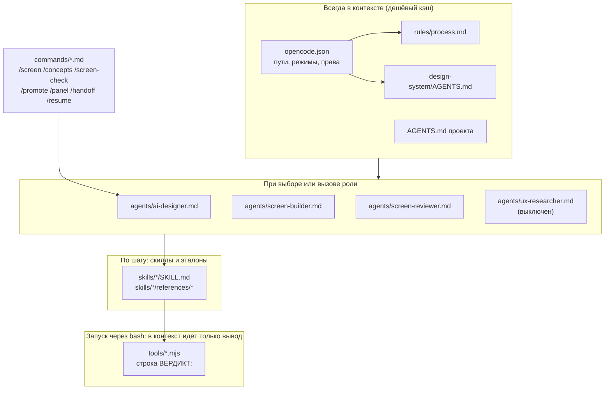
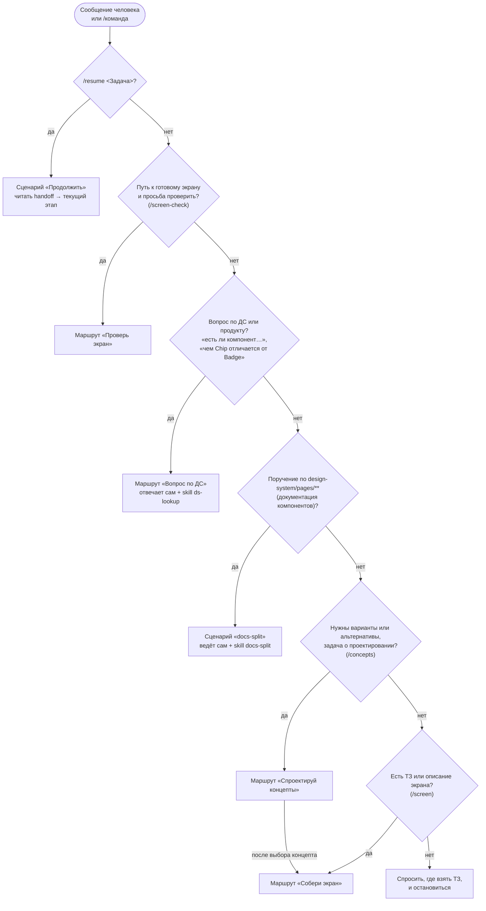
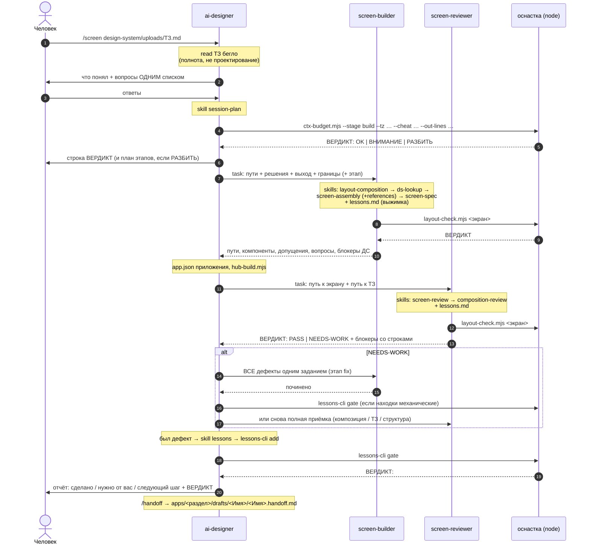
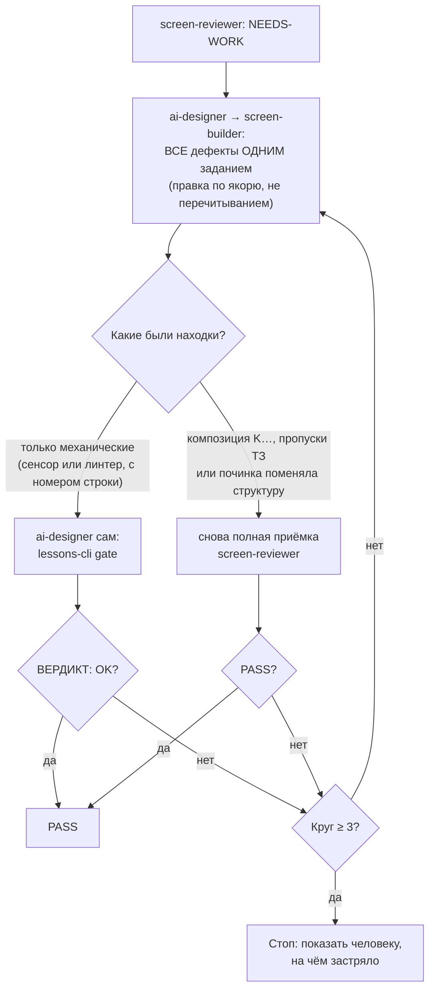

# Как работает агентская система из `.agents/`

Харнес превращает ТЗ в экран на дизайн-системе IBP: роли, команды, скиллы,
правила процесса и оснастка проверок. Здесь — весь рабочий процесс: из каких
слоёв он собран, как ведущий агент выбирает маршрут, что происходит при
сборке и приёмке, чем всё проверяется и как это дорабатывать.

Правила, составы проверок и процедуры здесь **не пересказываются**: у каждого
есть владелец, и ниже стоит указатель на него — копия прозой расходится с
оригиналом на первой же правке. Источник истины — файлы; при расхождении с
этим текстом верить файлам.

Вход для агента — `.agents/AGENTS.md` (короткий список указателей). Этот файл —
для человека.

---

## 0. Коротко

- Задача агента: превратить ТЗ в экран на дизайн-системе IBP. На выходе
  `apps/<раздел>/drafts/<Имя>/pages/<Имя>.html` (живой HTML-макет) и `<Имя>.screen.md`
  (спецификация для агента-разработчика) в приложении трека `rnd`, плюс
  `app.json` приложения и пересобранный реестр хаба `hub.js`.
- Человек выбирает одного агента — **`ai-designer`**. Это оркестратор: он
  разговаривает с человеком, выбирает маршрут и раздаёт задания субагентам
  `screen-builder` и `screen-reviewer`. Третья роль, `ux-researcher`,
  выключена, пока не подключена база знаний продукта (§13).
- Знания разложены по слоям по стоимости контекста: правила процесса и ДС —
  всегда, роль — при вызове, **скилл** агент подгружает сам на нужном шаге.
- Три обязательных механизма: **приёмка** (отдельный агент, два чек-листа,
  статический сенсор), **смета контекста до старта** (окно около 250 000
  токенов, большой экран делится на этапы, между сессиями состояние переносит
  handoff), **самообучение** (каждый починенный дефект становится уроком, урок
  закрепляется сторожем, закрепление доказывается откатом).
- Сквозной принцип: **не выдумывать**. Нет компонента, токена или доменного
  факта — стоп и вопрос человеку.

---

## 1. Что где лежит

| Что | Где |
|---|---|
| Правила процесса — читаются целиком в начале задачи | `rules/process.md` |
| Роли: `ai-designer`, `screen-builder`, `screen-reviewer`, `ux-researcher` (выключен) | `agents/` |
| Команды `/screen`, `/screen-check`, `/concepts`, `/promote`, `/panel`, `/handoff`, `/resume` | `commands/` |
| Скиллы — пошаговые инструкции, грузятся на своём шаге | `skills/<id>/SKILL.md` + `references/` |
| Оснастка: сенсор, гейт, сторожа, генераторы, фикстуры | `tools/` |
| Панель прототипа: рантайм (сценарии показа и комментарии) и её README — владелец описания | `proto-panel/` |
| Вход для агента | `AGENTS.md` |
| Этот документ | `README.md` |

### 1.1 Структура проекта: три части

Харнес — одна из трёх частей проекта; они лежат в отдельных каталогах и
работают только друг с другом (решение владельца Р8). Где что — знает
манифест `project.json` в корне, инструменты берут пути оттуда и литералов
имён не содержат.

| Часть | Где | Кто знает путь |
|---|---|---|
| Дизайн-система | `design-system/` (её вход — `design-system/AGENTS.md`) | `apps/ds-config.js` (строка `DS_PATH`, `project.json → designSystem.from`); экраны — через загрузчик |
| Харнес агента | `.agents/` | `project.json → agentKit.mount`, оснастка — `agentKit.tools` |
| Адаптер opencode | `.opencode/opencode.json` — **один файл**: пути до харнеса, режимы и права ролей | `project.json → agentKit.adapter` |
| Приложения | модуль `apps/<раздел>/<имя>-app/` или концепт `apps/<раздел>/drafts/<имя>/` — `app.json` (трек и запись хаба), экраны в `pages/`, блоки в `widgets/<группа>/`, `data/`, `refs/` | `project.json → apps`, форма — `appShape`, места — `appPlaces` |
| Загрузчик ДС | `apps/ds-config.js` + `apps/ds-body.js` — **строка `DS_PATH` — единственное место, где записан путь до ДС**; остальное генерируется | `project.json → boot` (см. `apps/README.md`) |
| Реестр хаба | `hub.js` — генерируется из `app.json`; страница хаба `index.html` не правится | `project.json → hub` |
| Состояние проверок | `.agent-state/` — журнал прогонов и снимок гейта, вне git | `project.json → state` (см. `.agent-state/README.md`) |

Контрактов два: `project.json` (контракт 1, сверяет `tools/manifest-check.mjs`)
и `app.json` приложения (сверяет `tools/registry-check.mjs`, собирает
`tools/hub-build.mjs`). Перенос ДС — правка одного значения и пересборка
загрузчика: ни один экран не трогается.

---

## 2. Слои контекста

| Слой | Файлы | Когда попадает в контекст | Назначение |
|---|---|---|---|
| Конфиг адаптера | `.opencode/opencode.json` | при старте opencode | пути до харнеса, режимы и права ролей, роль-исполнитель команды, каталог скиллов. Модели здесь нет (§12) |
| Корневые правила | `AGENTS.md` проекта | при старте, всегда | вход: где харнес, ДС, приложения и манифест; одна команда проверки |
| Правила процесса | `rules/process.md` | в начале задачи, целиком | проект, границы записи, работа с файлами, проверки, экономия контекста, самообучение |
| Правила ДС | `design-system/AGENTS.md` | в начале задачи, целиком | карта ДС, запреты, каркас экрана, каталог компонентов, чем проверять ДС |
| Роли | `agents/*.md` | первым чтением по указателю из конфига | роль и порядок работы |
| Команды | `commands/*.md` | чтением по указателю, когда человек пишет `/команда` | готовый вход в маршрут, исполняет `ai-designer` |
| Скиллы | `skills/<имя>/SKILL.md` + `references/` | **по решению агента**, на нужном шаге | пошаговые инструкции, эталоны, чек-листы |
| Оснастка | `tools/*.mjs`, `skills/*/tooling/*.mjs` | запуск через `bash`, в контекст идёт только вывод | сенсор, гейт, сторожа, генераторы, журнал прогонов |



**Почему именно так.** Модели на рабочем контуре работают с ограниченным
окном, поэтому постоянный вход короткий, а тяжёлые детали лежат в скиллах.
Правила и скиллы — стабильный вход, который модель берёт из кэша, поэтому
`process.md` §13 запрещает урезать инструктаж ради экономии: экономить нужно
на выводе, на промахах кэша и на повторных чтениях больших файлов.

**Разница между ролью, скиллом и правилами.** *Правила* — в контексте всегда,
поэтому короткие. *Роль* — порядок работы, грузится при вызове. *Скилл* —
инструкция, которую агент подгружает сам, когда дошёл до шага.

**Почему в конфиге адаптера указатели, а не тексты ролей.** Копия роли в
конфиге разошлась бы с оригиналом молча; подстановки файла в значения конфига
в документации установленной версии (2.0.11) нет, а симлинк на Windows без
режима разработчика git выписывает текстовым файлом. Поэтому конфиг называет
путь, а агент читает роль первым действием. Сходимость конфига с харнесом —
у каждой роли и команды есть запись, описание одно, аргументы передаются —
проверяет гейт (`agent-config`, КФ5).

**Честная граница.** Массив `instructions` opencode v2 принимает схемой, но не
загружает (его документация, «Instructions → Configuration»): активные правила
v2 берёт из `AGENTS.md`. Поэтому правила процесса и ДС подключены двумя путями
сразу — через `instructions` (их читает v1) и через указатели корневого
`AGENTS.md` и поля `system` каждой роли (их исполняет агент).

**Карта файлов** — не таблицей, а командой (таблица устаревала с каждым новым
файлом):

```bash
find .agents .opencode boot -name node_modules -prune -o -type f -print | sort
grep -h "^description:" .agents/skills/*/SKILL.md   # что делает каждый скилл
```

---

## 3. Как запускать

```bash
cd "путь к репозиторию"
opencode
```

| Способ | Как |
|---|---|
| Выбор агента | `Tab` → выбрать `ai-designer`. Он единственный в списке — остальные субагенты и вручную не выбираются |
| Собрать экран | `/screen design-system/uploads/ТЗ-реестр-сделок.md` |
| Проверить готовое | `/screen-check apps/deal-registry/pages/DealRegistry.html` |
| Несколько концептов до сборки | `/concepts design-system/uploads/ТЗ-реестр-сделок.md` |
| Посчитать смету захода | `node .agents/skills/session-plan/tooling/ctx-budget.mjs --stage build --tz <ТЗ> --cheat Table,Modal --out-lines 900` |
| Посмотреть состав этапов | `node .agents/skills/session-plan/tooling/ctx-budget.mjs --stages` |
| Сверить смету с фактом | `node .agents/skills/session-plan/tooling/ctx-budget.mjs --calibrate --stage build --fact <токенов>` + аргументы сметы |
| Перенести согласованный концепт в модуль | `/promote apps/postrade/drafts/<имя> apps/postrade/deals-app` |
| Панель прототипа: включить и описать сценарии · взять комментарии в работу | `/panel ai-bankster-prototype-v02` · `/panel ai-bankster-prototype-v02 comments` |
| Сохранить контекст / продолжить в новой сессии | `/handoff` · `/resume DealRegistry` |
| Закрыть заход | `node .agents/tools/lessons-cli.mjs gate` — строка `ВЕРДИКТ:` |
| Просто спросить | словами: «есть ли в ДС компонент для…», «чем Chip отличается от Badge» |

Скриншот макета прикладывается в сообщение файлом — если выбранная модель
умеет смотреть картинки; иначе макет описывается текстом.

Результат: экран в `apps/<раздел>/drafts/<Имя>/pages/` — `<Имя>.html` открывается двойным
кликом в браузере (или с хаба `index.html`), `<Имя>.screen.md` уходит
агенту-разработчику.

**Как посмотреть, что делает субагент.** Когда `ai-designer` запускает
субагента, создаётся дочерняя сессия: войти — `Leader + Down`, переключаться
стрелками, вернуться — `Up`.

---

## 4. Роли и главное ограничение субагентов

Роль, порядок работы и сужение прав каждого агента — в `agents/<роль>.md`;
фактические права всех слоёв, включая встроенных помощников `general` и
`explore`, — §11.

**Субагент не видит разговор с человеком.** Он получает только текст задания и
стартует с чистого контекста. Поэтому задание — самостоятельный документ, и в
нём всегда четыре части:

1. **Пути**: ТЗ, скриншот, папка результата, промежуточные результаты.
2. **Что уже решено**: ответы человека текстом, а не «см. выше».
3. **Что нужно на выходе**: какие файлы и в каком формате.
4. **Чего не делать**: границы объёма.

Если субагент делает не то, почти всегда виновато задание, а не субагент.
Встроенному помощнику задание пишется так же, и в нём прямо сказано «ничего не
менять»: права у помощников общие, они могут править файлы ДС (§11).

---

## 5. Дерево маршрутизации



Команды — готовые входы в эти ветки, все исполняются агентом `ai-designer`.
Ветки «Исследуй и собери» нет с 21.09.2026: базы знаний не было, и ветка
всегда возвращала пустой отчёт (§13). Просьба об исследовании — ответ «базы
знаний нет» и работа по ТЗ; вопросы о пользователях — человеку.

Где что описано:

| Что | Владелец |
|---|---|
| шаги каждого маршрута, формат ответа человеку, границы | `agents/ai-designer.md` |
| шкала концептов A/B/C и пометка `[ПРЕДЛОЖЕНИЕ]` | скилл `concept-design` |
| раскатка страниц документации ДС | скилл `docs-split` |
| перенос задачи между сессиями | `commands/handoff.md`, `commands/resume.md` |
| перенос концепта из `drafts/` в модуль раздела | `commands/promote.md`, `tools/promote.mjs` |
| панель прототипа: форматы, устройство, коды ПН · процедура агента | `proto-panel/README.md` · скилл `proto-panel`, `commands/panel.md` |
| этапы короткого и длинного маршрута | `ctx-budget.mjs --stages` (паспорт `stages.json`) |
| порядок скиллов внутри сборки и решение вопросов вёрстки | `agents/screen-builder.md` |

---

## 6. Последовательность сборки («Собери экран», `/screen <ТЗ>`)



На длинном маршруте (смета `РАЗБИТЬ`) сборка идёт этапами, по одному этапу за
сессию, с handoff между ними; состав этапов печатает `ctx-budget.mjs --stages`.

---

## 7. Цикл приёмки

Приёмка двухслойная, потому что механически чистый экран может быть плохо
скомпонован.

| Слой | Владелец | Что ловит |
|---|---|---|
| Сенсор (без браузера) | `tools/layout-check.mjs` — состав печатает `--rules` | часть механики и геометрии, с номерами строк |
| Механика ДС | скилл `screen-review` (чек-лист Б, З, К) | подключения, токены, иконки, классы, каркас, хуки, заглушки, каскад CSS, полнота ТЗ |
| Композиция | скилл `composition-review` (чек-лист K) | пустоты, ширины тайлов, колонки полей, иерархия |
| Уроки | `skills/screen-review/references/lessons.md` | правила, ещё не закрытые кодом |

Каждая претензия подтверждается номером строки и цитатой; «выглядит
неправильно» дефектом не считается. Какие пункты чек-листов закрыты сторожем,
а какие признаны суждением — печатает `lessons-cli coverage`. Лист-документ
без каркаса приложения объявляет в шапке спеки `kind: document` — сенсор не
требует от него каркаса (скилл `screen-spec`).



Развилку задают две роли вместе: `agents/ai-designer.md` (шаг «Вердикт
NEEDS-WORK») и `agents/screen-reviewer.md`.

---

## 8. Проверки: одна команда и её сторожа

Заход закрывается одной командой; строка `ВЕРДИКТ:` идёт в отчёт человеку:

```bash
node .agents/tools/lessons-cli.mjs gate
```

Гейт сам решает, что гонять: он помнит отпечатки файлов и список упавших
шагов (`.agent-state/`), поэтому проверяет изменившееся и не даёт красному
шагу исчезнуть молча. Состав для любого набора изменений печатает
`gate --dry --changed <путь,…>`, полный состав — `gate --full --dry`. Числа
шагов здесь не пересказываются: они меняются вместе с составом.

| Инструмент | Что стережёт |
|---|---|
| `tools/layout-check.mjs` | сенсор раскладки экрана: блокеры Б, замечания З, каскад К, геометрия K. Состав — `--rules` |
| `design-system/scripts/ds-lint.js` (через `ds-lint-cli.mjs`) | правила ДС: подключения, классы, токены, парность доков и кода |
| `design-system/scripts/spec-audit.mjs` | обещания спек ДС против кода |
| `tools/manifest-check.mjs` | `project.json` против диска (коды МФ) |
| `tools/boot-build.mjs --check` | загрузчик ДС собран из манифеста и не правлен руками (БТ) |
| `tools/hub-build.mjs --check` | реестр хаба собран из `app.json` (ХБ) |
| `tools/assemble.mjs --check` | модульные страницы: собранный `*.preview.html` не устарел, метки ведут в `widgets/` своего раздела, модуль не берёт виджеты из `drafts/` (СБ) |
| `tools/module-readme.mjs --check` | у каждого модуля `<имя>-app` есть README.md, дерево в нём сходится с папкой (МР) |
| `tools/promote.mjs --selftest` | перенос концепта в модуль (ПР); на рабочем дереве инструмент пишет — гейт гоняет только откат |
| `tools/proto-panel.mjs --check` | панель прототипа: форматы `flows.yaml` и `comments.md`, страницы и селекторы сценариев, зеркала и включатель = генератор, рантайм на токенах ДС (ПН) |
| `tools/registry-check.mjs` | приложения и хаб: записи, форма приложения, живые ссылки страниц, возврат на хаб (П) |
| `tools/agent-config.mjs` | адаптер CLI: один конфиг, без модели, записи сходятся с харнесом, пути живые, продуктовые приложения закрыты (КФ) |
| `tools/vendor-scan.mjs` | нейтральность репозитория: абсолютные пути с машины автора, имена посторонних инструментов; не читает игнор-лист `project.json → vendorScan.ignore` — локальное машины из `.gitignore` |
| `tools/lessons-cli.mjs` | форма журнала уроков (`check`), доказательство закрепления откатом (`verify`), покрытие чек-листов (`coverage`), сигнал об эффекте (`stats`) |

У каждого сторожа есть `--selftest`: он проверяет сам себя откатом на
временном дереве, и гейт гоняет его, когда правят самого сторожа.

---

## 9. Самообучение

Заход, в котором что-то сломалось и починилось, заканчивается уроком. Урок
записывается командой (`lessons-cli add --from <черновик>`), форму записи
проверяет `lessons-cli check`, а закрепление уровня «исполняемое»
доказывается откатом — парой фикстур «дефект/эталон» (`lessons-cli verify`).

Процедура целиком — у скилла `lessons`, **единственного владельца**: уровни
закрепления, формат записи, курация и пределы выжимок описаны там и здесь не
пересказываются. Что случилось после закрепления — регресс, живые и
исчезнувшие коды — печатает `lessons-cli stats`; состояние журнала и долг
курации — `lessons-cli state`.

---

## 10. Контекст: смета и границы сессии

Крупная задача начинается со сметы: `ctx-budget.mjs --stage <этап>` считает
вход, выход и запас окна и печатает `ВЕРДИКТ: OK | ВНИМАНИЕ | РАЗБИТЬ`. Паспорт
этапов и коэффициенты — `--stages` (файл `skills/session-plan/tooling/stages.json`),
процедура — скилл `session-plan`. Между сессиями состояние переносит файл
handoff (`apps/<Задача>/<Задача>.handoff.md`), а не история переписки: сжатие
теряет детали принятых решений, файл — нет.

---

## 11. Права: что агент может, а что нет

Права складываются из двух слоёв: общие правила `.opencode/opencode.json`
действуют на **всех** агентов, включая встроенных, а правила роли в том же
конфиге (`agents.<роль>.permissions`) их сужают. Побеждает последнее
совпавшее правило. Ниже — то, что записано в конфиге; при расхождении с ним
верить конфигу.

**Общий слой — разрешено почти всё.**

| Действие | Права |
|---|---|
| чтение и поиск (`read`, `glob`, `grep`) | разрешены |
| правка файлов (`edit`) | разрешена везде, в том числе в `design-system/` |
| команды (`shell`) | разрешены все без подтверждения, кроме трёх запретов по началу команды: `rm …`, `git push…`, `git reset…` |
| интернет (`webfetch`, `websearch`) | разрешён |
| субагенты (`subagent`) и скиллы (`skill`) | разрешены |
| пути вне рабочей директории (`external_directory`) | правила нет — действует умолчание opencode: запрос подтверждения. Это точка подключения базы знаний (§13) |
| `"share": "disabled"`, `"autoupdate": false` | переписка не выгружается, обновления не тянутся из интернета |

**Роли — сужение.**

| Роль | Правка файлов | Интернет |
|---|---|---|
| `ai-designer` | без подтверждения — `apps/**`, кроме приложений трека `product`; остальное — с подтверждением | запрещён |
| `screen-builder` | то же | запрещён |
| `screen-reviewer` | запрещена | запрещён |
| `ux-researcher` | запрещена | запрещён |

Приложение трека `product` закрыто правилом `edit` на `apps/<раздел>/<id>/**` с
эффектом `ask` **после** общего разрешения `apps/**`. Проекты и концепты с
22.09.2026 лежат в одном `apps/`, и граница «в продукт агент не пишет»
держится этим правилом; забытое правило ловит гейт (`agent-config`, КФ7).
Реестр `hub.js` руками не правится — его собирает `hub-build.mjs`.

**Чего эти права НЕ дают — важно знать до поручения.**

- **Встроенные вспомогательные агенты** (`general`, `explore` — ведущий зовёт
  их для поиска по репозиторию) работают с общими правами: они **могут
  править файлы ДС** и ходить в интернет без подтверждения. Защита ДС от них
  держится на задании, которое им дают, а не на правах.
- **Команда обходит правку.** Сужение `edit` касается инструмента правки;
  `sed -i`, перенаправление в файл или скрипт `node` пишут файл без
  подтверждения.
- **Запрет удаления — по началу команды.** Закрыты `rm …`, `git push…`,
  `git reset…`; другие способы удалить файл (`git rm`, скрипт) не закрыты.
- **`opencode --auto`** одобряет всё, что не запрещено явно: подтверждение
  правки вне разрешённого (в том числе в приложениях трека `product`)
  превращается в разрешение. Остаются только запреты — три команды выше,
  правка у приёмщика и исследователя, интернет у своих ролей.

Описать фактические права, а не сузить конфиг до прежнего описания, — решение
владельца от 21.09.2026 (`docs/agent-imp.md`, У7). Если его пересмотрят,
начинать с общего слоя: сужение в нём закроет и встроенных агентов.

---

## 12. Как подключить модель

Модель в конфиге репозитория намеренно не задана — её выбирают под контур.
Провайдер и имя модели на каждой машине свои: дома — публичный API, на рабочем
контуре — корпоративная копия у другого провайдера. Пара «провайдер/модель»,
которой на машине нет, не откатывает opencode на модель по умолчанию, а
останавливает его ошибкой `Model not found`. Поэтому гейт краснеет на ключах
`model`, `small_model`, `provider` и модели роли в конфиге репозитория
(`agent-config`, КФ3).

**Куда писать модель — в глобальный конфиг машины**:
`~/.config/opencode/opencode.json`. Точный путь печатает `opencode debug paths`
(строка `config`). Он грузится первым, проектный конфиг его дополняет.

Публичный провайдер: `opencode auth login`, затем в глобальный конфиг
`{ "model": "<провайдер>/<модель>" }`. Внутренний шлюз (OpenAI-совместимый
API — частый случай) описывается там же блоком `provider` с `baseURL` и
списком `models`; идентификаторы должны совпадать с тем, что возвращает
`GET /v1/models` шлюза. Ключ — в переменной окружения или через
`opencode auth login`.

**Разные модели под разные роли.** Субагент без своей настройки работает на
модели того, кто его вызвал. Развести — в том же глобальном конфиге:
`"agents": { "screen-reviewer": { "model": "<провайдер>/<модель>" } }`. Не в
роль харнеса и не в конфиг репозитория: они уезжают вместе с репозиторием, и
модель, которой нет на другой машине, остановит роль. Разумная раскладка:
сборку отдать более сильной модели, приёмку — дешёвой и быстрой.

---

## 13. Как это дорабатывать

**Появился новый компонент в ДС.** В харнесе править ничего не нужно: знание о
ДС живёт в самой ДС (`design-system/AGENTS.md`). Имя компонента — в каталог
§6 того файла (его сверяет с манифестом аудит ДС), рантайм с хуком — строкой в
`design-system/specs/_runtime-hooks.md`. Порядок — `design-system/MAINTAINING.md`.

**Появились локальные компоненты проекта** (тайл «КНР», «Финансовые метрики»).
Заведите скилл `skills/local-components/SKILL.md` с `name: local-components`
(имя папки и поле `name` обязаны совпадать) и `description` одной строкой —
что в скилле и когда его грузить. Агент подхватит его сам.

**Нужна новая роль или команда.** Файл в `agents/` (или `commands/`) с внятным
`description` — по нему ведущий поймёт, когда звать, — и запись в
`.opencode/opencode.json`: для роли `agents.<имя>` с тем же `description`,
`mode`, правами и полем `system`, называющим путь к файлу роли; для команды
`commands.<имя>` с `description`, `agent` и `template`, где названы путь к
сценарию и его подстановки. Гейт (`agent-config`, КФ5) проверит, что запись и
файл сходятся. Затем допишите строку в таблицу «Твоя команда» в
`agents/ai-designer.md` и, если нужно, новый маршрут.

**Появился репозиторий базы знаний.** Он живёт отдельно от этого репозитория.
Подключение — в `skills/knowledge-lookup/SKILL.md`, приложение «Как подключить
репозиторий»: правило `external_directory` в конфиге адаптера с путём (путь
абсолютный или от домашней папки), строка `KB = …` в самом скилле и возврат
выключенного маршрута «Исследуй и собери» с командой `/research` (удалены
21.09.2026, лежат в истории git). Больше нигде путь не зашит.

**Агент делает что-то не так.** Правится текстом, не кодом:
- путает компоненты → дополните «Частая путаница в именах» в `skills/ds-lookup/SKILL.md`;
- халтурит с контентом → усильте «Контент: рисуем, а не заглушаем» в `skills/screen-assembly/SKILL.md`;
- макет не кликается → проверьте `design-system/specs/_runtime-hooks.md`;
- пропускает проверку → добавьте пункт в блокеры `skills/screen-review/SKILL.md`;
- субагент делает не то → почти всегда виновато задание: усильте «Главное про
  субагентов» в `agents/ai-designer.md`.

Разобрали инцидент — тем же заходом впишите класс ошибки в чек-лист или
заведите сторожа, иначе он повторится (§9).

**Проверить, что opencode всё увидел:** `/agents` покажет роли, `/skills` —
скиллы. Роли или команды нет — нет её записи в конфиге адаптера (ловит гейт,
КФ5). Скилла нет — проверьте, что файл называется `SKILL.md` заглавными, что в
шапке есть `description` и что `name` совпадает с именем папки: opencode v2
берёт ID скилла из пути, а скилл без `description` модели не объявляет (ловит
гейт, КФ4).

---

## 14. Известные ограничения

- **Макет живой, но не приложение.** Штатное поведение компонентов работает:
  поповеры, модалки, аккордеоны, сортировка, табы, тултипы, сворачивание
  панели навигации. Не работает то, что относится к данным: реальная
  фильтрация строк, пересчёт пагинации, сохранение, переходы между экранами.
  Такое описано словами в `<Имя>.screen.md`.
- **Репозитория базы знаний ещё нет**, поэтому исследовательский маршрут
  выключен: `/research` нет, `ux-researcher` не вызывается. Вопросы о
  пользователях агент задаёт человеку — выдумывать их по интерфейсу ему
  запрещено. Когда репозиторий появится — §13, кода трогать не нужно.
- **Проверка раскладки — статическая.** Сенсор не запускает браузер: часть
  геометрии и всё, что видно только в рендере, остаётся за границей и
  проверяется глазами (`process.md` §9).
- Слабые модели плохо держат длинные файлы: если экран получается очень
  большим — просите собирать его частями (сначала каркас и шапка, потом
  таблица, потом модалки).
- Точность вёрстки по скриншоту у небольших моделей ниже, чем у топовых.
  Приёмка для них не формальность, а необходимый шаг — поэтому `ai-designer`
  и не имеет права её пропустить.

---

## 15. Состояние после работ 21–22.09.2026

Итоги задач `docs/agent-imp.md` и `docs/restructure-3-repos.md` (журналы
исполнения — там же). Подробности у владельцев; здесь только то, что меняет
картину выше.

| Что | Состояние | Владелец |
|---|---|---|
| Исследование (`/research`, `ux-researcher`, `knowledge-lookup`) | выключено: базы знаний нет. Роль и скилл оставлены с пометкой | приложение скилла `knowledge-lookup` |
| Смета контекста | решено калибровать: три замера на настоящих заходах. Пока их нет, гейт печатает `ВНИМАНИЕ: калибровка сметы: ДОЛГ` | скилл `session-plan`, `ctx-budget.mjs --calibration-state` |
| Права | конфиг не сужали; §11 описывает фактические права, включая встроенных помощников | `docs/agent-imp.md`, У7 |
| Вид файла `kind: document` | лист-документ без каркаса приложения: Б5 и К12 не применяются, Б6 — ровно один h1 | `layout-check.mjs` (`kindOf`), скилл `screen-spec` |
| Журнал прогонов и снимок гейта | каталог состояния `.agent-state/` вне git | `.agent-state/README.md`, шапка `runlog.mjs` |
| Адаптер CLI | один файл `opencode.json`; записи сходятся с харнесом (КФ5), пути живые (КФ6), продуктовые приложения закрыты (КФ7) | `agent-config.mjs` |
| Приложения и хаб | модуль `<раздел>/<имя>-app/` или концепт `<раздел>/drafts/<имя>/` (П8); форма — `pages/`, `widgets/<группа>/`, `data/`, `refs/` (П6); ссылки страниц живые (П7); `hub.js` собирается из `app.json`; README модуля с деревом (МР); виджеты общие в пределах раздела (СБ) | `registry-check.mjs`, `hub-build.mjs`, `module-readme.mjs`, `assemble.mjs` |
| Путь до ДС | только строка `DS_PATH` в `apps/ds-config.js`; литерал каталога ДС в экране — блокер Б34 | `apps/README.md`, `boot-build.mjs`, `layout-check.mjs` |

Что осталось по реструктуризации: разводка трёх каталогов по отдельным
репозиториям (шаги Ш12–Ш13 плана) — отложена решением владельца 22.09.2026:
пока три части живут независимыми каталогами одного репозитория.

---

## 16. Указатели вместо пересказа

| Что | Где смотреть |
|---|---|
| Состав гейта для любого набора изменений | `lessons-cli.mjs gate --dry --changed <путь,…>`; полный — `gate --full --dry` |
| Реализованные проверки сенсора | `layout-check.mjs --rules` |
| Подкоманды оснастки уроков | `node .agents/tools/lessons-cli.mjs` без аргументов |
| Паспорт этапов, коэффициенты, пороги окна | `ctx-budget.mjs --stages` |
| Структура проекта и её сверка с диском | `project.json`; `manifest-check.mjs` |
| Загрузчик ДС, реестр хаба | `apps/README.md`, `boot-build.mjs`, `hub-build.mjs` — оба с `--check` |
| Приложения, их форма и возврат на хаб | `apps/README.md`, `registry-check.mjs` |
| Модульные страницы, README модулей, перенос концепта | `assemble.mjs`, `module-readme.mjs`, `promote.mjs` (шапки), `commands/promote.md` |
| Самообучение: формат урока, уровни закрепления, доказательство откатом, курация | скилл `lessons` — единственный владелец процедуры |
| Состояние журнала уроков, долг курации, давность ритуальных прогонов | `lessons-cli.mjs state` |
| Что случилось после закрепления (регресс, живые и исчезнувшие коды) | `lessons-cli.mjs stats` |
| Сквозные принципы: чтение ДС, запреты, не выдумывать неизвестное, вердикт строкой, граница статики, экономия контекста | `rules/process.md` §3, §4, §7, §8, §9, §13; границы записи — §4–§5 и `agents/ai-designer.md` («Границы») |
| Формат спек (страница и виджет), демо-данные с типами и выходные артефакты | скилл `screen-spec` + `references/template.md`, `references/widget-template.md`, `references/data-template.js`; handoff — `commands/handoff.md` |
| Панель прототипа: форматы, устройство, горячие клавиши, коды ПН, кандидаты в ДС | `proto-panel/README.md`; процедура агента — скилл `proto-panel`; `proto-panel.mjs --selftest` |

## 17. Панель прототипа

Служебная шторка поверх прототипов из `apps/`: сценарии показа (таб «Сценарии») —
клик по шагу приводит прототип в нужное состояние — и комментарии к прототипу
со статусами. Открывается `Alt+Shift+P` на любой странице прототипа, у
которого есть папка `proto-panel/`; прототипы ради неё не правятся.

| Слой | Где | Что |
|---|---|---|
| Рантайм | `proto-panel/` (`core.js` … `panel.js`, `panel.css`) | один код на все прототипы; ядро `core.js` общее с оснасткой (UMD) |
| Включатель | `apps/proto-panel.js` — генерат | список приложений с папкой панели; его подключает загрузчик `ds-body.js` |
| Данные | `apps/<…>/proto-panel/` | `flows.yaml` (сценарии пишет агент), `comments.md` (пишет панель, закрывает агент), `panel-data.js` (зеркало — генерат) |
| Инструмент | `tools/proto-panel.mjs` | сборка, проверка (ПН), `--enable`, `--disable`, `--list`, `--resolve`, `--selftest` |
| Гейт | шаги `panel`, `panel-selftest` | поднимаются правкой данных панели, любой страницы приложения, `app.json`, включателя, рантайма, манифеста |
| Агент | скилл `proto-panel`, команда `/panel`, маршрут «Правки по комментариям» в `agents/ai-designer.md` | включение по вопросу «включить панель?», сценарии после PASS, комментарии в работу |

Всё остальное — в `proto-panel/README.md`: он владелец описания, здесь только
указатели.
