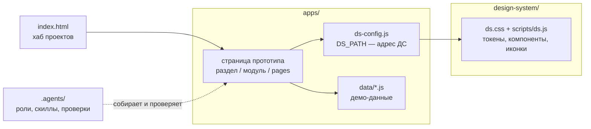
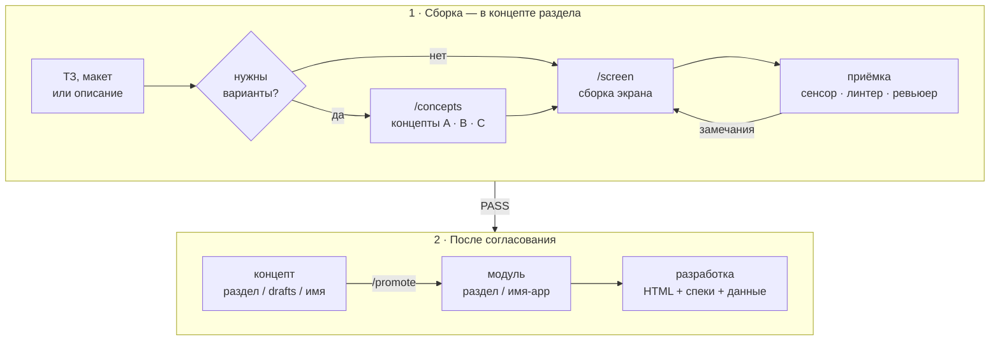

<p align="center">
  
</p>

<h1 align="center">Прототипы IBP</h1>

<p align="center">
  Интерактивные HTML-прототипы на дизайн-системе IBP.<br>
  Открываются двойным кликом и уходят в разработку вместе со спеками и данными.
</p>

<p align="center">
  <a href="#быстрый-старт">Быстрый старт</a> ·
  <a href="#как-устроен-репозиторий">Структура</a> ·
  <a href="#как-рождается-прототип">Процесс</a> ·
  <a href="#передача-в-разработку">Передача в разработку</a> ·
  <a href="#проверки">Проверки</a> ·
  <a href="#документация">Документация</a>
</p>

<div align="center">

| 58 | 247 | 37 | 22 |
|:---:|:---:|:---:|:---:|
| компонентов и основ ДС | глифов | иллюстраций | модуля по устройству фронтенда |

</div>

---

## Что это

Дизайнеры собирают здесь интерактивные прототипы экранов IBP: на настоящих
компонентах дизайн-системы, с состояниями, модальными окнами и демо-данными.
Фронтенд-разработка забирает готовую страницу, её спеку и данные и пишет по ним
ts/js реального продукта. Экраны собирают люди и агент — по одним правилам и
под одними проверками.

| | Часть | Что внутри |
|---|---|---|
| 🎨 | [`design-system/`](design-system/) | Дизайн-система IBP: токены, компоненты, иконки, иллюстрации, документация. Источник истины для любого экрана |
| 🧩 | [`apps/`](apps/) | Прототипы, разложенные как фронтенд: раздел → модуль `*-app` → страницы, виджеты, данные |
| 🤖 | [`.agents/`](.agents/) | Агентная система: роли, команды, скиллы и проверки, которые собирают экран по ТЗ |

> **Главное правило — ничего не выдумывать.** Цвет, размер, отступ, радиус,
> шрифт, класс, имя иконки — только из дизайн-системы. Нет нужного — вопрос,
> а не изобретение.

## Быстрый старт

1. Откройте [`index.html`](index.html) двойным кликом — это **хаб проектов**: дизайн-система,
   проекты и концепты в одном месте.
2. Выберите прототип — страницы открываются прямо из файлов, сервер не нужен.

Если встроенный браузер редактора не показывает стили по `file://`, подойдёт любой
статический сервер:

```bash
python3 -m http.server 8765    # затем http://localhost:8765
```

**Что понадобится**

| Задача | Нужно |
|---|---|
| Смотреть прототипы | любой современный браузер |
| Запускать проверки и генераторы | Node.js 18+ |
| Собирать экраны с агентом | агентный CLI (opencode), модель подключается по [`.agents/README.md`](.agents/README.md) |

## Куда смотреть

| Я хочу… | Куда |
|---|---|
| посмотреть прототипы | [`index.html`](index.html) — хаб проектов |
| собрать экран по ТЗ с агентом | `opencode` → агент `ai-designer` → `/screen <путь к ТЗ>` |
| поправить экран руками | `apps/<раздел>/<модуль>/pages/`, затем [проверки](#проверки) |
| забрать экран в разработку | [передача в разработку](#передача-в-разработку) |
| найти компонент или токен | [`design-system/index.html`](design-system/index.html), спеки — [`design-system/specs/`](design-system/specs/) |
| доработать агента | [`.agents/README.md`](.agents/README.md) |

## Как устроен репозиторий

```
.
├── index.html          хаб проектов — меню и колонки строятся из hub.js
├── hub.js              реестр хаба, собирается из app.json приложений
├── project.json        манифест: где ДС, агентная система, приложения, треки
├── AGENTS.md           вход для агентов: где правила, роли и команды
├── GIGACODE.md         те же правила для GigaCode
├── design-system/      дизайн-система IBP
├── apps/               прототипы
│   ├── ds-config.js    адрес дизайн-системы — одна строка DS_PATH
│   ├── ds-body.js      второй тег загрузчика ДС
│   ├── core/           разделы системы, как у фронтенда
│   ├── ib/
│   ├── pretrade/
│   └── postrade/
│       ├── deals-app/  модуль раздела
│       └── drafts/     концепты раздела
├── .agents/            агентная система: роли, команды, скиллы, проверки
├── .opencode/          адаптер агентного CLI — один opencode.json
└── docs/               планы и задачи
```

### Модуль и концепт

Раздел повторяет часть системы (`core`, `ib`, `pretrade`, `postrade`), модуль —
модуль фронтенда (`clients-app`, `deals-app` …). Прототип живёт в одном из двух мест:

| | Где | Что это |
|---|---|---|
| **Модуль** | `apps/<раздел>/<имя>-app/` | согласованная часть системы, колонка «Проекты» на хабе |
| **Концепт** | `apps/<раздел>/drafts/<имя>/` | прототип на согласование, колонка «Концепты» |

Форма у обоих одна, поэтому согласованный концепт переезжает в модуль одной командой
`/promote` — без перекладки файлов.

```
<раздел>/<имя>-app/
├── README.md     описание модуля, дерево файлов, имена сущностей во фронтенде
├── app.json      запись для хаба: название, трек, стартовая страница
├── pages/        экраны .html и их спеки .screen.md
├── widgets/      тайлы, таблицы, модалки, контекстные меню, поповеры — по группам
├── data/         демо-данные с описанием типов
└── refs/         входящие материалы: ТЗ, скриншоты, DTO
```

Имена экранов и виджетов — как у фронтенда (`Deal`, `DealTeamTile`), чтобы разработчик
находил пару без перевода. Виджет общий для своего раздела: тайл из `deals-app` можно
вшить в страницу `payments-app`. Подробно — [`apps/README.md`](apps/README.md).

### Как страница получает дизайн-систему



Адрес дизайн-системы записан **ровно в одном месте** — строкой `DS_PATH` в
[`apps/ds-config.js`](apps/ds-config.js). Переезд ДС — правка этой строки, экраны не трогаются.
Готовые страницы зависят только от `apps/` и `design-system/`: агентная система нужна,
чтобы собирать и проверять, а не чтобы открывать.

## Как рождается прототип



С человеком говорит один агент — **`ai-designer`**. Он уточняет ТЗ, считает, влезет ли
работа в одну сессию, и раздаёт задания: `screen-builder` собирает экран,
`screen-reviewer` принимает его по чек-листам.

| Команда | Что делает |
|---|---|
| `/screen <ТЗ>` | собрать экран по ТЗ из компонентов ДС |
| `/concepts <ТЗ>` | несколько текстовых концептов на шкале «консервативно ↔ концептуально» |
| `/screen-check <экран> [ТЗ]` | приёмка готового экрана: вердикт и список дефектов |
| `/promote <концепт> <модуль>` | перенести согласованный концепт из `drafts/` в модуль раздела |
| `/panel <приложение> [on · flows · states · comments · off]` | панель прототипа: включить, описать сценарии показа, привести в порядок зафиксированные состояния, взять комментарии в работу, выключить |
| `/handoff` · `/resume <задача>` | сохранить контекст задачи и продолжить её в новой сессии |

Каждый починенный дефект становится уроком, а урок — проверкой, которая не даст
повторить ошибку. Как устроена агентная система целиком — [`.agents/README.md`](.agents/README.md).

## Показ прототипа

У прототипа может быть **панель прототипа** — служебная шторка, которая не
видна на странице, пока её не позвали:

- `Alt+Shift+P` на любой странице прототипа — шторка справа (на macOS Alt — это
  Option);
- **Flows** — сценарии показа блок-схемой: клик по состоянию открывает нужную
  страницу и проигрывает действия до этого места, мини-плеер и
  `Alt+Shift+→ / ←` листают состояния — путь не приходится проходить руками;
- **Fix State** (`Alt+Shift+S`) — поработали с прототипом и зафиксировали,
  что получилось: панель записывает клики и ввод в сценарий, у состояния —
  постоянный номер State NN; названия и селекторы агент приводит в порядок
  по `/panel <приложение> states`;
- **Comments** — правки к прототипу с привязкой к странице и состоянию; они
  ложатся файлом рядом с прототипом, агент берёт их в работу по
  `/panel <приложение> comments` и закрывает с записью решения.

Интерфейс панели — на английском.

Панель включает агент (`/panel <приложение>`); сейчас она есть у
`ib/drafts/ai-bankster-prototype-v02`. Форматы, запись на диск и ограничения —
[`.agents/proto-panel/README.md`](.agents/proto-panel/README.md).

## Передача в разработку

Рядом с каждым экраном лежит всё, что нужно, чтобы написать его в продукте:

| Файл | Что в нём |
|---|---|
| `pages/<Имя>.html` | наверстанная страница на классах ДС — открывается сама |
| `pages/<Имя>.screen.md` | спека: назначение, раскладка, компоненты, состояния, тексты, данные, соответствие файлов |
| `widgets/<группа>/<Имя>/` | фрагмент виджета и его паспорт |
| `data/*.js` | демо-данные с JSDoc-типами, имена полей — в стиле API |
| `README.md` модуля | дерево файлов и пары сущностей во фронтенде |

Спеки написаны по-русски — их читают и люди, которые проверяют прототип. Английское
имя раздела стоит в скобках (`Состояния (States)`, `Соответствие файлов (Implementation
mapping)`), как в дизайнерском дереве спек, — по нему ориентируется агент разработки.
Шаблоны и правила — скилл [`screen-spec`](.agents/skills/screen-spec/SKILL.md).

## Проверки

Любая работа закрывается одной командой:

```bash
node .agents/tools/lessons-cli.mjs gate          # проверить изменившееся
node .agents/tools/lessons-cli.mjs gate --full   # проверить всё
```

Последняя строка — вердикт: `ВЕРДИКТ: OK` или `ВЕРДИКТ: FAIL` со списком находок.
Гейт сам решает, какие проверки нужны для изменённых файлов:

| Что проверяется | Чем |
|---|---|
| экран: каркас, компоненты, токены, иконки, спека рядом | сенсор `layout-check` и линтер ДС |
| хаб, форма и место приложений, живые ссылки страниц | `registry-check` |
| модульные страницы собраны из актуальных виджетов | `assemble --check` |
| README модулей совпадает с их папками | `module-readme --check` |
| реестр хаба и загрузчик ДС не правлены руками | `hub-build`, `boot-build` |
| в репозитории нет абсолютных путей и посторонних имён | `vendor-scan` |

<details>
<summary>Генераторы и инструменты</summary>

```bash
node .agents/tools/hub-build.mjs                  # пересобрать реестр хаба после правки app.json
node .agents/tools/assemble.mjs                   # собрать модульные страницы из виджетов
node .agents/tools/module-readme.mjs              # обновить деревья в README модулей
node .agents/tools/promote.mjs <концепт> <модуль> --dry   # показать план переноса концепта
node .agents/tools/layout-check.mjs <экран.html>  # сенсор одного экрана
```

Генераторы и сторожа проверяют сами себя: `--selftest` прогоняет их на временном дереве.
Сенсор проверяется корпусом эталонных и заведомо плохих экранов (`lessons-cli verify`).

</details>

## Правила

- Только дизайн-система: классы, токены, иконки, иллюстрации — из `design-system/`.
- Литерала `design-system/` в экране нет — ДС подключает загрузчик из `apps/`.
- Страницы открываются по `file://`: данные — обычными `<script>`, без `fetch`.
- Валюта — кодом (`RUB`), а не «руб.» или «₽».
- Своё поверх ДС — только на токенах и с записью в «Открытые вопросы» спеки.
- Реестр хаба `hub.js`, загрузчик ДС и деревья в README модулей руками не правятся —
  их собирают генераторы, проверяет гейт.
- В файлах нет абсолютных путей с машины автора.

## Документация

| Что | Где |
|---|---|
| Приложения: форма, модули, концепты, виджеты, данные | [`apps/README.md`](apps/README.md) |
| Агентная система целиком: роли, маршруты, приёмка, проверки | [`.agents/README.md`](.agents/README.md) |
| Правила процесса | [`.agents/rules/process.md`](.agents/rules/process.md) |
| Вход для агентов | [`AGENTS.md`](AGENTS.md) |
| Дизайн-система для агента: карта, чтение, запреты, каталог | [`design-system/AGENTS.md`](design-system/AGENTS.md) |
| Спеки и демо-данные | [`.agents/skills/screen-spec/SKILL.md`](.agents/skills/screen-spec/SKILL.md) |
| Задачи | [`docs/tasks/`](docs/tasks/) |

<p align="center"><sub>Прототипы IBP · дизайн-система IBP</sub></p>
