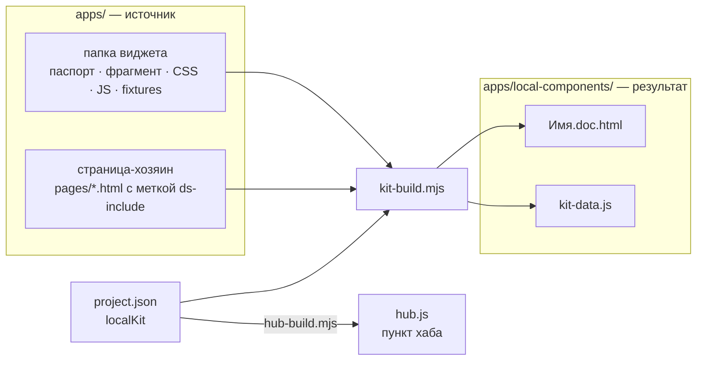

<h1 align="center">Локальные компоненты</h1>

<p align="center">
  Витрина тайлов, таблиц, модальных окон и поповеров модулей IBP.<br>
  Каждый компонент — на своей странице: живое демо, все состояния, паспорт и код.<br>
  Страницы собираются из виджетов приложений и руками не правятся.
</p>

<p align="center">
  <a href="#быстрый-старт">Быстрый старт</a> ·
  <a href="#зачем-здесь-html-страницы">Зачем HTML</a> ·
  <a href="#как-собирается-страница">Сборка</a> ·
  <a href="#как-править">Как править</a> ·
  <a href="#проверки">Проверки</a> ·
  <a href="#для-агентов">Для агентов</a>
</p>

---

## Что это

**Локальный компонент** — крупный блок экрана, которого нет в дизайн-системе: тайл,
таблица, модальное окно, контекстное меню, поповер. Он живёт у модуля, где его сделали, в
папке виджета `apps/<раздел>/<модуль>/widgets/<группа>/<Имя>/`. Страницы модуля вшивают
его меткой `<ds-include>`, разработка забирает его отдельным компонентом.

Витрина показывает каждый такой виджет отдельно от страницы: как он работает, из чего
собран и зачем нужен.

| | Часть | Что внутри |
|---|---|---|
| 🧩 | папка виджета `apps/…/widgets/<группа>/<Имя>/` | **источник**: паспорт, фрагмент разметки, CSS, JS, данные демо |
| ⚙️ | [`.agents/tools/kit-build.mjs`](../../.agents/tools/kit-build.mjs) | **генератор**: читает виджеты и пишет страницы витрины |
| 🖼 | `apps/local-components/` — эта папка | **результат**: обзор и страница на каждый компонент |

> **Главное правило — правится виджет, а не витрина.** Страницы `*.doc.html` и реестр
> `kit-data.js` — генераты: ручная правка пропадёт при следующей сборке, а до неё гейт
> покажет расхождение.

## Быстрый старт

1. Откройте хаб проектов [`index.html`](../../index.html) в корне → колонка «Дизайн-система» →
   «Локальные компоненты». Или [`index.html`](index.html) этой папки двойным кликом.
2. Слева — меню по категориям, справа — карточки. Карточка открывает страницу компонента.

Если встроенный браузер редактора не показывает стили по `file://`, подойдёт любой
статический сервер из корня проекта:

```bash
python3 -m http.server 8765    # затем http://localhost:8765/apps/local-components/index.html
```

Смотреть витрину можно в любом современном браузере; пересобирать — нужен Node.js 18+.

## Куда смотреть

| Я хочу… | Куда |
|---|---|
| посмотреть, как работает компонент | [`index.html`](index.html) → страница компонента, вкладка «Конструктор» |
| поправить вид или разметку | папка виджета: `<Имя>.html`, `.css`, `.js` → [пересобрать](#как-править) |
| поправить описание | паспорт `<Имя>.md` в папке виджета → пересобрать |
| завести новый компонент | [новый компонент](#новый-компонент) |
| показать демо на данных | `fixtures.json` виджета + [сценарий демо](#сценарий-демо) |
| добавить категорию меню | `project.json → localKit.categories` → пересобрать |
| понять, почему гейт красный | [коды КТ](#проверки) |
| узнать правила самих локальных компонентов | страница ДС [«Локальные компоненты»](../../design-system/patterns/LocalComponents/LocalComponents.html) |

## Зачем здесь HTML-страницы

Вопрос естественный: виджеты уже лежат в `apps/…/widgets/`, зачем рядом ещё HTML-файлы?

Страницы проекта открываются двойным кликом — по `file://`. Там не работает `fetch`, и
браузер не может подтянуть фрагмент виджета на лету: рантайм ДС `ds-include.js` делает
именно это, но по `file://` он бессилен. Значит, фрагмент надо вшить в страницу **до**
открытия. Этим и занят генератор: `<Имя>.doc.html` — собранная страница одного
компонента, так же как `Deal.preview.html` — собранная страница сделки.

| Копией — обновится после пересборки | Ссылкой — видно сразу |
|---|---|
| фрагмент `<Имя>.html` и соседние фрагменты: окна, которые открывает тайл, подчасти окна | `<Имя>.css` и `<Имя>.js` виджета и его окон |
| паспорт `<Имя>.md`, превращённый в разделы документации | скрипты данных и виджетов со страницы-хозяина (`data/*.js` …) |
| оси конструктора — состояния и режимы из CSS виджета | стили и рантаймы ДС, оболочка витрины (`kit.css`, `kit-nav.js`, `kit-docpage.js`) |
| текст `.html`, `.css`, `.js` для вкладки «Код» | сценарий демо `<Имя>.demo.js` |
| `fixtures.json` — данные сценария | |

Генераты лежат в git, чтобы витрина открывалась без Node и без сборки — как и собранные
страницы модулей.

## Как устроено

```
apps/local-components/
├── README.md              этот файл
├── index.html             обзор: меню и карточки — руками, один раз
├── kit-data.js            реестр window.IBPKit — генерат
├── kit-nav.js             левая панель и карточки обзора — руками
├── kit-docpage.js         рантайм страницы: конструктор, демо, «Все состояния рядом» — руками
├── kit.css                раскладка витрины на токенах ДС — руками
└── <раздел>/<модуль>/     зеркало модуля в apps/
    ├── <Имя>.doc.html     страница компонента — генерат
    └── <Имя>.demo.js      сценарий демо — руками, необязательно
```

Источник каждой страницы — папка виджета:

```
apps/<раздел>/<модуль>/widgets/<группа>/<Имя>/
├── <Имя>.md          паспорт: имя, категория, назначение, связи, документация
├── <Имя>.html        фрагмент разметки с одним корневым элементом
├── <Имя>.css         раскладка, состояния [data-state], режимы [data-mode]
├── <Имя>.js          поведение, которого нет в рантаймах ДС
├── fixtures.json     данные для сценария демо
└── <Подчасть>/       со своим паспортом — своя страница (например, карточка в окне)
```

Группы — `tiles`, `tables`, `modals`, `context-menus`, `popovers`
(`project.json → appShape.widgetGroups`).

Витрина лежит в `apps/`, но это **не раздел и не приложение**: в ней нет `app.json`,
`pages/` и спек экранов, а проверки экранов её не обходят (см. [Проверки](#проверки)). Где
ей лежать, записано одной строкой — `project.json → localKit.dir`.

## Как собирается страница



**Страница-хозяин** — первая страница `apps/**/pages/*.html`, которая вшивает виджет меткой
`<ds-include>`. С неё генератор берёт то, без чего виджет не оживёт: соседние фрагменты
(окна тайла, их подчасти, окна подтверждения) и скрипты данных и виджетов — в её порядке.
Логику самой страницы (например, «нарисовать тайл из стора сделки») генератор не
переносит — для этого есть [сценарий демо](#сценарий-демо).

| Блок страницы | Источник |
|---|---|
| имя, категория, назначение, версия | шапка паспорта: `name`, `category`, `purpose`, `version`, `updated` |
| меню и группы обзора | `category` паспорта; порядок категорий — `project.json → localKit.categories` |
| окно или поповер под своим тайлом в меню | `artifactOf` окна или `opens` тайла — именем виджета или путём до его `.md` |
| «Из чего собран» | `ds` и `uses` паспорта, файлы и подпапки виджета |
| «Где стоит» | `usedOn` паспорта и страницы приложений, которые вшивают виджет |
| документация | тело паспорта целиком, по разделам `##` |
| живое демо | фрагмент `<Имя>.html`, вшитый при сборке |
| состояния и режимы конструктора | селекторы `[data-state]` и `[data-mode]` в `<Имя>.css`; по умолчанию — атрибуты фрагмента |
| ширина демо (тайл, таблица, подчасть) | класс `col-N` на метке страницы-хозяина |
| вкладка «Код» | `.html`, `.css`, `.js` виджета как есть |
| данные сценария | `fixtures.json` виджета |

Страница компонента: слева меню витрины, сверху живое демо, снизу три вкладки:

- **Конструктор** — состояние данных, режим прав, ширина и свои контролы сценария;
- **Документация** — паспорт; в разделе «Состояния» — «Все состояния рядом»: копия
  фрагмента на каждую пару «состояние × режим»;
- **Код** — файлы виджета как есть.

## Как править

| Что меняю | Где | Пересобрать? |
|---|---|---|
| вид, раскладку, поведение | `<Имя>.css`, `<Имя>.js` в папке виджета | демо обновится сразу; вкладка «Код» и оси состояний — копия, поэтому перед сдачей — **да** |
| разметку | `<Имя>.html` в папке виджета | **да** |
| описание, связи, категорию | паспорт `<Имя>.md` | **да** |
| данные демо | `fixtures.json` виджета | **да** |
| окна тайла, скрипты данных | страница-хозяин `apps/…/pages/*.html` | **да**, и `assemble.mjs` для самой страницы |
| сценарий демо | `<Имя>.demo.js` здесь | правка — нет; **новый файл — да**: тег на страницу ставит генератор |
| оболочку витрины | `index.html`, `kit-nav.js`, `kit-docpage.js`, `kit.css` здесь | нет — это общие файлы всех страниц |
| список категорий | `project.json → localKit.categories` | **да** |

Пересборка — из корня проекта:

```bash
node .agents/tools/kit-build.mjs            # пересобрать все страницы и реестр
node .agents/tools/kit-build.mjs --check    # сверить, ничего не записывая
```

Генератор пишет только в эту папку: в виджеты и страницы приложений он ничего не пишет.
Страницу удалённого виджета пересборка удаляет сама.

### Новый компонент

1. Заведите папку виджета `apps/<раздел>/<модуль>/widgets/<группа>/<Имя>/` — по правилам
   модуля (его `widgets/README.md`) и заготовке ДС
   [`templates/local-component/`](../../design-system/templates/local-component/).
2. Положите фрагмент `<Имя>.html` и паспорт `<Имя>.md` по шаблону
   [`Component.md`](../../design-system/templates/local-component/Component.md). Для
   витрины обязательны `name`, `category` и `purpose`; категория — из
   `project.json → localKit.categories`.
3. Вшейте виджет в страницу модуля меткой `<ds-include>` — так у демо появятся окна и
   данные страницы.
4. `node .agents/tools/kit-build.mjs` — страница появится здесь, пункт — в меню и на обзоре.

### Паспорт: что читает витрина

| Поле | Что даёт |
|---|---|
| `name`, `purpose` | заголовок и подзаголовок страницы, карточка обзора — **обязательны** |
| `category` | группа меню и обзора — **обязательна**, из `localKit.categories` |
| `type` | тип: `tile`, `table`, `modal`, `popover`, `context-menu`; нет — по группе виджета, у вложенной папки — «подчасть» |
| `version`, `updated` | версия и дата в шапке страницы |
| `ds` | «Из чего собран → Компоненты ДС», со ссылками на страницы ДС |
| `uses` | локальные компоненты, которые берёт этот |
| `opens`, `artifactOf` | одна связь «тайл → окно», достаточно записать с одной стороны: у тайла — «Открывает», у окна — «Открывается из»; окно — под своим тайлом в меню |
| `opensFrom`, `dependsOn` | «Связи» → «Как открывается» (триггер фразой) и «Зависит от» |
| `usedOn` | «Где стоит» |
| `frontend` | «Пара во фронтенде» |
| `variants`, `owner`, `designer` | карточка «Паспорт коротко» |

Ссылку на другой компонент пишите именем виджета (`DealTeamModal`) или путём до его
`.md`. Нераспознанную ссылку генератор покажет текстом и напечатает `ВНИМАНИЕ` — это не
дефект.

## Сценарий демо

Общее демо показывает фрагмент как есть: пример из макета и переключение состояний и
режимов. Если демо должно работать на данных, рядом со страницей кладётся
`<Имя>.demo.js` — в `apps/local-components/<раздел>/<модуль>/`. Генератор подключает его
последним, и файл регистрирует сценарий:

```js
window.IBPKitDemo.register('<Имя>', {
  states: ['partial'],                 // состояния, которые CSS не различает (та же разметка, другие данные)
  controls: function (defs) {          // дополнить конструктор своими контролами
    return defs.concat([{ key: 'long', label: 'Длинные наименования', bool: true, value: false }]);
  },
  apply: function (el, st, ctx) {      // наполнить узел: живой фрагмент или копию для «Все состояния»
    // ctx.fixtures — fixtures.json виджета; рисовать функциями самого виджета
  }
});
```

Рисуйте данные **функциями виджета**, а не своей разметкой: так вид в витрине не
разойдётся с видом на странице. Образцы:

- [`CounterpartiesTile.demo.js`](postrade/deals-app/CounterpartiesTile.demo.js) — строки
  через `PostTileKNR.rowsHTML`;
- [`CounterpartyCard.demo.js`](postrade/deals-app/CounterpartyCard.demo.js) — карточка
  через `PostCardCounterparty.render`.

## Проверки

Витрину сверяет гейт проекта, шаг `kit`: он поднимается, когда меняется виджет,
страница-хозяин, данные приложения, сама витрина или `project.json`.

```bash
node .agents/tools/lessons-cli.mjs gate     # последняя строка — ВЕРДИКТ: OK | FAIL
```

| Код | Что ловит | Что делать |
|---|---|---|
| КТ1 | манифест не объявляет витрину (`localKit`) или загрузчик ДС | поправить `project.json` |
| КТ2 | у папки виджета нет паспорта; в паспорте нет `name`, `category`, `purpose`; категории нет в списке; `fixtures.json` не читается | поправить паспорт или список категорий |
| КТ3 | страница разошлась с виджетом: паспорт, фрагмент, CSS/JS, фикстуры или страница-хозяин правлены без пересборки | `node .agents/tools/kit-build.mjs` |
| КТ4 | у компонента нет фрагмента `<Имя>.html` | положить фрагмент |
| КТ5 | в витрине лишняя страница: виджета больше нет | пересобрать |
| КТ6 | два компонента с одним именем в разных модулях | переименовать один |

**Почему сюда не заходят сенсор, линтер и сторож хаба.** Они проверяют **экраны** в
`apps/`, а страница витрины — не экран: у неё свой каркас (docs-split ДС), прямые ссылки на
стили ДС и нет спеки. Поэтому каталог `localKit.dir` из них исключён: правка файла
витрины поднимает в гейте только `kit` и проверку нейтральности, а экраны модулей
проверяются как раньше.

<details>
<summary>Самопроверка генератора</summary>

```bash
node .agents/tools/kit-build.mjs --selftest   # откат на временном дереве: сборка, КТ1–КТ6, пути страницы
```

</details>

## Правила

- `*.doc.html` и `kit-data.js` руками не правятся — только виджет и пересборка.
- Всё о компоненте — в его папке в `apps/`; витрина хранит только оболочку и сценарии демо.
- Сценарий демо рисует функциями виджета, а не своей разметкой.
- Страницы открываются по `file://`: никаких `fetch`, данные — обычными `<script>`.
- В эту папку не заводятся `app.json`, `pages/`, спеки экранов — это не приложение.
- Переезд витрины — правка `project.json → localKit` (`dir`, `registry`), затем
  `kit-build.mjs` и `hub-build.mjs`: инструменты берут путь оттуда.
- В файлах нет абсолютных путей с машины автора.

## Для агентов

Порядок работы с компонентом:

1. Найти папку виджета `apps/<раздел>/<модуль>/widgets/<группа>/<Имя>/`; имя — из
   «Имён фронтенда» README модуля.
2. Править там: фрагмент, CSS, JS, паспорт, `fixtures.json`. Здесь — только
   `<Имя>.demo.js` и оболочку, если задача именно про них.
3. `node .agents/tools/kit-build.mjs` — пересобрать витрину; если правилась
   страница-хозяин — ещё `node .agents/tools/assemble.mjs`.
4. `node .agents/tools/lessons-cli.mjs gate` — последняя строка `ВЕРДИКТ: OK`.

Не делать: править `*.doc.html` и `kit-data.js`; копировать фрагмент виджета в сценарий
демо; заводить здесь `app.json` и `pages/`. `ВНИМАНИЕ` в выводе генератора — нераспознанная
ссылка паспорта, не дефект.

## Ограничения

- Логика страницы-хозяина (например, `Deal.html` рисует тайл из стора сделки) в демо не
  переносится. Общее демо показывает фрагмент с примером из макета, данные «как на
  странице» даёт сценарий.
- Ссылки в паспортах записаны по-разному: где-то именем виджета, где-то текстом с путём
  до `.md`. Приведение паспортов к шаблону — задача
  [`0003`](../../docs/tasks/MS0003-specs-to-common-template.md).
- Метки `<ds-include>` внутри фрагментов генератор, как и сборщик страниц, не раскрывает:
  окна и подчасти вшиваются отдельными метками на странице-хозяине.

## Документация

| Что | Где |
|---|---|
| Проект целиком: структура, процесс, проверки | [`README.md`](../../README.md) |
| Приложения: форма, модули, виджеты, сборка страниц | [`apps/README.md`](../README.md) |
| Виджеты модуля сделок: подключение, режимы, связи | [`postrade/deals-app/widgets/README.md`](../postrade/deals-app/widgets/README.md) |
| Правила локальных компонентов в ДС | [`LocalComponents.html`](../../design-system/patterns/LocalComponents/LocalComponents.html), заготовка — [`templates/local-component/`](../../design-system/templates/local-component/) |
| Шаблон паспорта виджета | [`Component.md`](../../design-system/templates/local-component/Component.md) |
| Генератор: что делает, коды, самопроверка | шапка [`kit-build.mjs`](../../.agents/tools/kit-build.mjs) |

<p align="center"><sub>Локальные компоненты · прототипы IBP</sub></p>
