# Как работает агент `ai-designer`

Документ описывает, как устроена агентская обвязка в `.opencode/`: из каких
частей она состоит, как ведущий агент выбирает маршрут, какие скиллы в каком
порядке загружаются и зачем, как устроены приёмка, бюджет контекста и
самообучение. Всё ниже взято из файлов обвязки. Если здесь что-то расходится с
файлами, верить файлам.

---

## 0. Коротко

- Задача агента: превратить ТЗ в экран на дизайн-системе IBP. На выходе
  `Concepts/<Имя>/<Имя>.html` (живой HTML-макет) и `<Имя>.screen.md`
  (спецификация для агента-разработчика), плюс запись в реестре `hub.js`.
- Человек выбирает одного агента, **`ai-designer`**. Это оркестратор: он
  разговаривает с человеком, выбирает маршрут и раздаёт задания трём
  субагентам (`ux-researcher`, `screen-builder`, `screen-reviewer`).
- Знания разложены по слоям по стоимости контекста. Правила
  (`ds-rules.md`) лежат в контексте всегда. Роль агента грузится, когда его
  выбрали или вызвали. **Скилл** агент подгружает сам, когда доходит до
  нужного шага.
- В работе три обязательных механизма:
  1. **Приёмка обязательна всегда**: отдельный агент-приёмщик, два чек-листа,
     статический сенсор.
  2. **Смета контекста считается до старта**: окно около 250 000 токенов, большой
     экран делится на этапы, между сессиями состояние переносит файл handoff.
  3. **Самообучение**: каждый починенный дефект становится уроком. Урок
     закрепляется сторожем, и закрепление доказывается откатом на фикстуре.
- Сквозной принцип: **не выдумывать**. Нет компонента, токена или доменного
  факта, значит стоп и вопрос человеку. Своё решение допустимо только там, где
  у ДС нет ответа, и только с явной пометкой.

---

## 1. Из чего состоит обвязка

### 1.1. Слои

| Слой | Файлы | Когда попадает в контекст | Назначение |
|---|---|---|---|
| Конфиг | `.opencode/opencode.json` | при старте opencode | права (`read`/`edit`/`bash`/`task`/`skill`), подключение правил через `instructions`, `share: disabled`, `autoupdate: false`. Модель намеренно не задана: её прописывают в глобальном конфиге машины |
| Корневые правила | `AGENTS.md` (корень репозитория) | при старте, всегда | короткие правила проекта и карта `.opencode/`. Открытый формат, его читают и другие агентные CLI |
| Правила ДС | `.opencode/rules/ds-rules.md` | **всегда, во всех агентах** | карта репозитория, жёсткие запреты, каркас экрана, каталог компонентов, экономия контекста, бюджет окна, самообучение |
| Агенты (роли) | `.opencode/agents/*.md` | при выборе (primary) или вызове через `task` (subagent) | роль, порядок работы, права, температура |
| Команды | `.opencode/commands/*.md` | когда человек пишет `/команда` | готовый сценарий запуска маршрута, всегда исполняется агентом `ai-designer` |
| Скиллы | `.opencode/skills/<имя>/SKILL.md` + `references/` | **по решению агента**, на нужном шаге (инструмент `skill` или `read`) | пошаговые инструкции, эталоны, чек-листы |
| Оснастка | `.opencode/skills/*/tooling/*.mjs` + `*.json` / `*.jsonl` | запускается через `bash`, в контекст попадает только вывод | сенсор раскладки, гейт, смета, линтеры реестра, журнал прогонов |

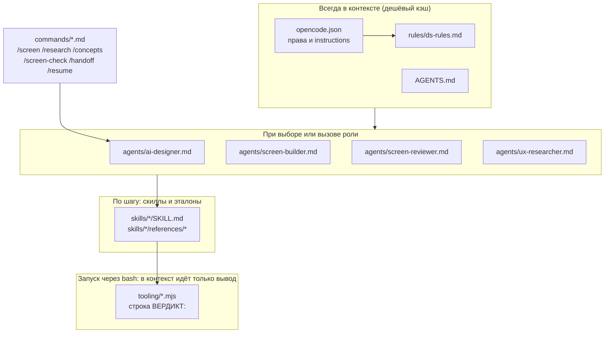

**Почему именно так.** Модели на рабочем контуре работают с ограниченным окном,
поэтому постоянный вход короткий, а тяжёлые детали лежат в скиллах. Правила
и скиллы — стабильный вход, который модель берёт из кэша. Поэтому
`ds-rules.md` §13 **запрещает урезать инструктаж ради экономии**. Экономить
нужно на выводе, на промахах кэша и на повторных чтениях больших файлов.

### 1.2. Карта файлов

```
.opencode/
├── opencode.json            конфиг: права, instructions → rules/ds-rules.md
├── README.md                инструкция для человека: запуск, модель, права, доработка
├── rules/ds-rules.md        правила ДС (всегда в контексте)
├── agents/
│   ├── ai-designer.md       primary: оркестратор, маршруты, разговор с человеком
│   ├── screen-builder.md    subagent: сборка экрана
│   ├── screen-reviewer.md   subagent: приёмка, ничего не правит
│   └── ux-researcher.md     subagent: выжимка из базы знаний продукта
├── commands/
│   ├── screen.md            /screen <ТЗ>
│   ├── research.md          /research <тема|ТЗ>
│   ├── concepts.md          /concepts <ТЗ>
│   ├── screen-check.md      /screen-check <экран> [ТЗ]
│   ├── handoff.md           /handoff [Задача]
│   └── resume.md            /resume <Задача>
└── skills/
    ├── session-plan/        смета окна, этапы, границы сессии   + tooling/ctx-budget.mjs, stages.json
    ├── ds-lookup/           как искать в ДС, не сжигая контекст
    ├── layout-composition/  композиция: колонки, поля, группировка   + references/{detail-view,forms,tables,dashboards}.md
    ├── concept-design/      шкала концептов A/B/C, [ПРЕДЛОЖЕНИЕ]
    ├── screen-assembly/     пошаговая сборка HTML   + references/{skeleton.html,patterns.md,runtime-hooks.md}
    ├── screen-spec/         формат <Имя>.screen.md   + references/template.md
    ├── screen-review/       чек-лист механики ДС   + references/lessons*.md, tooling/* (сенсор, гейт и др.)
    ├── composition-review/  чек-лист композиции (K1–K13)
    ├── lessons/             процедура самообучения   + references/lessons.md
    ├── knowledge-lookup/    база знаний продукта (пока заготовка)
    └── docs-split/          раскатка страниц документации ДС   + tooling/docs-split.mjs, references/*
```

---

## 2. Роли

| Агент | Режим | t° | Права на запись | Что делает | Чего не делает |
|---|---|---|---|---|---|
| **ai-designer** | `primary` | 0.2 | `Concepts/**` и `hub.js`, остальное с подтверждением. `webfetch`/`websearch` запрещены. `task` разрешён | говорит с человеком, задаёт вопросы, выбирает маршрут, пишет задания субагентам, собирает итог, ведёт `hub.js`, пишет уроки и handoff | не отменяет приёмку. Сам пишет экран только когда задача слишком мала для передачи |
| **screen-builder** | `subagent` | 0.1 | `Concepts/**`, остальное с подтверждением | собирает `<Имя>.html` и `<Имя>.screen.md` из компонентов ДС, проставляет хуки рантаймов, проверяет себя сенсором | не общается с человеком, не трогает файлы ДС, не расширяет объём, не пишет свой JS вместо рантайма |
| **screen-reviewer** | `subagent` | 0 | **никакой** (`edit: deny`) | прогоняет сенсор и два чек-листа, сверяет с ТЗ, выносит `PASS` / `NEEDS-WORK` с номерами строк и цитатами | ничего не правит и не предлагает улучшений сверх чек-листов |
| **ux-researcher** | `subagent` | 0.1 | **никакой** (`edit: deny`) | ищет в базе знаний роли, JTBD, ограничения и прошлые решения, у каждого утверждения указывает источник | не проектирует, не достраивает данные, не обобщает малые выборки |

Встроенные агенты `general` и `explore` тоже доступны ведущему для поиска по
репозиторию, когда своего агента под задачу нет.

Температура отражает роль: у приёмщика 0 (детерминированный вердикт), у
сборщика 0.1 (дословное копирование разметки), у оркестратора 0.2 (разговор и
формулировки).

### Главное ограничение субагентов

**Субагент не видит разговор с человеком.** Он получает только текст задания
и стартует с чистого контекста. Поэтому задание — самостоятельный документ, и
в нём всегда четыре части:

1. **Пути**: ТЗ, скриншот, папка результата, промежуточные результаты.
2. **Что уже решено**: ответы человека и выжимка исследования, текстом, а не
   «см. выше».
3. **Что нужно на выходе**: какие файлы и в каком формате.
4. **Чего не делать**: границы объёма.

Если субагент делает не то, почти всегда виновато задание, а не субагент
(README §6).

---

## 3. Как ведущий агент принимает решения

### 3.1. Дерево маршрутизации

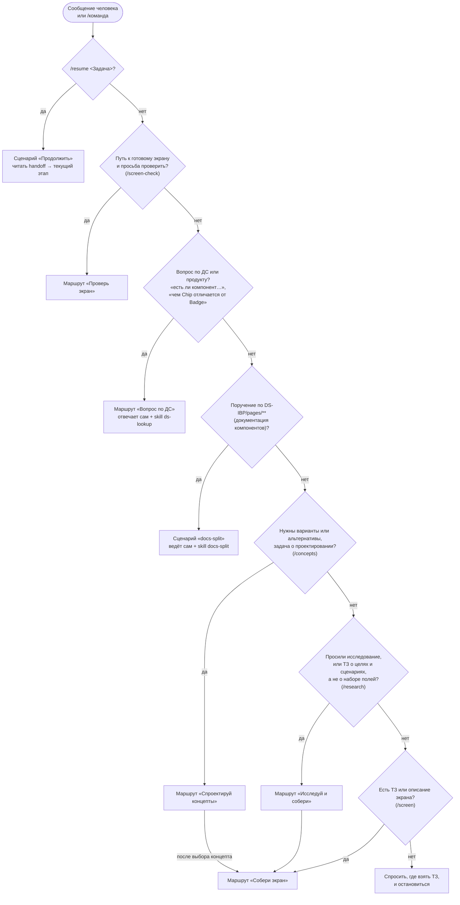

Команды — готовые входы в эти ветки. Все шесть команд исполняются агентом
`ai-designer` (`agent: ai-designer` в шапке).

### 3.2. Принципы выбора

| Принцип | Откуда | Что значит на практике |
|---|---|---|
| **Самый дешёвый исполнитель, который справится** | ai-designer.md | вопрос по ДС ведущий решает сам, субагент дороже и медленнее. Большую сборку отдаёт субагенту |
| **Вопросы задаёт только ведущий** | ai-designer.md, screen-builder.md | у субагентов нет доступа к человеку. Неясности идут одним списком **до** задания. Субагент возвращает допущения и вопросы в отчёте |
| **Приёмка не отменяется никогда** | ai-designer.md | первая приёмка всегда полная, повторная идёт по уровню (§5) |
| **Смета до первого задания** | session-plan | узнать на середине сборки, что заход не влезает, значит заплатить за половину работы дважды |
| **Нет в ДС, значит стоп** | ds-rules §4, §7 | нет компонента или токена: вопрос, а не импровизация. Исключение только в фазе концептов (B/C) с пометкой `[ПРЕДЛОЖЕНИЕ]` |
| **Доменный факт не придумывается** | ds-rules §7, concept-design, screen-spec | смысл поля, статуса или связи уходит в «Открытые вопросы», даже в концепте C |
| **Демо-данные — «рыба»** | screen-builder, composition-review | значения придумываются без вопросов. Проверяется только форма: формат, длина, единообразие |
| **Допущения называются явно** | ai-designer.md «Как отчитываешься» | молча решить спорный вопрос за человека — худшее, что может сделать агент |
| **Сессия закрывается на границе этапа** | session-plan, ds-rules §13 | не «пока влезает». Состояние переносится файлом handoff |

### 3.3. Формат ответа человеку

Каждый ответ ведущего строится так:

1. **Что сделано**: конкретно, с путями.
2. **Что нужно от вас**: вопросы и решения за человеком.
3. **Следующий шаг**.

Плюс явный список принятых допущений. Когда задача закрыта, последней строкой
идёт путь к handoff.

---

## 4. Маршруты подробно

### 4.1. «Собери экран» (`/screen <ТЗ>`) — основной

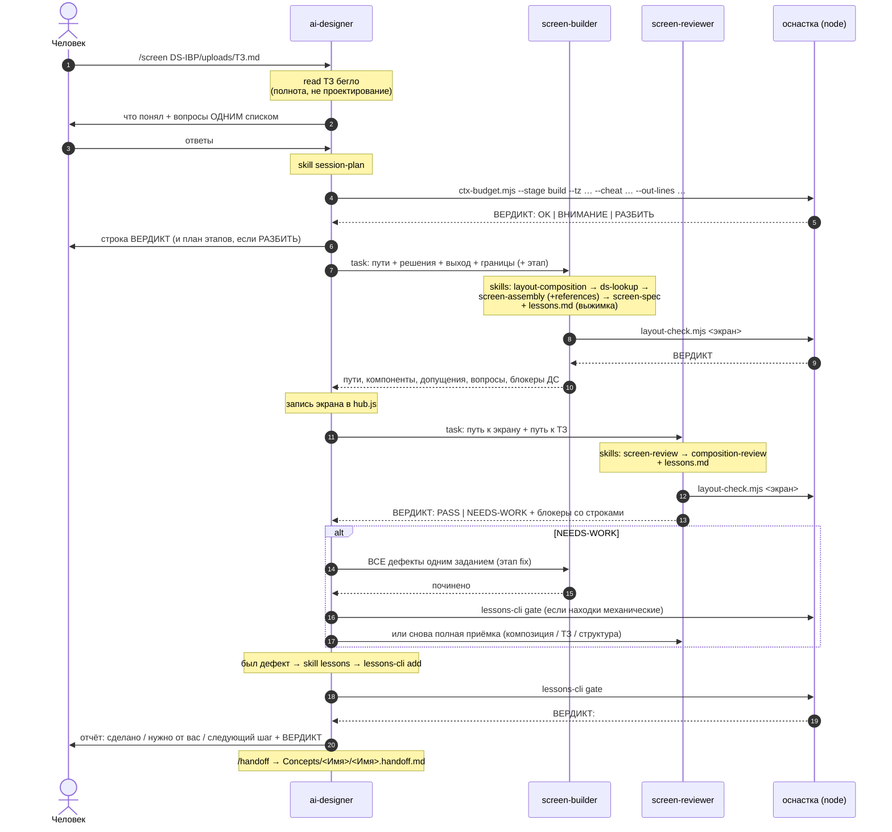

Шаги по `ai-designer.md`:

1. Прочитать ТЗ бегло: понять полноту, а не спроектировать.
2. Выписать человеку, что понял, и задать вопросы **одним списком**.
3. Посчитать смету (`session-plan`). `OK` ведёт на короткий маршрут,
   `РАЗБИТЬ` на длинный: план этапов пишется в handoff, по одному этапу за
   сессию.
4. Задание `screen-builder`. На длинном маршруте в задании только текущий
   этап.
5. Задание `screen-reviewer`: полная приёмка по обоим чек-листам и сверка с ТЗ.
6. `NEEDS-WORK`: все блокеры уходят одним заданием, затем повторная приёмка
   по уровню (§5). После трёх кругов без `PASS` работа останавливается, и
   ведущий показывает человеку, на чём застряли.
7. `PASS`: отчёт, урок (если что-то чинилось), `lessons-cli gate`, handoff.

### 4.2. «Исследуй и собери» (`/research`)

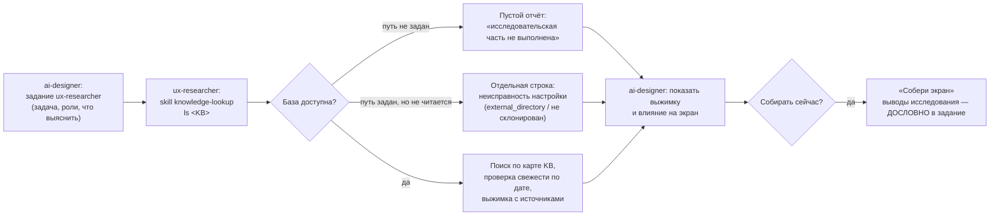

Правила исследователя: у каждого утверждения есть ссылка на файл. Не нашёл —
значит строка в разделе «Чего в базе знаний нет». Никаких процентов и
«большинства» при выборке 1–5 человек. Факт и гипотеза помечаются отдельно.
**Пустой результат считается нормальным результатом**: он показывает, где
нужны интервью.

> Сейчас в `knowledge-lookup/SKILL.md` стоит `KB = <путь не задан>`, а
> `external_directory` в конфиге пуст. Маршрут всегда вернёт честный пустой
> отчёт, пока базу знаний не подключат (README §6).

### 4.3. «Спроектируй концепты» (`/concepts`)

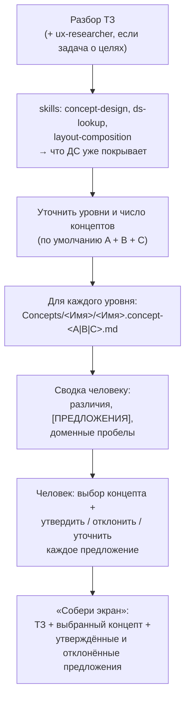

Шкала из `concept-design`:

| Уровень | Разрешено | Запрещено |
|---|---|---|
| **A. Консервативный** | только существующее в ДС, дословно | любое изобретение, даже с пометкой |
| **B. Сбалансированный** | минимальные расширения: новая компоновка, вариант, состояние, семантика токена | новые компоненты и паттерны целиком |
| **C. Концептуальный** | новые компоненты, паттерны, приёмы | ничего, но доменные факты всё равно не придумываются |

Выход за ДС помечается дважды: инлайн `[ПРЕДЛОЖЕНИЕ]` и строкой в секции
«Предложения к расширению ДС». На этой фазе HTML не собирается. В сборке
концепт C становится строгим: ДС плюс утверждённые предложения, без новых
изобретений.

### 4.4. «Проверь экран» (`/screen-check <экран> [ТЗ]`)

Задание сразу уходит `screen-reviewer`, ведущий сам ничего не правит и
пересказывает вердикт. Если вердикт `NEEDS-WORK`, ведущий спрашивает, чинить
ли. Если найденное починили, заход закрывается уроком (`lessons`), затем
`lessons-cli add`, `check` (должен дать БЛОКЕР 0), `state`.

### 4.5. «Вопрос по ДС или продукту»

Ведущий отвечает сам: грузит `ds-lookup` и находит ответ точечными командами
(оглавление чит-шита, блок компонента, `_index.md`, спека). Субагент не
нужен.

### 4.6. Сценарий «страницы документации» (docs-split)

Касается `DS-IBP/pages/**`, то есть не `Concepts/` и не `Projects/`. Файлы ДС
правятся **только по явному поручению** человека. Ведёт сам ведущий, потому что
у страниц нет `.screen.md` и через `screen-builder` они не идут:

```
docs-split.mjs map → ручная структура по references/skeleton.md
                   → docs-split.mjs inject <page>   (CSS вставляет скрипт, модель его не читает)
                   → docs-split.mjs check <page>    (ВЕРДИКТ: OK)
                   → приёмка screen-reviewer
```

Живость страницы в браузере (табы, TOC, конструктор) проверяет только
человек: браузер по скрипту в контуре запрещён (ds-rules §9).

### 4.7. «Продолжить задачу» (`/handoff` и `/resume`)

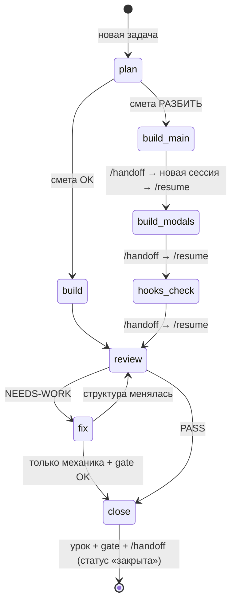

`/resume <Задача>`:

1. Прочитать `Concepts/<Задача>/<Задача>.handoff.md`. Файла нет — перечислить
   все handoff со статусами и спросить.
2. Прочитать **только** файлы из раздела «Читать первыми».
3. Взять текущий этап (`→`) и загрузить инструктаж **только этого этапа**
   (состав печатает `ctx-budget.mjs --stages`).
4. Пересчитать смету теми же аргументами. `РАЗБИТЬ` — не начинать, а
   предложить дробить дальше.
5. Если файлы могли измениться: `lessons-cli gate --dry`.
6. Ответить: где остановились, смета, открытые вопросы, с чего начать. Ждать
   подтверждения. Уже принятые решения не пересматривать.

Handoff ограничен 80 строками и содержит только факты: цель, этапы со
статусами (ровно один `→`), аргументы сметы, решения с автором («пользователь»,
«по правилу ДС» или «допущение агента»), что сделано, `ВЕРДИКТ:` проверок,
открытые вопросы, следующий шаг, что читать первым.

---

## 5. Цикл приёмки

Приёмка двухслойная, потому что механически чистый экран может быть плохо
скомпонован.

| Слой | Скилл | Что ловит | Коды |
|---|---|---|---|
| Сенсор (без браузера) | `layout-check.mjs` | часть механики и геометрии, с номерами строк. Состав печатает `--rules` | Б…, З…, K… |
| Механика ДС | `screen-review` | подключения, токены, иконки, классы, каркас, хуки, суммы колонок, заглушки, каскад CSS, полнота ТЗ | Б1–Б33, З1–З11, К1–К14 |
| Композиция | `composition-review` | пустоты, ширины тайлов, колонки полей, длинные поля, сопоставимость соседей, режим чтения или ввода, иерархия, добавленные сущности | K1–K13 |
| Уроки | `screen-review/references/lessons.md` | накопленные правила, которые не закрыты кодом, применяются как блокеры | Л… |

Порядок работы приёмщика: скилл `screen-review` → экран целиком (единственный
файл, который читается целиком) → сенсор → grep-проверки того, что сенсор не
покрыл → созависимость TableFilter и модалки `.tfm` → `*.page.js` (прежде чем
объявлять кнопку «мёртвой») → каскад CSS и порядок скриптов → блокеры →
`composition-review` → `<Имя>.screen.md` → сверка с ТЗ.

**Доказательность.** Каждая претензия подтверждается номером строки и цитатой.
«Выглядит неправильно» дефектом не считается. Претензия по композиции
содержит имя блока и число полей или колонок. Класс «сторож промолчал» идёт в
отчёт как дефект инструмента, а не как «сборщик невнимателен».

**Старшинство правил композиции:** K6 > K1 > K5 (ровный ряд важнее идеально
набитого тайла). Отклонение, обоснованное в `screen.md` правдиво, понижается
до замечания и не переоткрывается каждый прогон.

### Повторная приёмка по уровню

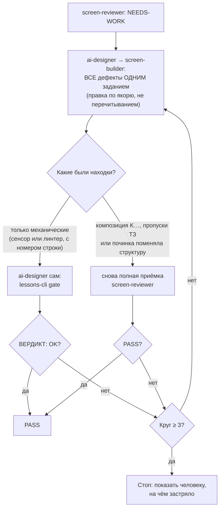

---

## 6. Бюджет контекста: смета, этапы, сессии

### 6.1. Зачем

Окно рабочей модели около **250 000 токенов на сессию**, вход и выход вместе.
Замер на экране в 1486 строк: сборка, приёмка, правки и урок в одной сессии
съели 220–235 тыс. Ещё один круг правок с перечитыванием экрана, и заход
погибает, а всё, что не записано в файл, теряется.

Пороги (`stages.json`): потолок 250 000, резерв 20 % (рабочий потолок
200 000), `ВНИМАНИЕ` начинается со 150 000.

### 6.2. Смета

```bash
node .opencode/skills/session-plan/tooling/ctx-budget.mjs --stage build \
  --tz "<ТЗ>" --cheat Table,TableCell,TableFilter,Modal --out-lines 900
```

Скрипт сам меряет блоки чит-шита (238 КБ): в контекст агента они не попадают
ни одним токеном. Ориентиры `--out-lines`: карточка или форма 300–500 строк,
реестр с тулбаром 600–900, реестр с модалкой фильтра 1200–1600.

| Вердикт | Что делает агент |
|---|---|
| `OK` | короткий маршрут |
| `ВНИМАНИЕ` | влезает без запаса: сузить вход, приёмку обязательно в отдельной сессии |
| `РАЗБИТЬ` | длинный маршрут, смета каждого подэтапа отдельно |

### 6.3. Маршруты и паспорт этапов

Короткий: `plan → build → review → close`. Экран до ~800 строк.
Длинный: `plan → build-main → build-modals → hooks-check → review → fix → close`.

Какие файлы грузит каждый этап (печатает `ctx-budget.mjs --stages`, числа —
оценка токенов):

| Этап | Роль | Что делает | Инструктаж (скиллы и эталоны) |
|---|---|---|---|
| **plan** | ai-designer | разбор ТЗ, вопросы, смета, выбор маршрута, план в handoff | ai-designer.md · **session-plan** · **ds-lookup** · **layout-composition** (≈14 тыс.) |
| **build** | screen-builder | экран целиком | screen-builder.md · **layout-composition** · **ds-lookup** · **screen-assembly** + patterns + skeleton + runtime-hooks · **screen-spec** + template · lessons.md (≈38,5 тыс.) |
| **build-main** | screen-builder | каркас, крошки, PageHeader, основной блок, разделы спеки 1–6 | то же, что build, без runtime-hooks (≈35 тыс.) |
| **build-modals** | screen-builder | модалки и вторичные блоки по якорю `#sec:modals`, разделы спеки 7–13 | screen-builder.md · patterns · template · lessons.md (≈20 тыс.) |
| **hooks-check** | screen-builder | хуки рантаймов, сенсор, починка своего | screen-builder.md · runtime-hooks · lessons.md (≈16 тыс.) |
| **review** | screen-reviewer | полная приёмка | screen-reviewer.md · **screen-review** · **composition-review** · lessons.md (≈24,5 тыс.) |
| **fix** | screen-builder | починка по отчёту, только секции с дефектами | screen-builder.md · lessons.md (≈12,5 тыс.) |
| **close** | ai-designer | урок, `lessons-cli gate`, handoff | **lessons** (≈8 тыс.) |

Постоянный вход каждой сессии (`AGENTS.md` + `ds-rules.md`) — около 12 тыс.
токенов. Промежуточный `FAIL` сенсора между этапами ожидаем: триггер модалки
уже стоит, а самой модалки ещё нет. Сенсор гоняется в конце `hooks-check`.

### 6.4. Правила экономии, которые влияют на поведение

- **Экран целиком не перечитывается.** Правка идёт так: `grep -n` по якорю
  (`#sec:head`, `#sec:content`, `#sec:modals`), затем `read` 20–40 строк и
  точечная правка. Замер: три круга правок стоят 20 900 токенов по якорю
  против 96 700 с перечитыванием.
- **Спека пишется по разделам следом за разметкой**, а не в конце.
- **В спеке нет журнала правок** (блокер Б32): история живёт в git.
- **Большие файлы ДС читаются только точечно**: `icons-data.js` не открывается
  никогда, `_cheatsheet.md` читается по блоку, `pages/**` не читаются.
- **Проверки запускаются одной командой в конце захода** (`lessons-cli gate`),
  а во время работы — точечно.
- **Экономия — средство, а не цель**: «Сэкономил токены и ошибся — задача
  экономии НЕ выполнена» (`ds-lookup`). Спеку читать, если есть сомнение.
- **Калибровка — долг**: `ctx-budget.mjs --calibrate --fact <токенов>`
  сверяет смету с фактом. Пока замеров нет, `gate` и `state` об этом напоминают.

---

## 7. Скиллы: зачем каждый и кто его грузит

### 7.1. Каталог

| Скилл | Зачем существует | Кто грузит | Когда | Что внутри / оснастка |
|---|---|---|---|---|
| **session-plan** | уложить заход в окно: смета до старта, короткий или длинный маршрут, граница сессии, handoff | ai-designer | начало любой крупной задачи, `/resume` | `tooling/ctx-budget.mjs` (`--stage`, `--stages`, `--calibrate`, `--selftest`), `stages.json` (паспорт и коэффициенты), `calibration.jsonl` |
| **ds-lookup** | найти компонент, разметку, токены и иконки, не читая большие файлы. Порядок старшинства **CSS → спека → чит-шит** | ai-designer (plan, вопрос по ДС, концепты), screen-builder (шаг 2) | до выбора компонентов | три команды поиска, триггеры обязательного чтения полной спеки, словарь «частой путаницы в именах» |
| **layout-composition** | решить композицию **до** вёрстки: режим экрана, класс поля, колонки полей, ширина тайла, группировка, порядок блоков | ai-designer (plan, концепты), screen-builder (шаг 1.5) | сразу после разбора ТЗ, до компонентов | формулы (`floor((ширина−40)/240)`, максимум 4), таблицы ширин, профили `references/{detail-view,forms,tables,dashboards}.md` |
| **concept-design** | сравнивать подходы: шкала A/B/C, честная маркировка выхода за ДС | ai-designer | маршрут «Спроектируй концепты» | формат `<Имя>.concept-<A\|B\|C>.md`, правило передачи в сборку |
| **screen-assembly** | собрать HTML по шагам: каркас, крошки, PageHeader, сетка, тайлы, таблицы, модалки, контент, интерактив | screen-builder (шаги 3–4) | перед записью HTML | `references/skeleton.html` (каркас с якорями), `patterns.md` (рецепты), `runtime-hooks.md` (какие `data-*` оживляют компоненты) |
| **screen-spec** | описать экран **данными** для агента-разработчика | screen-builder (шаг 5) | по разделам, следом за разметкой | `references/template.md` (13 разделов: назначение … открытые вопросы) |
| **screen-review** | чек-лист механики ДС и точка входа во всю оснастку проверки | screen-reviewer, screen-builder (самопроверка) | после сборки, при приёмке | блокеры Б, замечания З, каскад К; `tooling/`: сенсор, `lessons-cli`, фикстуры, реестры; `references/lessons.md` (выжимка) и `lessons-raw.md` (архив) |
| **composition-review** | гейт «хорошо ли скомпоновано», независимый от механики | screen-reviewer, screen-builder (самопроверка) | после `screen-review` | K1–K13, старшинство K6 > K1 > K5, принятые отклонения, «что дефектом не является» |
| **lessons** | единственный владелец процедуры самообучения | ai-designer (close), screen-reviewer (формулирует урок в отчёте) | в заходе что-то сломалось и починилось; при курации | формат записи, три уровня закрепления, доказательство откатом, `stats`, команды `lessons-cli` |
| **knowledge-lookup** | путь к базе знаний продукта, карта папок, правила источников | ux-researcher | первым делом в исследовании | переменная `KB` (пока не задана), инструкция подключения, требования к файлам базы |
| **docs-split** | раскатка страниц документации ДС на паттерн «сплиттер + табы» | ai-designer | только по поручению про `DS-IBP/pages/**` | `tooling/docs-split.mjs` (`map`/`inject`/`check`), `references/{pages-index,skeleton,lessons}.md` |

### 7.2. Порядок скиллов внутри сборки (`screen-builder`)

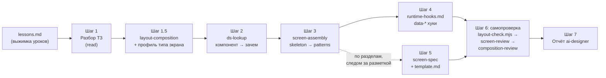

**Почему композиция идёт раньше компонентов.** Переставлять тайлы в готовой
разметке дороже, чем спланировать. Сначала решается «сколько колонок и что
рядом», потом «каким компонентом».

**Как сборщик решает вопросы вёрстки** (главное правило `screen-builder.md`):

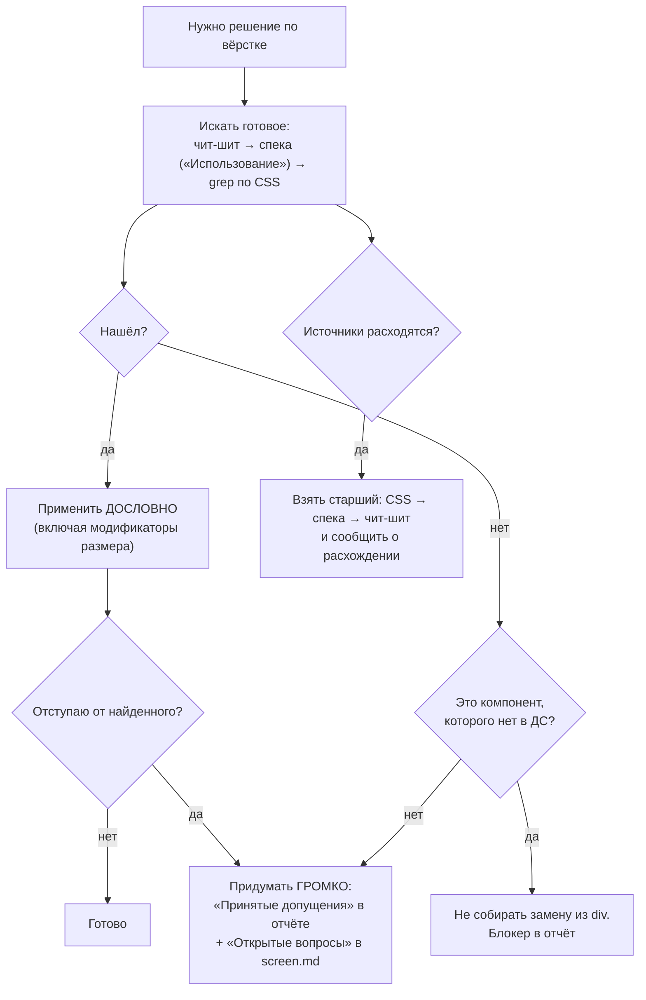

### 7.3. Матрица «скилл × этап»

| Скилл \ этап | plan | build / build-main | build-modals | hooks-check | review | fix | close | концепты | вопрос по ДС | docs-split | исследование |
|---|---|---|---|---|---|---|---|---|---|---|---|
| session-plan | ● | | | | | | | | | | |
| ds-lookup | ● | ● | | | | | | ● | ● | | |
| layout-composition | ● | ● | | | | | | ● | | | |
| concept-design | | | | | | | | ● | | | |
| screen-assembly | | ● | ○ patterns | ○ hooks | | | | | | | |
| screen-spec | | ● | ○ template | | | | | | | | |
| screen-review | | ○ самопроверка | | ○ сенсор | ● | ○ | | | | ○ приёмка | |
| composition-review | | ○ самопроверка | | | ● | | | | | | |
| lessons (процедура) | | | | | ○ формат урока | | ● | | | | |
| lessons.md (выжимка) | | ● | ● | ● | ● | ● | | | | | |
| knowledge-lookup | | | | | | | | ○ | | | ● |
| docs-split | | | | | | | | | | ● | |

● обязательно по паспорту или маршруту · ○ частично (reference, самопроверка
или по ситуации)

---

## 8. Оснастка (tooling)

Всё запускается из корня репозитория. Скрипты написаны на чистом Node, без
браузера. **Истина — строка `ВЕРДИКТ:`, а не код выхода** (ds-rules §8):
подстановки и пайпы перезаписывают `$?`.

| Инструмент | Путь | Что делает |
|---|---|---|
| **layout-check** (сенсор) | `screen-review/tooling/layout-check.mjs` | статическая замена скриншотной проверки: механика (Б) и геометрия (K) из токенов `styles/*.css` и эвристики ширины символа. `--rules` печатает состав, `--etalons` проверяет эталоны каркаса |
| **lessons-cli** | `screen-review/tooling/lessons-cli.mjs` | `gate` (итоговая проверка захода), `add`, `check`, `anchors`, `verify`, `coverage`, `state`, `stats` |
| **ctx-budget** | `session-plan/tooling/ctx-budget.mjs` | смета окна, паспорт этапов, калибровка, самотест |
| **docs-split** | `docs-split/tooling/docs-split.mjs` | `map` / `inject` / `check` для страниц документации |
| **projects-hub** | `screen-review/tooling/projects-hub.mjs` | сторож реестра `hub.js`: поля, иконки, пути, полнота (каждый `.html` в `Concepts/` и `Projects/` зарегистрирован), ссылка на хаб (П1–П5) |
| **agent-config** | `screen-review/tooling/agent-config.mjs` | ровно один конфиг `.opencode/opencode.json`, в корне конфига нет, ключей модели нет (КФ1–КФ3) |
| **vendor-scan** | `screen-review/tooling/vendor-scan.mjs` | нейтральность репозитория: без имён вендоров и моделей, служебных каталогов посторонних инструментов, абсолютных путей автора |
| **runlog** | `screen-review/tooling/runlog.mjs` | модуль: пишет строку в `runs.jsonl` на каждый прогон сенсора, линтера и аудита на настоящем файле (фикстуры не пишутся) |
| **fragments** | `screen-review/tooling/fragments.mjs` | модуль: отличает фрагмент (`<ds-include src>`) от экрана, чтобы не было ложных блокеров |

Данные: `anchors.json` (реестр живых идентификаторов сторожей), `coverage.json`
(чем закрыт каждый пункт чек-листов), `gate-snapshot.json` (отпечатки файлов
для инкрементального гейта), `runs.jsonl` (журнал прогонов), `fixtures/`
(пары `_base.ok.html` / `<ID>.bad.html` для доказательства откатом).

### 8.1. Что делает `lessons-cli gate`

Одна команда в конце захода заменяет серию отдельных прогонов. По снимку
`gate-snapshot.json` она запускает **только сторожей изменившегося**
(`--full` запускает всё, `--dry` показывает шаги).

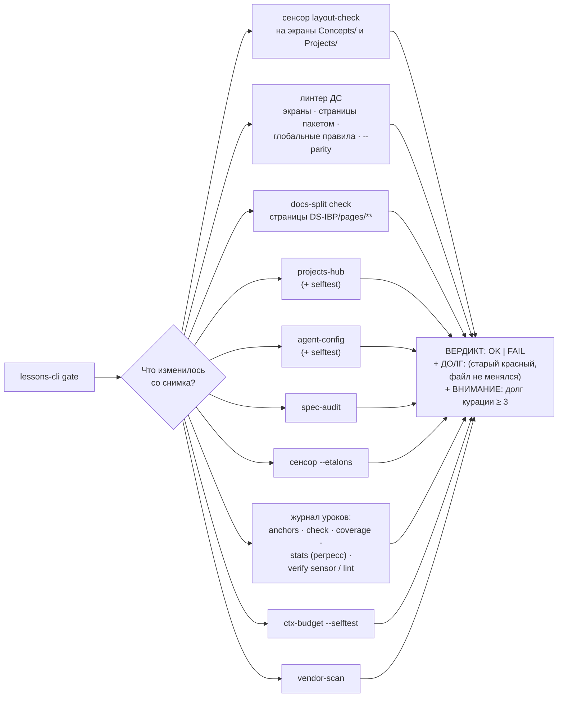

Упавший шаг, чей файл с тех пор не менялся, идёт строкой `ДОЛГ:` и не
краснит вердикт. Иначе старый красный экран краснил бы каждый гейт, и `FAIL`
перестал бы что-то значить.

---

## 9. Самообучение: урок → закрепление → доказательство

Журнал уроков существует, чтобы **один и тот же дефект не повторялся**, а не
для истории. Поэтому проверяется не факт записи, а факт закрепления, и
закрепление доказывается прогоном.

### 9.1. Два файла

| Файл | Что это | Кто читает |
|---|---|---|
| `screen-review/references/lessons-raw.md` | архив, только дописывается, полная история | никто при работе, только курация |
| `screen-review/references/lessons.md` | кураторская выжимка, предел 20 записей и 150 строк | все роли перед сборкой и приёмкой |

Отдельные выжимки по теме: `docs-split/references/lessons.md` (раскатка) и
`lessons/references/lessons.md` (как писать сторожей).

### 9.2. Процесс

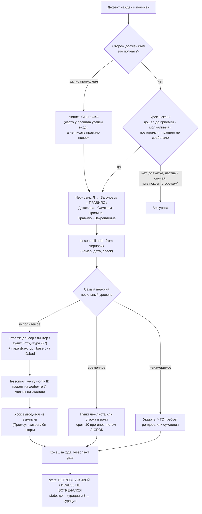

Ключевые правила:

- **Якорь пишется с пространством имён**: `сенсор:Б9`, `линтер:B9`,
  `чек-лист:К3`, `аудит:4`, `структурно:`. Латинская B и кириллическая Б
  выглядят одинаково, поэтому `check` ловит `Л-АЛФАВИТ`.
- **Один владелец у каждого правила.** Процедура описана только в скилле
  `lessons`, остальные файлы на неё ссылаются. Пересказ ловится находкой
  `Л-ВЛАДЕЛЕЦ`. Состав сторожей тоже не пересказывается прозой, его печатают
  сами инструменты (`--rules`, `--stages`).
- **Курацию запускает событие, а не календарь**: долг курации ≥ 3 по
  `lessons-cli state`. У агента нет часов и памяти между сессиями.
- **`stats` смотрит, что случилось после закрепления**, по журналу
  `runs.jsonl`. `РЕГРЕСС` означает, что код дефекта появился уже после дня
  закрепления.
- Роли распределены так: **ревьюер** описывает новый дефект форматом урока и
  предлагает уровень, **ведущий** дописывает урок в архив и решает уровень
  закрепления.

---

## 10. Сквозные принципы

1. **Основа — ДС, выход за неё всегда виден.** Молчаливое изобретение считается
   дефектом, даже если результат выглядит лучше.
2. **Не выдумывать данные и домен.** Догадка, записанная как факт, уедет в
   разработку требованием. Неизвестное становится вопросом или «Открытым
   вопросом», и помечается «допущение агента».
3. **Старший источник побеждает**: CSS компонента → полная спека → чит-шит.
   О расхождении нужно сообщить.
4. **Правило без реализации — дефект** (Л42). Прежде чем полагаться на
   поведение «из коробки», агент проверяет `grep` по `scripts/ds-*`.
5. **Один владелец правила** (Л43). Копия прозой разъезжается с оригиналом,
   поэтому состав проверок печатают инструменты.
6. **Что нельзя измерить, делается структурно невозможным.** Браузера нет,
   значит нужны маркировочные правила (скролл-контейнер
   `flex:1;min-height:0;overflow-y:auto`, никаких фиксированных ширин, зазоры
   только компонентами).
7. **Доказательство вместо утверждения**: дефект с номером строки и цитатой,
   закрепление с фикстурой, проверка по строке `ВЕРДИКТ:`.
8. **Макет живой, но без своего JS.** Поведение дают хуки рантаймов ДС
   (`data-table`, `data-modal`, `data-tabs`…). Данные (фильтрация, пагинация,
   сохранение) описываются словами в `screen.md`.
9. **Границы записи**: агенты пишут в `Concepts/<Имя>/` и `hub.js`. Файлы ДС
   трогаются только по явному поручению, в `Projects/` переносит человек,
   `DS-IBP/uploads/` не трогается.
10. **Контекст — ресурс, но корректность важнее.** Сессия равна этапу,
    состояние хранится в файлах, а не в истории.

---

## 11. Артефакты на выходе

| Файл | Кто пишет | Для кого | Формат |
|---|---|---|---|
| `Concepts/<Имя>/<Имя>.html` | screen-builder | человек (двойной клик), разработчик | один самодостаточный HTML: только `../../DS-IBP/ds.css` + `../../DS-IBP/scripts/ds.js`, токены, `<i data-icon>`, хуки рантаймов, якоря `#sec:*` |
| `Concepts/<Имя>/<Имя>.screen.md` | screen-builder | агент-разработчик | YAML-шапка + 13 разделов таблицами. «Открытые вопросы» есть всегда, журнала правок нет |
| `Concepts/<Имя>/<Имя>.concept-<A\|B\|C>.md` | ai-designer | человек, затем screen-builder | таблицы: суть, состав, компоненты, предложения, открытые вопросы |
| `Concepts/<Задача>/<Задача>.handoff.md` | ai-designer | следующая сессия | до 80 строк: этапы, смета, решения, проверки, следующий шаг |
| запись в `hub.js` | ai-designer | хаб `index.html` | `group: 'concepts'`, `root: 'Concepts/<Имя>'`. Без неё гейт красный (П4) |
| урок в `lessons-raw.md` | ai-designer через `lessons-cli add` | курация, сторожа | Л-запись с полем «Закрепление» |

---

## 12. Наблюдения: расхождения и слабые места

Замечено при разборе. Это не часть процесса, а список на доработку.

| # | Что | Где | Последствие |
|---|---|---|---|
| 1 | **Глобальные права шире, чем описано в README.** В `opencode.json`: `edit: {"*": "allow"}`, `bash: {"*": "allow"}` (кроме `rm`, `git push`, `git reset`), `webfetch: allow`, `websearch: allow`. README §5 обещает запись только в `Concepts/**`, выключенный `webfetch` и «безопасные команды без подтверждения, остальные спрашивают». Сужение есть только во frontmatter четырёх своих агентов | `opencode.json` ↔ README §5 | встроенные `general` / `explore`, которых ведущий может вызвать, работают с глобальными правами: могут править файлы ДС и ходить в сеть. Любая shell-команда проходит без подтверждения |
| 2 | **У скилла `docs-split` нет `name` и `description` во frontmatter** (там `belongs_to` / `purpose` / `checked`). README §6 сам говорит, что без `name`, совпадающего с именем папки, скилл не подхватывается | `skills/docs-split/SKILL.md` | скилл, скорее всего, не виден в `/skills` и не грузится инструментом `skill`, только чтением файла по пути |
| 3 | «Три маршрута» в README §1 против шести сценариев в `ai-designer.md` (плюс «Спроектируй концепты», «Вопрос по ДС», docs-split) | README §1 | README неполон как карта поведения |
| 4 | В шаге 6 `screen-builder.md` написано «два гейта», а перечислено три пункта (сенсор, `screen-review`, `composition-review`) | `agents/screen-builder.md` | мелкая неточность формулировки |
| 5 | Два стартовых шаблона: сборка копирует `screen-assembly/references/skeleton.html`, а блокер Б22 и §12 `screen-assembly` ссылаются на `DS-IBP/templates/screen/Screen.html` | `screen-assembly/SKILL.md`, `screen-review/SKILL.md` | неясно, какой эталон главный. Правка одного может не дойти до другого (тот же класс, что с бургером в эталоне) |
| 6 | База знаний не подключена: `KB = <путь не задан>`, `external_directory: {}` | `knowledge-lookup`, `opencode.json` | маршрут «Исследуй и собери» пока всегда возвращает пустой отчёт |
| 7 | Смета не откалибрована: `calibration.jsonl` пуст (`lessons-cli state`: «замеров 0») | `session-plan/tooling` | вердикты `OK` / `РАЗБИТЬ` опираются на оценочные коэффициенты |
| 8 | Правила пишут о PowerShell и `%TEMP%` (ds-rules §8), а команды в скиллах — bash (`grep`, `sed -n`) | `ds-rules.md` §8 ↔ скиллы | на Windows без bash-утилит часть команд из скиллов не сработает. Предусмотрен только запасной вариант `read` с `offset` вместо `sed` |
