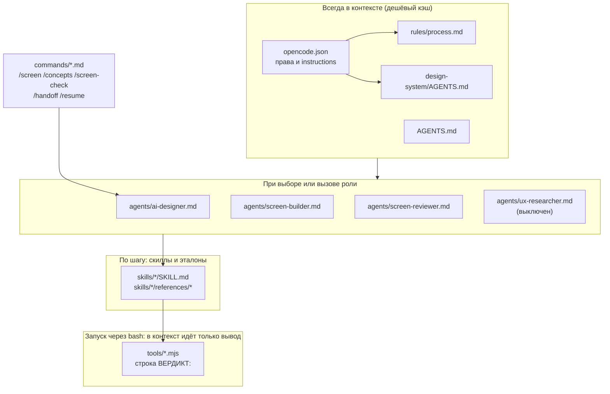
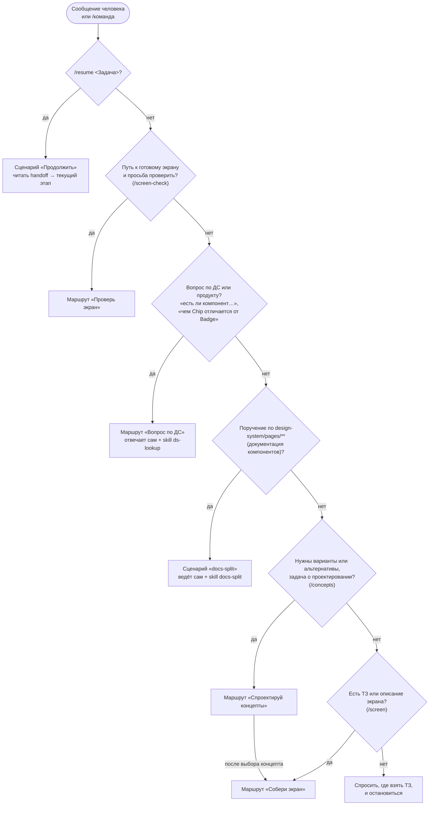
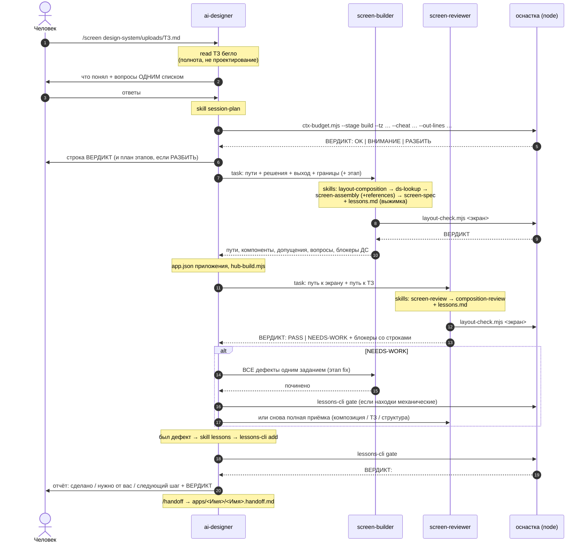
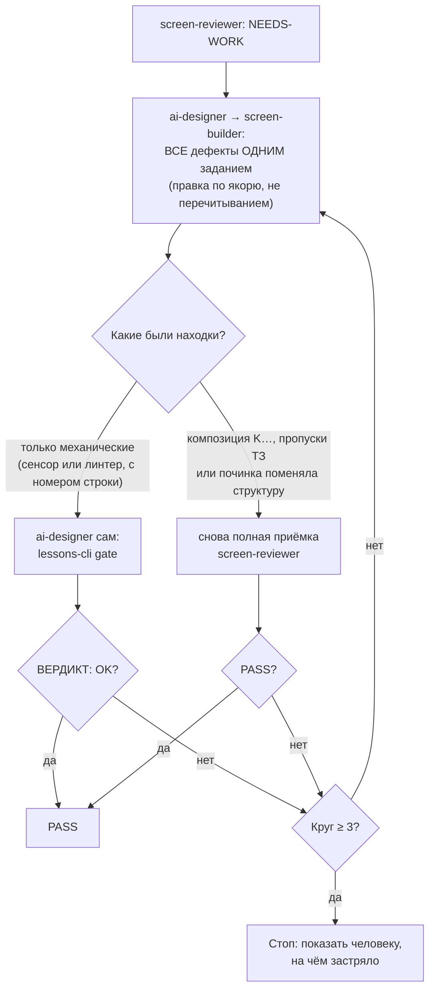

# Как работает агент `ai-designer`

Карта обвязки в `.agents/` и её адаптера `.opencode/`: из каких слоёв она состоит, как ведущий агент
выбирает маршрут, в каком порядке идут сборка и приёмка. Правила, составы
проверок и процедуры здесь **не пересказываются**: у каждого есть владелец, и
ниже стоит указатель на него — копия прозой расходится с оригиналом на первой
же правке. Источник истины — файлы обвязки; при расхождении верить файлам.
История решений — `docs/agent-imp.md` и `docs/restructure-3-repos.md` (журналы
исполнения в конце обоих).

---

## 0. Коротко

- Задача агента: превратить ТЗ в экран на дизайн-системе IBP. На выходе
  `apps/<Имя>/pages/<Имя>.html` (живой HTML-макет) и `<Имя>.screen.md`
  (спецификация для агента-разработчика) в приложении трека `rnd`, плюс
  `app.json` приложения и пересобранный реестр хаба `hub.js`.
- Человек выбирает одного агента, **`ai-designer`**. Это оркестратор: он
  разговаривает с человеком, выбирает маршрут и раздаёт задания субагентам
  `screen-builder` и `screen-reviewer`. Третья роль, `ux-researcher`,
  выключена, пока не подключена база знаний продукта (§6).
- Знания разложены по слоям по стоимости контекста. Правила
  (`process.md`) лежат в контексте всегда. Роль агента грузится, когда его
  выбрали или вызвали. **Скилл** агент подгружает сам, когда доходит до
  нужного шага.
- В работе три обязательных механизма:
  1. **Приёмка обязательна всегда**: отдельный агент-приёмщик, два чек-листа,
     статический сенсор.
  2. **Смета контекста считается до старта**: окно около 250 000 токенов,
     большой экран делится на этапы, между сессиями состояние переносит файл
     handoff.
  3. **Самообучение**: каждый починенный дефект становится уроком, урок
     закрепляется сторожем, закрепление доказывается откатом (скилл `lessons`).
- Сквозной принцип: **не выдумывать**. Нет компонента, токена или доменного
  факта — стоп и вопрос человеку. Своё решение допустимо только там, где у ДС
  нет ответа, и только с явной пометкой.

---

## 1. Слои

| Слой | Файлы | Когда попадает в контекст | Назначение |
|---|---|---|---|
| Конфиг | `.opencode/opencode.json` | при старте opencode | права и подключение правил через `instructions`. Модель не задана: она в глобальном конфиге машины. Фактические права — README §5 |
| Адаптер ролей и команд | `.opencode/agents/*.md`, `.opencode/commands/*.md` | при выборе агента или команды | указатели на файлы харнеса; в шапке — режим, температура и права роли, у команды — роль-исполнитель. Сходимость с харнесом — гейт, `agent-config` КФ5 |
| Корневые правила | `AGENTS.md` | при старте, всегда | вход: где харнес, ДС и манифест, одна команда проверки. Открытый формат, его читают и другие агентные CLI |
| Правила процесса | `.agents/rules/process.md` | **всегда, во всех агентах** | проект, границы записи, работа с файлами, проверки, экономия контекста, самообучение |
| Правила ДС | `design-system/AGENTS.md` | **всегда, во всех агентах** | карта ДС, запреты, каркас экрана, каталог компонентов, чем проверять ДС |
| Манифест проекта | `project.json` | чтением, когда нужен путь | где ДС, харнес, адаптер, приложения и их треки, загрузчик, состояние гейта (§1.1) |
| Агенты (роли) | `.agents/agents/*.md` | первым чтением по указателю из адаптера | роль и порядок работы |
| Команды | `.agents/commands/*.md` | чтением по указателю, когда человек пишет `/команда` | готовый вход в маршрут, исполняет `ai-designer` |
| Скиллы | `.agents/skills/<имя>/SKILL.md` + `references/` | **по решению агента**, на нужном шаге | пошаговые инструкции, эталоны, чек-листы |
| Оснастка | `.agents/tools/*.mjs` + данные, `.agents/skills/*/tooling/*.mjs` | запуск через `bash`, в контекст идёт только вывод | сенсор, гейт, сторожа, журнал прогонов; у скиллов — смета и раскатка docs-split |



**Почему именно так.** Модели на рабочем контуре работают с ограниченным окном,
поэтому постоянный вход короткий, а тяжёлые детали лежат в скиллах. Правила и
скиллы — стабильный вход, который модель берёт из кэша, поэтому `process.md`
§13 запрещает урезать инструктаж ради экономии: экономить нужно на выводе, на
промахах кэша и на повторных чтениях больших файлов.

### 1.1 Структура проекта

Три части в одном репозитории, каждая — в своём каталоге (реструктуризация
21–22.09.2026; разводка по отдельным репозиториям — шаги Ш12–Ш13 плана, ждут
решения владельца). Работают они только друг с другом (решение Р8).

| Часть | Где | Кто знает путь |
|---|---|---|
| Дизайн-система | `design-system/` | `project.json → designSystem.mount`; экраны — через загрузчик `boot/` |
| Харнес агента | `.agents/` (вход — `.agents/AGENTS.md`) | `project.json → agentKit.mount`, оснастка — `agentKit.tools` |
| Адаптер opencode | `.opencode/` | `project.json → agentKit.adapter` |
| Приложения | `apps/<id>/` — `app.json` (трек и запись хаба), экраны в `pages/`, `components/`, `data/`, `refs/` | `project.json → apps`, форма — `appShape` |
| Загрузчик ДС | `boot/ds-head.js`, `boot/ds-body.js` — **единственное место в экранах, где записан путь до ДС**; генерируется | `project.json → boot` |
| Реестр хаба | `hub.js` — генерируется из `app.json`, страница хаба `index.html` не правится | `project.json → hub` |
| Состояние гейта | `.agent-state/` — журнал прогонов и снимок, вне git | `project.json → state` |

Контрактов два: `project.json` (контракт 1, сверяет `manifest-check.mjs`) и
`app.json` приложения (сверяет `registry-check.mjs`, собирает `hub-build.mjs`).
Перенос ДС — правка `designSystem.mount` и `boot-build.mjs`: ни один экран не
трогается.

**Карта файлов** — не таблицей, а командой (таблица устаревала с каждым новым
файлом):

```bash
find .agents .opencode boot -name node_modules -prune -o -type f -print | sort
grep -h "^description:" .agents/skills/*/SKILL.md   # что делает каждый скилл
```

---

## 2. Роли и главное ограничение субагентов

Роль, порядок работы и сужение прав каждого агента — в шапке и теле
`.agents/agents/<роль>.md`; фактические права всех слоёв, включая
встроенных помощников `general` и `explore`, — README §5.

### Главное ограничение субагентов

**Субагент не видит разговор с человеком.** Он получает только текст задания
и стартует с чистого контекста. Поэтому задание — самостоятельный документ, и
в нём всегда четыре части:

1. **Пути**: ТЗ, скриншот, папка результата, промежуточные результаты.
2. **Что уже решено**: ответы человека текстом, а не «см. выше».
3. **Что нужно на выходе**: какие файлы и в каком формате.
4. **Чего не делать**: границы объёма.

Если субагент делает не то, почти всегда виновато задание, а не субагент.
Встроенному помощнику задание пишется так же, и в нём прямо сказано «ничего не
менять»: права у помощников общие, они могут править файлы ДС (README §5).

---

## 3. Дерево маршрутизации



Команды — готовые входы в эти ветки, все исполняются агентом `ai-designer`.
Ветки «Исследуй и собери» нет с 21.09.2026: базы знаний не было, и ветка
всегда возвращала пустой отчёт (§6). Просьба об исследовании — ответ «базы
знаний нет» и работа по ТЗ; вопросы о пользователях — человеку.

Где что описано:

| Что | Владелец |
|---|---|
| шаги каждого маршрута, формат ответа человеку, границы | `agents/ai-designer.md` |
| шкала концептов A/B/C и пометка `[ПРЕДЛОЖЕНИЕ]` | скилл `concept-design` |
| раскатка страниц документации | скилл `docs-split` |
| перенос задачи между сессиями | `commands/handoff.md`, `commands/resume.md` |
| этапы короткого и длинного маршрута, инструктаж каждого этапа | `ctx-budget.mjs --stages` (паспорт `stages.json`) |
| порядок скиллов внутри сборки и решение вопросов вёрстки | `agents/screen-builder.md` |

---

## 4. Последовательность сборки («Собери экран», `/screen <ТЗ>`)



На длинном маршруте (смета `РАЗБИТЬ`) сборка идёт этапами, по одному этапу за
сессию, с handoff между ними; состав этапов печатает `ctx-budget.mjs --stages`.

---

## 5. Цикл приёмки

Приёмка двухслойная, потому что механически чистый экран может быть плохо
скомпонован.

| Слой | Владелец | Что ловит |
|---|---|---|
| Сенсор (без браузера) | `layout-check.mjs` — состав печатает `--rules` | часть механики и геометрии, с номерами строк |
| Механика ДС | скилл `screen-review` (чек-лист Б, З, К) | подключения, токены, иконки, классы, каркас, хуки, заглушки, каскад CSS, полнота ТЗ |
| Композиция | скилл `composition-review` (чек-лист K) | пустоты, ширины тайлов, колонки полей, иерархия |
| Уроки | `screen-review/references/lessons.md` | правила, ещё не закрытые кодом |

Каждая претензия подтверждается номером строки и цитатой; «выглядит
неправильно» дефектом не считается. Какие пункты чек-листов закрыты сторожем,
какие признаны суждением — печатает `lessons-cli coverage`. Лист-документ без
каркаса приложения объявляет в шапке спеки `kind: document` — сенсор не требует
от него каркаса (скилл `screen-spec`, пункт про YAML-шапку).

### Повторная приёмка по уровню



Развилку задают две роли вместе: `ai-designer.md` (шаг «Вердикт NEEDS-WORK»)
и `screen-reviewer.md`.

---

## 6. Состояние обвязки после работ 21–22.09.2026

Итоги задач `docs/agent-imp.md` и `docs/restructure-3-repos.md` (журналы
исполнения — там же). Подробности — у владельцев; здесь только то, что меняет
картину выше.

| Что | Состояние | Владелец |
|---|---|---|
| Исследование (`/research`, `ux-researcher`, `knowledge-lookup`) | выключено: базы знаний нет. Роль и скилл оставлены с пометкой, включаются, когда задан `KB` | приложение скилла `knowledge-lookup` |
| Смета контекста | решено калибровать: три замера на настоящих заходах сборки экрана. Пока их нет, гейт печатает `ВНИМАНИЕ: калибровка сметы: ДОЛГ` | скилл `session-plan`, `ctx-budget.mjs --calibration-state` |
| Права | конфиг не сужали; README описывает фактические права, в том числе то, что встроенные помощники могут править файлы ДС | README §5 |
| Вид файла `kind: document` | лист-документ без каркаса приложения: Б5 и К12 не применяются, Б6 — ровно один h1 | `layout-check.mjs` (`kindOf`), скилл `screen-spec` |
| Журнал прогонов и снимок гейта | каталог состояния `.agent-state/` (`project.json` → `state`), вне git: `runs/` — файл на прогон, хранятся последние 2000 строк; `gate-snapshot.json` — отпечатки для гейта | шапка `runlog.mjs` |
| Предел выжимок уроков | превышение — блокер `check` (находка `Л-ПРЕДЕЛ`) | скилл `lessons` |
| Нейтральность | абсолютный путь ловится в posix- и windows-форме, есть селфтест | шапка `vendor-scan.mjs` |
| Обход сторожей | `check` и гейт видят `docs/` и все корневые правила агентных CLI; правка спеки экрана перепроверяет сам экран | `lessons-cli.mjs` (`OWNER_ROOTS`, матрица гейта) |
| Видимость скиллов | у каждого скилла `description`, `name` совпадает с папкой — проверяет гейт | `agent-config.mjs`, КФ4 |
| Адаптер CLI | указатели сходятся с ролями и командами харнеса (КФ5), пути `instructions` живые (КФ6), приложения трека `product` агент правит только с подтверждением (КФ7) | `agent-config.mjs` |
| Приложения и хаб | трек — поле `app.json`; экраны прямо в `pages/` (П6), ссылки страниц живые (П7); `hub.js` собирается из `app.json` | `registry-check.mjs`, `hub-build.mjs` |
| Путь до ДС | только `project.json` и сгенерированный `boot/`; литерал каталога ДС в экране — блокер сенсора Б34 | `boot-build.mjs`, `layout-check.mjs` |

Что осталось по реструктуризации: разводка трёх каталогов по отдельным
репозиториям и проверка после неё (шаги Ш12–Ш13) — только после «да»
владельца и ответов на вопросы §12 плана. Универсальность харнеса (Ш14) снята
решением Р8.

---

## 7. Указатели вместо пересказа

| Что | Где смотреть |
|---|---|
| Состав гейта для любого набора изменений | `lessons-cli.mjs gate --dry --changed <путь,…>`; полный — `gate --full --dry` |
| Структура проекта и её сверка с диском | `project.json`; `manifest-check.mjs` |
| Загрузчик ДС, реестр хаба | `boot-build.mjs`, `hub-build.mjs` — оба с `--check` |
| Адаптер CLI, приложения и возврат на хаб | `agent-config.mjs` (КФ1–КФ7), `registry-check.mjs` (П1–П7) |
| Реализованные проверки сенсора | `layout-check.mjs --rules` |
| Подкоманды оснастки уроков | `node .agents/tools/lessons-cli.mjs` без аргументов |
| Паспорт этапов, коэффициенты, пороги окна | `ctx-budget.mjs --stages` |
| Самообучение: формат урока, уровни закрепления, доказательство откатом, курация | скилл `lessons` — единственный владелец процедуры |
| Состояние журнала уроков, долг курации, давность ритуальных прогонов | `lessons-cli.mjs state` |
| Что случилось после закрепления (регресс, живые и исчезнувшие коды) | `lessons-cli.mjs stats` |
| Сквозные принципы: чтение ДС, запреты, не выдумывать неизвестное, вердикт строкой, граница статики, экономия контекста | `process.md` §3, §4, §7, §8, §9, §13; границы записи — `process.md` §4–§5 и `ai-designer.md` («Границы») |
| Формат спеки экрана и выходные артефакты | скилл `screen-spec` + `references/template.md`; handoff — `commands/handoff.md` |
