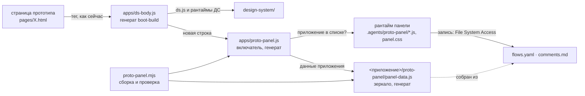

# Панель прототипа: сценарии показа и комментарии

## Коротко

- **Что.** Служебная панель поверх прототипов из `apps/`: на любой странице
  прототипа `Alt+Shift+P` → справа выезжает шторка (Drawer ДС, базово 595 px,
  ширина тянется за край, клик мимо закрывает) → в шапке имя приложения
  (`ai-bankster-prototype-v02`) → табы **«Сценарии»** и **«Комментарии»**;
  табы расширяемые — дальше добавятся другие. На самой странице по умолчанию
  ничего служебного нет; белая кнопка с шестерёнкой справа внизу включается в
  настройках панели.
- **Сценарии.** Сценарии показа, у каждого — шаги блок-схемой. Клик по шагу
  приводит прототип в состояние этого шага: открывает нужную страницу и
  проигрывает действия (клики, ввод) до нужного места. Для показа — мини-плеер
  `‹ 3 / 8 ›` в правом нижнем углу (отключается в настройках) и
  `Alt+Shift+→ / ←`.
- **Комментарии.** Правки к прототипу с привязкой к странице и шагу, статусы
  «открыт / сделан / отклонён». Агент берёт открытые комментарии в работу и
  закрывает их с записью решения.
- **Где лежат данные.** Рядом с прототипом, в папке приложения:
  `<приложение>/proto-panel/flows.yaml` (сценарии), `comments.md`
  (комментарии), `panel-data.js` (генерат: страница по `file://` не может
  прочитать YAML и MD, поэтому читает их JS-зеркало).
- **Как устроено.** Не расширение браузера и не копии кода по папкам. Один
  общий рантайм в харнесе `.agents/proto-panel/`; его подключает существующий
  загрузчик `apps/ds-body.js`, прототипы не правятся. **Включатель — наличие
  папки `proto-panel/` у приложения**: папка есть — панель есть, папки нет —
  страница работает как сейчас. Папку заводит агент ai-designer по ответу
  «да» на вопрос «включить панель?».
- **Запись на диск.** Из браузера — через File System Access API: папка
  проекта подключается один раз. Нет API или доступа — комментарий остаётся
  черновиком в браузере, его можно скачать файлом `comments.md`.
- **Оснастка.** `node .agents/tools/proto-panel.mjs` собирает зеркала,
  проверяет форматы, страницы и селекторы (коды ПН), включает панель, выводит
  и закрывает комментарии. Проверку гоняет новый шаг гейта `panel`.
- **Пилот** — `apps/ib/drafts/ai-bankster-prototype-v02`, сценарий «Отчёт из
  конструктора»: главная → новый чат → конструктор → заполнение → ожидание →
  отчёт готов → просмотр в split view → выгрузка.

## Objective

Дизайнер показывает прототип, собранный агентом, и не проходит пользовательский
путь руками при каждом показе. Он открывает панель, видит путь блок-схемой,
кликает шаг, и прототип оказывается в нужном состоянии. Здесь же он записывает
правки к прототипу. Сценарии и комментарии лежат файлами рядом с прототипом,
их читают и правят и человек, и агент. Панель — служебный инструмент проекта,
не часть продукта: в разработку она не передаётся, в спеках экранов не
описывается, прототипы ради неё не меняются.

## 1. Контекст

**Как сейчас.** Прототип — набор самодостаточных `.html` в `pages/`
приложения, открывается двойным кликом (`file://`). Состояние экрана задают
три вещи:

1. адрес: страница и параметры (`RequestThread.html?id=1` — готовый запрос из
   истории, `?run=1` — сразу ход подготовки, `?builder=1` — конструктор);
2. действия пользователя: клики, ввод, выбор;
3. таймеры экранного скрипта: ответ через 500 мс, анимации.

Чтобы на показе дойти до «материал открыт в split view», дизайнер каждый раз
проходит путь целиком: главная → плитка «AI Pitcher» → «Конструктор» → поиск
объекта → выбор фокусов → отправка → клик по индикатору подготовки →
«Просмотр». Это долго, и на показе легко ошибиться.

**Пример пути из пилота** (механика сверена с кодом
`apps/ib/drafts/ai-bankster-prototype-v02/pages/RequestThread.html`):

| Шаг                   | Как достигается сейчас                                                                                                                                                  |
| --------------------- | ----------------------------------------------------------------------------------------------------------------------------------------------------------------------- |
| Главная               | `pages/index.html`, плитка «AI Pitcher» ведёт на `RequestThread.html`                                                                                                   |
| Новый чат             | `RequestThread.html` без параметров — пустая нить (`S.pristine`)                                                                                                        |
| Открыть конструктор   | кнопка `#btnBuilder` → `setBuilder(true)`, панель `#cmpDrawer` получает `.is-open`                                                                                      |
| Заполнить конструктор | поиск `#bldFind` (событие `input` → `drawObjects`), объект `[data-obj="sah"]`, фокусы `[data-focus="debt"]`, `[data-focus="ideas"]` — фрагменты попадают в поле запроса |
| Ожидание отчёта       | `#btnSend` → `send()` → через 500 мс `startRun()`, индикатор подготовки `[data-act="finish"]`                                                                           |
| Отчёт готов           | клик по индикатору → `finishRun()`: карточка материала `.doc` в нити и уведомление «Материал готов»                                                                     |
| Просмотр в split view | `.doc .btn[data-act="open"]` → `openPreview()`: панель `#pv` справа, во фрейме `MaterialReport.html`                                                                    |
| Выгрузка              | в шапке `#pv` кнопка `[data-menu="doc-menu"]` → меню `#doc-menu` получает `.is-open`: детальный PDF/Word, краткий PDF (скачивает `refs/report-example-for-test.pdf`)    |

**Что важно для решения:**

- страницы грузят ДС двумя тегами загрузчика: `apps/ds-config.js` первым в
  `<head>` и `apps/ds-body.js` вместо `ds.js`. Оба файла генерирует
  `boot-build.mjs`. Все страницы приложений (и хаб) подключают `ds-body.js`,
  фрагменты виджетов — нет;
- по `file://` не работают `fetch`/XHR, ES-модули и доступ к документу во
  фрейме. Данные странице доступны только обычным `<script>`;
- в приложении разрешены только папки `pages/`, `widgets/`, `data/`, `refs/`
  (сторож хаба, П6), любой `.html` вне `pages/` и `widgets/` — дефект;
- генераты (`hub.js`, загрузчик, деревья README) руками не правятся: гейт
  сверяет их с генератором;
- в репозитории нельзя: абсолютные пути с машины автора, имена вендоров и
  моделей (сторож `vendor-scan`), своё поверх ДС без записи в открытые вопросы.

## 2. Решение и почему так

### 2.1 Варианты

| Вариант                                            | Плюсы                                                                                                                                                                | Минусы                                                                                                                                                                                                                                                                                                                       | Итог                     |
| -------------------------------------------------- | -------------------------------------------------------------------------------------------------------------------------------------------------------------------- | ---------------------------------------------------------------------------------------------------------------------------------------------------------------------------------------------------------------------------------------------------------------------------------------------------------------------------- | ------------------------ |
| **Расширение браузера**                            | прототипы не трогает, работает на любой странице                                                                                                                     | ставится в корпоративный браузер через политику ИБ, у коллег его нет. Писать на диск умеет только в «Загрузки» (или нужен нативный хост — ещё одна установка). Код живёт вне репозитория и вне гейта. Агент не может включить или выключить его для прототипа. Папку страницы оно «найдёт» не лучше скрипта в самой странице | нет                      |
| **Копия модуля в папку прототипа** (исходная идея) | «положил — работает»                                                                                                                                                 | N копий кода расходятся, обновление — правка всех копий. Папка вне формы приложения (П6). Странице нужен свой тег; удалили папку — тег ведёт в пустоту, в консоли 404, сторож П7 красный                                                                                                                                     | нет                      |
| **Общий рантайм + папка-включатель у приложения**  | один код, обновляется у всех сразу. Прототипы не правятся. Включение — папка с данными, как в исходной идее, только без кода. Данные рядом с прототипом и под гейтом | для записи на диск браузер просит разрешение на папку проекта — один раз                                                                                                                                                                                                                                                     | **да**                   |
| **Локальный сервер с записью**                     | запись без разрешений, в любом браузере                                                                                                                              | прототип открывается не двойным кликом, перед показом надо запускать процесс                                                                                                                                                                                                                                                 | план Б, вне задачи (§14) |

### 2.2 Выбранная схема



- **Код один** — `.agents/proto-panel/`. Это служебный модуль агента, как и
  остальная оснастка: он в харнесе, под гейтом и под `vendor-scan`. Копий
  кода по приложениям нет.
- **Включатель** `apps/proto-panel.js` генерирует `proto-panel.mjs`: в нём
  список приложений, у которых есть папка `proto-panel/`. Файл есть всегда
  (при нуле приложений список пустой), поэтому тег на него не даёт 404.
- **Данные** — в папке приложения `proto-panel/`. По `file://` страница
  читает их JS-зеркало `panel-data.js`, запись идёт в `comments.md` и в
  зеркало.
- **Как панель «находит папку страницы».** Включатель вычисляет приложение по
  адресу страницы (часть пути до `/pages/`). Читать данные он может сразу — по
  относительному адресу зеркала. Для записи браузеру нужно разрешение на
  папку: пользователь один раз выбирает корень проекта, дальше панель сама
  спускается в `apps/<приложение>/proto-panel/`.
- **Включение агентом.** Вопрос «включить панель прототипа?» — в общем списке
  вопросов при создании прототипа. «Да» → `proto-panel.mjs --enable <app>`
  (заготовка папки), после приёмки экранов — сценарии в `flows.yaml`. Копировать
  код не нужно.

### 2.3 Решения (согласованы с человеком 24.09.2026)

1. Папка данных — `proto-panel/` в корне приложения; рантайм —
   `.agents/proto-panel/`; включатель — `apps/proto-panel.js`.
2. Включатель — наличие папки: отдельного флага в `app.json` нет (один
   источник правды).
3. Сценарии — отдельный файл `proto-panel/flows.yaml`. Из предложенных
   форматов (md, yaml, plantuml) выбран YAML: у шага есть действия с
   селекторами и параметрами, им нужна строгая структура. PlantUML описывает
   картинку, а не действия; в md пришлось бы придумывать свою разметку и
   разбирать её. В панели сценарии только читаются, пишет их агент (или
   человек руками). Выгрузка сценария в PlantUML — в §14.
4. Комментарии — отдельный файл `proto-panel/comments.md`, номера `К-N`,
   статусы «открыт / сделан / отклонён», удаление — из файла (история в git).
5. **Доступ к файлам.** Страница в браузере не может писать на диск сама:
   браузер разрешает запись только в папку, которую человек выбрал своими
   руками. Поэтому при первом сохранении комментария браузер открывает окно
   выбора папки, и там выбирается папка проекта целиком — та, где лежат
   `apps/` и `project.json`. Это делается один раз: дальше панель сама
   находит папку нужного прототипа и сохраняет комментарии любого прототипа
   проекта. В новой сессии браузер может переспросить разрешение — одна кнопка
   «Разрешить». Можно выбрать и папку одного прототипа, тогда разрешение
   будет только на него.
6. Шторка — базово 595 px (`drawer--w4`), ширина тянется за левый край и
   запоминается, двойной клик по краю возвращает 595. Закрывается кликом вне
   шторки, Esc и крестиком; при переходе к шагу закрывается сама.
7. Панель открывается `Alt+Shift+P` на любой странице прототипа — и когда
   фокус в поле ввода, и когда он во фрейме превью. Кнопки на странице по
   умолчанию нет: её можно включить в настройках панели. Шаги сценария
   листаются мини-плеером и `Alt+Shift+→ / ←`. Отдельных клавиш «спрятать
   кнопку» и кликера нет.
8. В этой задаче панель включается только у `ai-bankster-prototype-v02`;
   остальным — `/panel <app>` по просьбе.

## 3. Что входит, что не входит

**Входит:**

- рантайм панели: горячие клавиши, шторка с изменяемой шириной, табы, User
  Flows, проигрыватель сценариев, мини-плеер, комментарии, хранение,
  настройки, кнопка по настройке;
- форматы `flows.yaml`, `comments.md`, `panel-data.js`, включатель;
- инструмент `proto-panel.mjs` с селфтестом, шаг гейта, правки сторожей и
  генераторов (манифест, загрузчик, сторож хаба, README модулей, перенос
  концепта);
- агентская часть: скилл `proto-panel`, команда `/panel`, вопрос да/нет в
  маршруте ai-designer, маршрут «Правки по комментариям», документация;
- пилот: панель у `ai-bankster-prototype-v02`, два сценария.

**Не входит (§14):** запись сценария кликами и правка шагов в панели,
комментарий-булавка на элементе, схема на весь экран с ветвлениями,
локальный сервер, действия внутри фреймов, скриншоты шагов, панель у других
приложений (включается по просьбе командой `/panel`).

## 4. Файлы

| Путь                                                             | Что                                                                                                                                                                 | Кто пишет                                                                                 |
| ---------------------------------------------------------------- | ------------------------------------------------------------------------------------------------------------------------------------------------------------------- | ----------------------------------------------------------------------------------------- |
| `project.json` → `protoPanel`                                    | `{ "runtime": ".agents/proto-panel", "boot": "apps/proto-panel.js", "dir": "proto-panel" }`                                                                         | руками, один раз                                                                          |
| `.agents/proto-panel/README.md`                                  | **владелец описания панели**: назначение, устройство, форматы, хранение, браузеры, горячие клавиши, ограничения, коды ПН, свои блоки поверх ДС                      | руками                                                                                    |
| `.agents/proto-panel/core.js`                                    | общее ядро без DOM: подмножество YAML, схема сценариев, разбор и запись `comments.md`, генерат зеркала, хеш, разбор селекторов. Один файл для браузера и Node (UMD) | руками                                                                                    |
| `.agents/proto-panel/store.js`                                   | хранение: зеркало, подключение папки, запись со слиянием, черновики, скачивание                                                                                     | руками                                                                                    |
| `.agents/proto-panel/runner.js`                                  | проигрыватель сценариев: переходы, действия, ожидания, продолжение после перезагрузки, ссылки на шаг                                                                | руками                                                                                    |
| `.agents/proto-panel/ui.js`                                      | горячие клавиши (и их пересылка из фрейма), шторка с ручкой ширины, реестр табов, мини-плеер, кнопка по настройке, настройки                                        | руками                                                                                    |
| `.agents/proto-panel/tab-flows.js`                               | таб «Сценарии»                                                                                                                                                    | руками                                                                                    |
| `.agents/proto-panel/tab-comments.js`                            | таб «Комментарии»                                                                                                                                                   | руками                                                                                    |
| `.agents/proto-panel/panel.js`                                   | старт панели и публичный API `window.ProtoPanel`                                                                                                                    | руками                                                                                    |
| `.agents/proto-panel/panel.css`                                  | стили своих блоков, только токены ДС, только селекторы `pp-`                                                                                                        | руками                                                                                    |
| `.agents/tools/proto-panel.mjs`                                  | сборка, проверка, включение, выключение, список и закрытие комментариев, селфтест                                                                                   | руками                                                                                    |
| `apps/proto-panel.js`                                            | включатель: список приложений с панелью, путь до рантайма, порядок файлов                                                                                           | **генерат** `proto-panel.mjs`                                                             |
| `apps/ds-body.js`                                                | плюс одна строка: подключить включатель                                                                                                                             | **генерат** `boot-build.mjs`                                                              |
| `<приложение>/proto-panel/flows.yaml`                            | сценарии показа                                                                                                                                                     | агент (человек может править)                                                             |
| `<приложение>/proto-panel/comments.md`                           | комментарии                                                                                                                                                         | панель и агент (человек может править)                                                    |
| `<приложение>/proto-panel/panel-data.js`                         | зеркало двух файлов выше для `file://`                                                                                                                              | **генерат**: `proto-panel.mjs` или панель при сохранении — одним и тем же кодом `core.js` |
| `.agents/skills/proto-panel/SKILL.md`                            | процедура агента: включение, сценарии, комментарии, проверка                                                                                                        | руками                                                                                    |
| `.agents/commands/panel.md` + запись в `.opencode/opencode.json` | команда `/panel`                                                                                                                                                    | руками                                                                                    |

Все файлы — UTF-8, переводы строк LF, по-русски в комментариях; без
абсолютных путей и имён вендоров.

## 5. Как панель попадает на страницу

### 5.1 Загрузчик (`boot-build.mjs` → `apps/ds-body.js`)

Если в манифесте объявлен `protoPanel.boot`, генератор добавляет в конец
функции `ds-body.js`, после цикла тегов ДС, строку:

```js
if (me && me.src)
  document.write(
    "<scr" +
      'ipt src="' +
      new URL("proto-panel.js", me.src).href +
      '"><\/scr' +
      "ipt>",
  );
```

Путь `proto-panel.js` — от `boot.dir` до `protoPanel.boot`, считает
генератор. Порядок разбора: `ds.js` → рантаймы ДС (их дописывает `ds.js`) →
доп. скрипты `data-ds` → включатель → файлы панели → экранный скрипт
страницы. Без `protoPanel` в манифесте строки нет (обратная совместимость,
кейс селфтеста).

### 5.2 Включатель (`apps/proto-panel.js`, генерат)

Образец того, что пишет генератор (список и путь — из диска и манифеста):

```js
/* СГЕНЕРИРОВАН proto-panel.mjs — руками не править; пересобрать:
   node .agents/tools/proto-panel.mjs (гейт сверяет, шаг panel).
   Включатель панели прототипа: ds-body.js подключает его на каждой странице.
   Панель есть только у приложений из списка — у них есть папка proto-panel/;
   на остальных страницах и на хабе файл ничего не делает, во фрейме
   только пересылает горячие клавиши панели наверх. */
(function () {
  var APPS = ["ib/drafts/ai-bankster-prototype-v02"];
  var RUNTIME = "../.agents/proto-panel/";
  var FILES = [
    "core.js",
    "store.js",
    "runner.js",
    "ui.js",
    "tab-flows.js",
    "tab-comments.js",
    "panel.js",
  ];
  var KEYS = ["KeyP", "ArrowRight", "ArrowLeft"]; // из core.HOTKEYS — одна константа на панель и включатель
  var me = document.currentScript;
  if (!me || !me.src) return;
  var apps = new URL("./", me.src);
  var here = decodeURIComponent(location.pathname),
    base = decodeURIComponent(apps.pathname);
  if (here.indexOf(base) !== 0) return; // хаб и всё вне apps/
  var rel = here.slice(base.length),
    cut = rel.lastIndexOf("/pages/");
  if (cut < 0) return;
  var app = rel.slice(0, cut);
  if (APPS.indexOf(app) < 0) return; // приложение без панели
  if (window.top !== window.self) {
    // превью во фрейме (MaterialReport в #pv): своей панели нет,
    document.addEventListener(
      "keydown",
      function (e) {
        // но её клавиши работают и отсюда
        if (!e.altKey || !e.shiftKey || KEYS.indexOf(e.code) < 0) return;
        e.preventDefault();
        e.stopPropagation();
        window.top.postMessage(
          { source: "proto-panel", type: "key", code: e.code },
          "*",
        );
      },
      true,
    );
    return;
  }
  var rt = new URL(RUNTIME, apps).href;
  var appUrl = new URL(
    app.split("/").map(encodeURIComponent).join("/") + "/",
    apps,
  ).href;
  window.__PROTO_PANEL = {
    app: app,
    appUrl: appUrl,
    pagesUrl: appUrl + "pages/",
    runtimeUrl: rt,
  };
  document.write('<link rel="stylesheet" href="' + rt + 'panel.css">');
  document.write(
    "<scr" +
      'ipt src="' +
      appUrl +
      'proto-panel/panel-data.js"><\/scr' +
      "ipt>",
  );
  for (var i = 0; i < FILES.length; i++)
    document.write("<scr" + 'ipt src="' + rt + FILES[i] + '"><\/scr' + "ipt>");
})();
```

Требования:

- **Во фрейме — без панели, но с клавишами.** Материал в split view —
  `MaterialReport.html` того же приложения во фрейме `#pv`. Без проверки
  `top` во фрейме появилась бы вторая панель. А без пересылки `Alt+Shift+P`
  не срабатывал бы, пока фокус во фрейме: события клавиатуры фрейма до
  страницы не доходят. Страница принимает сообщение только от своего
  дочернего фрейма (`e.source` — один из `window.frames`); `postMessage`
  работает и по `file://` — так уже устроен обмен `MaterialReport.html` с
  нитью;
- пробелы и кириллица в пути (`%20`, `%D0…`) — сравнение по декодированным путям;
- **правильность генерата доказывается исполнением** (урок Л128): селфтест
  выполняет включатель в `vm` с поддельными `document.currentScript`,
  `location`, `window.top`, `document.write` и `addEventListener` и сверяет,
  что записано и что навешено: страница приложения с панелью (теги),
  приложения без панели (ничего), фрейм приложения с панелью (только
  слушатель клавиш), хаб (ничего), путь с пробелом и кириллицей (теги).

### 5.3 Старт рантайма

- Файлы рантайма — **обычные скрипты**, без ES-модулей (по `file://` модули
  не грузятся) и без сборки. Язык — современный JS (`async/await`, `const`).
  `core.js` в браузере кладёт ядро в `window.ProtoPanelCore`, в Node отдаёт
  его через `module.exports`. В нём же константа `HOTKEYS` (модификаторы
  Alt+Shift, `KeyP`, `ArrowRight`, `ArrowLeft`) — одна на рантайм и
  включатель. Остальные файлы — IIFE, каждый кладёт свою
  часть во внутреннее пространство `window.ProtoPanel._*`; `panel.js`
  собирает публичный API (§13).
- На верхнем уровне файлы ничего не рисуют. `panel.js` ждёт
  `DOMContentLoaded`: экранный скрипт страницы к этому моменту отработал,
  разметка и рантаймы ДС готовы.
- Нет `window.ProtoPanelData` (зеркало не загрузилось) — кнопка всё равно
  рисуется, у неё отметка ошибки, а в шторке — Alert «Нет данных панели:
  пересоберите `node .agents/tools/proto-panel.mjs`».
- Сценарии рантайм читает прямо из `window.ProtoPanelData`, без копии:
  подмена шага в консоли действует до перезагрузки — так проверяются ошибки
  проигрывателя (§12.3, п. 9). Комментарии после записи на диск панель
  заменяет в этом же объекте.
- После вставки своей разметки панель оживляет её рантаймами ДС:
  `dsIcons.apply(root)`, `DSTooltip.bindAll(root)`, `DSMenu.bindAll(root)`,
  `DSDrawer.bindAll(root)`, `DSModal.bindAll(root)`, `DSInput.bindAll(root)`,
  `DSTabs.tabs(el, { onChange })`, `DSTabs.segment(el, { onChange })`,
  `DSDropdownList.bind(field, { list, onSelect })`. То же — после каждой
  перерисовки части шторки.

### 5.4 Изоляция от страницы

- Все id — с префиксом `pp-`, все свои классы — `pp-*`, данные в атрибутах —
  `data-pp-*`. Атрибуты, которые ловят обработчики страниц (`data-act`,
  `data-thread`, `data-ctx` и т. п.), панель **не использует**: у
  `RequestThread.html` делегированный обработчик клика на `document` смотрит
  именно на них.
- Свой CSS — только `.pp-*` и `#pp-*` (сторож ПН10). Внутренности и состояния
  компонентов ДС не переопределяются.
- Shadow DOM не используется: рантаймы ДС ищут разметку в `document`, а в
  теневом дереве не нашли бы ни шторку, ни меню, ни тултипы.
- В печать панель не попадает: `@media print { .pp-root, .pp-hl { display: none } }`.

## 6. Форматы

### 6.1 `flows.yaml` — сценарии показа

```yaml
# Сценарии показа прототипа — панель прототипа.
# Формат — .agents/proto-panel/README.md, раздел «flows.yaml».
# После правки: node .agents/tools/proto-panel.mjs (пересобрать зеркало).
version: 1
flows:
  - id: report-from-builder # латиница, цифры, дефис; уникален в файле
    title: Отчёт из конструктора # коротко, до ~40 символов
    desc: Новый чат → конструктор → … → выгрузка # необязательно, одна строка
    steps:
      - id: home # уникален в сценарии
        title: Главная
        page: index.html # файл в pages/ приложения, можно с ?параметрами
        note: | # необязательно: тезисы для показа
          Точка входа — плитка «AI Pitcher» в группе Origination.
      - id: builder-open
        title: Открыть конструктор
        do: # действия, по порядку
          - click: "#btnBuilder"
          - waitFor: "#cmpDrawer.is-open"
```

**Семантика шага — «шаг = одно состояние интерфейса».**

- Шаг с `page` — **точка входа**: проигрыватель открывает страницу заново
  (сбрасывает состояние её скрипта) и выполняет `do` этого шага.
- Шаг без `page` — **приращение**: его `do` выполняются поверх состояния
  предыдущего шага. Автор пишет только то, что пользователь делает на этом
  шаге.
- **Как достигается шаг N:** ближайший шаг `k ≤ N` с `page` → открыть его
  страницу → выполнить `do` шагов `k…N` подряд. Отсюда: у первого шага
  сценария `page` обязателен, а любой шаг достижим с нуля.
- Действие **не уводит со страницы**. Переход — только полем `page`
  следующего шага. Клик, который меняет `location`, проигрыватель ловит и
  показывает ошибкой.

**Действия.** У каждого действия ровно один глагол:

| Глагол    | Короткая форма          | Полная форма                                                                    | Что делает                                                                                                                                                                             |
| --------- | ----------------------- | ------------------------------------------------------------------------------- | -------------------------------------------------------------------------------------------------------------------------------------------------------------------------------------- |
| `click`   | `click: '<селектор>'`   | `target`, `index?`, `timeout?`                                                  | ждёт видимый и доступный элемент, прокручивает его в зону видимости (`block: nearest`), отдаёт `pointerdown → mousedown → (фокус) → pointerup → mouseup → click` с координатами центра |
| `fill`    | —                       | `target`, `value`, `index?`, `timeout?`                                         | фокус, значение через нативный сеттер (`input`/`textarea`) или `textContent` (`contenteditable`), события `input` и `change` (всплывающие)                                             |
| `press`   | `press: Enter`          | `key`, `target?`, `alt?`, `shift?`, `ctrl?`, `meta?`                            | `keydown` и `keyup` на цели или на активном элементе                                                                                                                                   |
| `hover`   | `hover: '<селектор>'`   | `target`, `index?`, `timeout?`                                                  | `pointerover → pointerenter → mouseover → mouseenter → pointermove → mousemove` — для тултипов и ховер-состояний                                                                       |
| `focus`   | `focus: '<селектор>'`   | `target`, `index?`, `timeout?`                                                  | `focus()`                                                                                                                                                                              |
| `scroll`  | `scroll: '<селектор>'`  | `target`, `block?` (`start` \| `center` \| `end`), `index?`                     | `scrollIntoView`                                                                                                                                                                       |
| `waitFor` | `waitFor: '<селектор>'` | `target`, `state?` (`visible` \| `hidden` \| `present` \| `absent`), `timeout?` | ждёт состояния элемента                                                                                                                                                                |
| `wait`    | `wait: 300`             | —                                                                               | пауза, мс, не больше 5000 — только там, где нечего ждать селектором (анимация без признака в DOM)                                                                                      |

- `index` — какой из найденных элементов: `0` первый (по умолчанию), `-1`
  последний, отрицательные — с конца.
- `timeout` — мс, по умолчанию 4000, не больше 15000.
- «Видимый» — `checkVisibility()` (запасной путь — `getClientRects().length`).
  «Доступный» — без `disabled` и `aria-disabled="true"`, не внутри `[inert]`.
- Селектор — CSS-селектор для `document.querySelectorAll`. В YAML — **всегда в
  одинарных кавычках**: без кавычек `#…` читается как комментарий, `[…]` — как
  потоковый список. Опираться на `id` и `data-*` разметки прототипа, а не на
  классы ДС (классы стилевые и меняются) и не на `:nth-child`.

**Подмножество YAML.** Внешних библиотек нет, разбор свой (`core.js`), и
подмножество — это договор:

- отступы — пробелы (таб — ошибка), блочные словари `ключ: значение` (ключ
  `[A-Za-z_][A-Za-z0-9_-]*`), блочные списки `- …`, список словарей
  (`- ключ: значение`, продолжение — на колонке ключа);
- скаляры: простой (одна строка; не начинается с `[ ] { } & * ! | > ' " % @` и
  обратной кавычки), в одинарных кавычках (`''` — кавычка), в двойных (`\"`,
  `\\`, `\n`, `\t`, `\uXXXX`), блочный `|` и `|-`;
- типы: `true`/`false` → логическое, `-?\d+` → целое, `null`/`~` → пусто,
  остальное — строка. Схема приводит числа к строке там, где ждёт строку
  (`title: 2025`);
- комментарии: строка с `#` первым непробельным символом, хвост ` #…` после
  простого скаляра, после закрывающей кавычки и после `|` / `|-`; внутри
  кавычек и внутри блока `|` `#` — обычный символ;
- **не поддерживается** — ошибка с номером строки: якоря и ссылки (`&`, `*`),
  теги (`!`), потоковые `[…]` и `{…}`, несколько документов (`---`), свёрнутый
  `>`, сложные ключи `?`, повтор ключа;
- сообщения — по-русски, с номером строки и подсказкой, например:
  `flows.yaml:23 — значение начинается с «[»: потоковых списков в подмножестве
нет; селектор возьмите в одинарные кавычки`.

**Схема** (проверяет `core.readFlows`, те же сообщения в браузере и в
инструменте): `version: 1`; `flows` — список (может быть пустым); у сценария
`id`, `title`, `steps` (не пустой), `desc` — по желанию; у шага `id`,
`title`; `page`, `note`, `do` — по желанию, но у первого шага `page`
обязателен; id — `^[a-z0-9]+(-[a-z0-9]+)*$`, уникальны в своей области;
неизвестные поля — ошибка (опечатка `titel` не должна проходить молча).
Нормализованная модель (она уходит в зеркало): у каждого действия полная
форма `{ verb, target, index, timeout, value, key, mods, state, block, ms }`
с подставленными значениями по умолчанию.

### 6.2 `comments.md` — комментарии

```markdown
---
type: proto-comments
---

# Комментарии к прототипу

Комментарии пишет панель прототипа (Alt+Shift+P на любой странице прототипа)
и правит агент. Формат — `.agents/proto-panel/README.md`, раздел «comments.md».

## К-1 · открыт

- Когда: 24.09.2026 14:05
- Автор: Михаил
- Страница: RequestThread.html
- Шаг: report-from-builder/waiting

Поменять текст ожидания: «Это займёт до 30 минут» → «обычно 10–15 минут».

## К-2 · сделан

- Когда: 24.09.2026 14:07
- Страница: RequestThread.html?id=1
- Решение: 25.09.2026 — текст кнопки «Просмотр» → «Открыть», RequestThread.html, функция docCard

Кнопка «Просмотр» в карточке материала — лучше «Открыть».
```

Грамматика (`core.parseComments` / `core.serializeComments`):

- шапка `---` с `type: proto-comments` — обязательна;
- **преамбула** — всё между шапкой и первым `## ` — сохраняется как есть;
- заголовок комментария: `## К-<номер> · <статус>`. При разборе допускаются
  латинская `K` и разделители `·`, `•`, `|`, `-`; статусы — `открыт`,
  `сделан`, `отклонён` (и `отклонен`). Запись — всегда в каноническом виде;
- метаданные — строки `- Ключ: значение` **сразу** под заголовком, ключи
  `Когда` (обязателен, `ДД.ММ.ГГГГ ЧЧ:ММ`), `Автор`, `Страница` (файл в
  `pages/`, можно с `?параметрами`), `Шаг` (`<сценарий>/<шаг>`), `Решение`.
  Первая строка, которая не метаданные, начинает текст;
- текст — markdown до следующего `## ` в начале строки или до конца файла.
  Пустой текст — ошибка. Заголовки внутри текста панель при записи понижает
  до `###`;
- номера уникальны, новый номер — максимум + 1 **по свежему файлу в момент
  записи**; порядок в файле — по номеру;
- модель: `{ n, status: 'open' | 'done' | 'rejected', created, author, page,
step: { flow, step } | null, resolution, body }`, коды статусов — в модели,
  русские слова — в файле и интерфейсе (карта подписей в `core.js`, как у
  демо-данных проекта);
- запись канонична и устойчива: `serialize(parse(x))` не меняет уже
  канонический файл (селфтест), CRLF читается, пишется LF.

### 6.3 `panel-data.js` — зеркало

```js
/* СГЕНЕРИРОВАН из flows.yaml и comments.md — руками не править.
   Пересобрать: node .agents/tools/proto-panel.mjs */
window.ProtoPanelData = {
  "format": 1,
  "app": { "id": "ai-bankster-prototype-v02", "title": "AI Pitcher ver. 02" },
  "sources": { "flows": "<fnv1a-32 hex>", "comments": "<fnv1a-32 hex>" },
  "flows": [ … нормализованная модель … ],
  "flowErrors": [],
  "comments": [ … ],
  "commentsPreamble": "…",
  "commentErrors": []
};
```

- Текст строит **одна функция** `core.mirrorText(...)`, её вызывают и
  инструмент, и браузер. Поэтому зеркало, записанное панелью, байт в байт
  совпадает с зеркалом инструмента, и гейт не краснеет после сохранения
  комментария.
- Детерминизм: без дат генерации, порядок ключей фиксированный, отступ 2
  пробела (читаемый дифф), не-ASCII экранирован `\uXXXX` — зеркало не зависит
  от кодировки, с которой браузер прочитал скрипт.
- `sources` — хеши FNV-1a (32 бита, по строке как есть) исходных файлов. По
  ним панель с подключённой папкой замечает, что файл правили после сборки.
- При ошибках в `flows.yaml` зеркало всё равно пишется: `flows: []`, текст
  ошибок — в `flowErrors`, панель показывает их в табе. Инструмент при этом
  выходит с FAIL (ПН1/ПН2).
- `app.title` — из `app.json`: правка названия приложения тоже требует
  пересборки (гейт напомнит).

### 6.4 Как появляется сценарий и его схема

**Сценарий составляет агент** — это текстовый файл `flows.yaml`, его не
рисуют.

| Когда | Что делает агент |
|---|---|
| новый прототип, на вопрос «включить панель?» ответ «да» | после приёмки экранов составляет сценарии по пользовательскому пути |
| готовый прототип — `/panel <app> flows` (так будет с v02) | составляет или пересобирает сценарии по текущим экранам |
| просьба словами: «добавь сценарий: главная → конструктор → …» | дописывает сценарий в `flows.yaml` |
| правка экрана сломала шаг (гейт, ПН5) | чинит шаг в том же заходе |

Порядок (правила — скилл `proto-panel`, п. 3):

1. **Путь** — из ТЗ, из README прототипа или из слов человека: «зайти в AI
   Pitcher → новый чат → конструктор → заполнить → дождаться отчёта → …».
2. **Путь режется на состояния:** шаг — то, что показывают на экране.
3. **Для каждого шага — по коду экрана**, который агент сам собирал: новая
   страница (`page`, с параметрами адреса) или действия на текущей (`do`);
   элементы — по `id` и `data-*` разметки; где результат появляется с
   задержкой — ожидание его признака (`waitFor`).
4. **Заметка для показа** (`note`) — одно-два предложения.
5. **Проверка:** `proto-panel.mjs --check` (страницы на месте, каждый
   селектор найден в коде страницы) → сборка зеркала → прогон в браузере.

Так составлены сценарии пилота (§12.2): путь — из постановки человека,
селекторы и ожидания — из кода `RequestThread.html`.

**Схема в панели строится сама** из этого файла при каждом открытии шторки:
вертикальная цепочка карточек-шагов на компонентах ДС со стрелками, у шагов с
новой страницей — метка «↻ страница», текущий шаг подсвечен (§7.4).
Отдельной картинки нет: поменяли `flows.yaml`, пересобрали — схема
обновилась.

**Чего в этой задаче нет** — записи сценария кликами, когда путь проходят
руками, а панель сама записывает шаги (§14). Если она нужна сразу, это
отдельный этап: запись действий с подбором устойчивых селекторов и запись
YAML из браузера.

## 7. Интерфейс панели

Вся панель — на компонентах ДС. Своё — только там, где компонента нет (§7.8),
и только на токенах. Тексты интерфейса — по-русски.

### 7.1 Вызов панели и кнопка (FAB) по настройке

```
                                 ┌─────────────────────────────────────────┐  ╭─────╮
                                 │ ‹   3 / 8 · Открыть конструктор   ›   ✕ │  │  ⚙  │
                                 └─────────────────────────────────────────┘  ╰─────╯
                                     мини-плеер (§7.2), пока идёт сценарий     кнопка —
                                                                             по настройке
```

- **Основной вызов — `Alt+Shift+P`** на любой странице прототипа: шторка
  открывается, повторное нажатие закрывает. Работает, когда фокус в поле
  ввода и когда он во фрейме превью (§5.2). По умолчанию на странице ничего
  служебного нет — прототип на показе выглядит как прототип.
- **Кнопка** — настройка «Показывать кнопку панели» (§7.6), по умолчанию
  выключена. Включённая стоит справа внизу, вид — как в первой постановке.
  Настройка общая для всех прототипов (`pp.prefs`).
- Кнопка и плеер живут в общем фиксированном контейнере `.pp-root`
  (flex в ряд, зазор `var(--space-8)`, выравнивание по центру). Место:
  `position: fixed`, справа и снизу `var(--space-24)`. Слой —
  `calc(var(--modal-z) - 1)`: выше контента и меню страницы, ниже модалок и
  шторок (свою шторку панель открывает поверх себя). Снекбары ДС — справа
  вверху, с углом не пересекаются.
- Кнопка — круг `var(--space-48)`, `border-radius: var(--radius-circle)`, фон
  `var(--bg-popup)` (белый — служебное), рамка `1px solid var(--border-light)`,
  тень `var(--elevation-2)`.
- Глиф `settings` 24 px, цвет `var(--text-secondary)` — как у пунктов бокового
  меню (NavPanel, Default). Hover — фон `var(--bg-table-default-hover)`, как у
  пункта меню; `:focus-visible` — обводка `2px var(--primary)` с отступом
  `var(--space-2)`.
- `aria-label="Панель прототипа"`, `aria-haspopup="dialog"`, тултип ДС
  «Панель прототипа · Alt+Shift+P»; открывает шторку триггером
  `data-drawer="pp-drawer"` (рантайм ДС).
- Бейдж на кнопке — число открытых комментариев **к текущей странице**, вместе
  с черновиками (Badge XS accent, в углу, как `.ibtn__badge`); при нуле скрыт.
- Нет данных панели — на кнопке вместо бейджа точка тона ошибки, в тултипе
  причина; без кнопки об этом скажет Alert шторки при `Alt+Shift+P` (§5.3).

### 7.2 Мини-плеер

Появляется в правом нижнем углу (слева от кнопки, если она включена), когда
сценарий активен. Настройка «Показывать мини-плеер во время сценария» (§7.6,
по умолчанию включена) убирает его совсем — тогда шаги листаются
`Alt+Shift+→ / ←` и из шторки, а на экране ничего служебного нет.

- Пилюля высотой `--space-48`: фон `var(--bg-popup)`, рамка `var(--border-light)`,
  тень `var(--elevation-2)`, радиус `var(--radius-full)`, отступы
  `var(--space-4)` / `var(--space-8)`, зазор `var(--space-4)`.
- Состав: IconButton M `chevron-left` «Предыдущий шаг» · подпись «3 / 8 ·
  Открыть конструктор» (`--type-body-s`, усечение многоточием,
  `max-width: var(--modal-w-2)` — шаг шкалы колонок ДС, 289 px; клик
  открывает шторку на табе «Сценарии»; тултип — `note` шага, многострочный) ·
  IconButton M `chevron-right` «Следующий шаг» · IconButton M `close` «Выйти
  из сценария».
- Состояния: **идёт переход** — Spinner вместо номера, «Перехожу к шагу 5…»,
  кнопки неактивны; **ошибка** — глиф `alert-triangle` тоном `--error`,
  «Шаг 5 не воспроизведён», клик открывает шторку на узле с ошибкой;
  **изменено вручную** (после шага пользователь кликал сам) — к подписи
  добавляется «· изменено», «вперёд» тогда идёт с перезагрузкой (§8.3).
- Край сценария: на первом шаге «назад» неактивна, на последнем «вперёд».
- Уже 640 px — только стрелки и номер.

### 7.3 Шторка

```
  клик по затемнению                   ⇔ ручка ширины — левый край шторки
  закрывает шторку        ┌──────────────────────────────── базово 595 ─┐
                          │ Панель прототипа › AI Pitcher ver. 02  ⋯  ✕ │ ← .drawer__path / __acts
                          ┃ ai-bankster-prototype-v02                   │ ← .drawer__title (id приложения)
                          ┃─────────────────────────────────────────────│
                          │  Сценарии      Комментарии ③                │ ← Tab M, липкий ряд
                          ┃─────────────────────────────────────────────│
                          ┃ [ Info ] Комментарии сохраняются только в   │ ← .drawer__alert (в теле, под табами)
                          ┃ этом браузере. [Подключить папку проекта]   │
                          │─────────────────────────────────────────────│
                          │  … содержимое таба (прокручивается          │
                          │  .drawer__body) …                           │
                          └─────────────────────────────────────────────┘
```

- Drawer ДС `drawer--w4` на слое `.modal-scrim.drawer-scrim#pp-drawer`
  (скрим, фокус-ловушка, Esc, `inert` фона, возврат фокуса — от `ds-modal.js`).
  Подвала нет.
- **Начальный фокус** — меткой `autofocus`: `ds-modal.js` (с 22.09.2026)
  фокусирует `[autofocus]`, иначе первое поле ввода тела — в табе «Сценарии»
  это был бы выбор сценария, и список открывался бы при каждом `Alt+Shift+P`.
  Метка стоит на текущем узле схемы (нет текущего — на «С первого шага»), в
  табе «Комментарии» — на поле ввода.
- **Закрытие** — клик вне шторки (по затемнению), Esc, крестик: штатное
  поведение ДС, `data-drawer-guarded` не ставится. Набранный, но не
  добавленный комментарий при этом не теряется (§7.5). При переходе к шагу
  шторка закрывается сама (настройка, §7.6).
- **Ширина** — базово 595 px (`drawer--w4`), тянется за левый край:
  - ручка `.pp-grip` — своя, по образцу ручки панели просмотра в
    `RequestThread.html` (`.pv__grip`): полоса 12 px во всю высоту у левого
    края **внутри** шторки (у `.drawer` стоит `overflow: hidden`, снаружи
    ручку обрезало бы), курсор `col-resize`, при наведении и в фокусе —
    линия `2px var(--primary)`; `role="separator"`,
    `aria-orientation="vertical"`, `aria-valuemin`, `aria-valuemax`,
    `aria-valuenow`, `aria-label="Ширина панели"`, `tabindex="0"`;
  - пределы — от `--modal-w-3` (442 px) до ширины окна минус `--modal-w-2`
    (289 px): слева всегда остаётся полоса страницы, по которой клик
    закрывает шторку. Значения токенов рантайм читает через
    `getComputedStyle`, литералов в коде нет;
  - ширина ставится инлайном на `.drawer` (класс `drawer--w4` остаётся базой)
    и запоминается в `pp.prefs.drawerWidth` — общая для всех прототипов;
    двойной клик по ручке возвращает 595; ручка в фокусе — `←` / `→` шагом
    32 px; при смене размера окна ширина зажимается в пределы;
  - перетаскивание — Pointer Events с `setPointerCapture` на ручке; на время
    перетаскивания на скриме класс `pp-resizing`
    (`#pp-drawer.pp-resizing …` — без анимации и выделения текста; селекторы
    с префиксом, сторож ПН10).
    **Клик, завершающий перетаскивание, гасится** (один `click` в фазе
    захвата сразу после `pointerup`): иначе отпускание над затемнением
    закрыло бы шторку;
  - уже 640 px шторку на всю ширину ставит ДС: ручка скрыта, инлайн-ширина
    снимается.
- Путь — «Панель прототипа › {title из app.json}», заголовок — **id
  приложения** (как в постановке).
- Действия шапки — кебаб `more-dots` (ContextMenu): «Подключить папку
  проекта…» / «Отключить папку», «Перечитать с диска» (при подключённой
  папке), «Настройки…».
- Зона `.drawer__alert` — Alert уровня панели, только когда есть что
  сказать: нет данных панели; комментарии не сохраняются на диск; нужно
  разрешение на папку («Разрешить доступ»); зеркало устарело и обновлено.
  Стоит в теле шторки под липким рядом табов: алерт появляется и исчезает
  при переключении таба и не двигает ряд табов.
- Ряд табов — Tab M, `tabs--horiz`, `data-tabs`; липкий в начале
  `.drawer__body` (`position: sticky; top: 0`, фон `--bg-popup`). Это
  раскладка, анатомия Drawer не меняется. Бейдж таба «Комментарии» — число
  открытых. Выбранный таб и сценарий запоминаются по приложению.
- **Реестр табов расширяемый**: `ProtoPanel.tab({ id, title, icon, badge(),
render(pane, ctx), onShow() })`. «Сценарии» и «Комментарии» регистрируются
  так же, как будущие табы.

### 7.4 Таб «Сценарии»

```
│ Сценарий  [ Отчёт из конструктора                              ⌄ ]  │ ← DropdownList (если сценариев ≥ 2)
│ Новый чат → конструктор → подготовка → … → выгрузка                 │ ← desc, body-s, secondary
│ [▶ С первого шага]   [Выйти из сценария]                            │
│                                                                     │
│ ┌─────────────────────────────────────────────────────────────────┐ │
│ │ (1)  Главная                                                 ⋯  │ │ ← узел: Avatar S с номером
│ │      ▢ index.html                                               │ │
│ │      Точка входа — плитка «AI Pitcher» в группе Origination.    │ │ ← note, 2 строки
│ └─────────────────────────────────────────────────────────────────┘ │
│                                │   ↻ RequestThread.html              │ ← соединитель: переход на страницу
│                                ▼                                     │
│ ┌─────────────────────────────────────────────────────────────────┐ │
│ │ (2)  Новый чат                                               ⋯  │ │
│ │      ▢ RequestThread.html                                       │ │
│ └─────────────────────────────────────────────────────────────────┘ │
│                                │                                     │
│                                ▼                                     │
│ ┏━━━━━━━━━━━━━━━━━━━━━━━━━━━━━━━━━━━━━━━━━━━━━━━━━━━━━━━━━━━━━━━━━┓ │
│ ┃ (3)  Открыть конструктор                  текущий шаг        ⋯  ┃ │ ← --primary-bg, рамка --primary
│ ┃      2 действия                                                 ┃ │
│ ┃      Конструктор выезжает внутри поля запроса — со страницы     ┃ │ ← у текущего note целиком
│ ┃      не уводит.                                                 ┃ │
│ ┗━━━━━━━━━━━━━━━━━━━━━━━━━━━━━━━━━━━━━━━━━━━━━━━━━━━━━━━━━━━━━━━━━┛ │
```

- **Выбор сценария** — DropdownList ДС (поле `inp inp--m` + `DSDropdownList.bind`):
  подпись — `title`, хелпер — «8 шагов». Сценарий один — вместо списка его
  название (`--type-body-l-strong`). Под ним `desc`, `--type-body-s`,
  `--text-secondary`.
- **Кнопки**: «С первого шага» — Button accent S, глиф `arrow-right`;
  «Выйти из сценария» — Button transparent S, только при активном сценарии.
- **Блок-схема** — вертикальная цепочка узлов (`role="list"`, узел —
  `role="listitem"` с кнопкой внутри):
  - узел — карточка во всю ширину: сетка `[номер | основное | меню]`, рамка
    `1px var(--border-light)`, радиус `var(--radius-card)`, фон
    `var(--bg-tile)`, поля `var(--space-12)` / `var(--space-16)`; hover —
    рамка `--border-primary` и тень `--elevation-2` (как у NavTile).
    Номер и основное — одна кнопка перехода `.pp-step__go`, меню — отдельная
    кнопка рядом (кнопка внутри кнопки — невалидная разметка);
  - номер — Avatar ДС `av av--circular av--s` с текстом;
  - основное: `title` — `--type-body-m-strong`; строка меты
    `--type-body-xs`, `--text-secondary`: у точки входа — глиф `file` и
    страница с параметрами, у приращения — «N действий»; `note` —
    `--type-body-s`, `--text-secondary`, две строки с многоточием, у текущего
    шага — целиком;
  - меню узла — IconButton S `more-dots` + ContextMenu: «Перейти к шагу»,
    «Скопировать адрес шага», «Комментировать шаг» (таб «Комментарии» с
    этим шагом в контексте);
  - состояния узла: обычный; **текущий** — фон `var(--primary-bg)`, рамка
    `var(--primary)`, `aria-current="step"`, пометка «текущий шаг» (или
    «текущий · изменено»); **идёт переход** — Spinner вместо номера;
    **ошибка** — рамка `var(--error)`, глиф `alert-triangle`, строка
    причины тоном ошибки (§8.5);
  - **соединитель** между узлами (`aria-hidden`): зазор `var(--space-24)`,
    линия `2px var(--border-primary)` по центру, глиф `arrow-narrow-down`
    `--text-inactive`. Если следующий шаг — точка входа, рядом подпись
    `--type-body-xs` «↻ <страница>» — видно, где страница открывается
    заново.
- **Клик по узлу** — переход к шагу (§8). По умолчанию шторка закрывается
  («Закрывать панель при переходе» в настройках): прототип виден, внизу —
  плеер.
- **Пусто** — EmptyState M «Сценариев пока нет» / «Сценарии показа описывает
  агент в proto-panel/flows.yaml — команда `/panel <приложение> flows`».
- **Ошибки `flows.yaml`** — Alert error в табе: «Сценарии не прочитаны» и
  первые пять сообщений `flowErrors` с номерами строк.
- Клавиатура: узлы — кнопки в порядке табуляции, Enter — переход.

### 7.5 Таб «Комментарии»

```
│ Новый комментарий                                                   │
│ ┌─────────────────────────────────────────────────────────────────┐ │
│ │ Что поправить, что обсудить…                                    │ │ ← InputText multiline
│ └─────────────────────────────────────────────────────────────────┘ │
│ [▢ RequestThread.html ✕] [Шаг: Ожидание отчёта ✕]       [Добавить]  │ ← Chip S edit · Button accent S
│ Ctrl+Enter — добавить                                                │
│ ( Открытые 3 │ Все 5 )                     ◯ Только эта страница     │ ← SegmentControl S · Switch
│ ─────────────────────────────────────────────────────────────────── │
│ К-3  [Открыт]  24.09.2026 14:05 · Михаил                     ✎   ⋯  │
│ RequestThread.html · Отчёт из конструктора → Ожидание отчёта         │ ← Link: переход в контекст
│ Поменять текст ожидания: «Это займёт до 30 минут» → «обычно…»        │ ← markdown
│ ─────────────────────────────────────────────────────────────────── │
│ К-2  [Сделан]  24.09.2026 14:07                              ✎   ⋯  │
│ ✓ Решение: 25.09.2026 — текст кнопки «Просмотр» → «Открыть» …        │
```

- **Ввод**: InputText ДС `inp inp--m inp--multiline` (textarea), метка «Новый
  комментарий». Под ним — контекст чипами Chip S edit с `chip__remove`:
  страница (имя файла с параметрами) и шаг (если сценарий активен и
  состояние не изменено вручную). Чип можно убрать; оба убраны — комментарий
  общий, ко всему прототипу. «Добавить» — Button accent S, неактивна при
  пустом тексте; `Ctrl+Enter` / `Cmd+Enter` — то же.
- **Набранное не теряется.** Шторка закрывается кликом мимо, поэтому текст
  и контекст недописанного комментария хранятся в `pp.ui:<app>` при каждом
  вводе и возвращаются при следующем открытии; «Добавить» очищает их.
- **Фильтр**: SegmentControl S «Открытые N · Все M» (по умолчанию —
  открытые), Switch «Только эта страница» (классы `sw--on/--off`
  переключает панель, если у Switch нет рантайма, — сверить по спеке Switch).
- **Карточка** (свой блок раскладки, разделитель `var(--border-light)`):
  - строка 1: `К-3` `--type-body-s-strong`; статус Chip S — «Открыт»
    `chip--info`, «Сделан» `chip--success`, «Отклонён» без тона; когда и кто —
    `--type-body-xs`, `--text-secondary`; справа IconButton S `edit` и кебаб:
    «Отметить сделанным» / «Вернуть в открытые» / «Отклонить» / «Удалить»;
  - строка 2 (если есть контекст): Link ДС «RequestThread.html · Отчёт из
    конструктора → Ожидание отчёта». Клик — к шагу через проигрыватель, без
    шага — открыть страницу. Шага больше нет — подпись «шаг удалён из
    сценария», ссылка ведёт на страницу;
  - текст — **безопасный markdown**: сначала экранировать HTML, потом абзацы,
    переводы строк, списки `- ` / `1. `, `**жирный**`, `*курсив*`, `` `код` ``,
    ссылки `[текст](url)` (только `http(s)` и относительные, `target=_blank`,
    `rel=noopener`), заголовки `###` — жирной строкой;
  - «Решение» — `--type-body-s`, `--text-secondary`, глиф `check-circle`;
  - черновик (не записан на диск) — пометка «не сохранено» и кнопка
    «Удалить черновик».
- **Правка** — текст карточки заменяется полем ввода с кнопками «Сохранить»
  (accent S) и «Отмена» (transparent S).
- **Удаление** — вложенный диалог подтверждения ДС (`modal-scrim--nested`,
  Primary `btn--danger`): «Удалить комментарий К-3? Он пропадёт из файла
  comments.md; прежняя версия останется в истории git.»
- **Без подключённой папки** можно только добавлять и править черновики;
  менять и удалять записанные комментарии нельзя — кнопки неактивны,
  тултип «Подключите папку проекта».
- **Пусто** — EmptyState M «Комментариев пока нет» / «Напишите, что поправить
  в прототипе, — комментарий сохранится рядом с ним».
- **Ошибки `comments.md`** (файл правили руками и сломали формат) — Alert error
  с сообщениями `commentErrors`. Запись блокируется до исправления, чтобы не
  затереть файл.

### 7.6 Настройки и горячие клавиши

Вложенная модалка ДС `modal--w4` «Настройки панели» (кебаб шапки → «Настройки…»):

| Настройка                               | Компонент   | По умолчанию                                                                           |
| --------------------------------------- | ----------- | -------------------------------------------------------------------------------------- |
| Автор комментариев                      | InputText M | пусто — строки «Автор» в файле нет                                                     |
| Показывать кнопку панели                | Switch      | выкл — панель открывается `Alt+Shift+P` (§7.1)                                         |
| Показывать мини-плеер во время сценария | Switch      | вкл (§7.2)                                                                             |
| Закрывать панель при переходе к шагу    | Switch      | вкл                                                                                    |
| Показывать действия при переходе к шагу | Switch      | выкл — подсветка цели и пауза 450 мс перед каждым действием **последнего** шага (§8.4) |

Настройки общие для всех прототипов (`pp.prefs`, как и ширина шторки). Ниже —
горячие клавиши парами ReadOnlyField ДС. Подвал: Primary «Готово»
(настройки применяются сразу, «Готово» только закрывает окно).

| Клавиши                       | Действие                                      | Где работает                                                           |
| ----------------------------- | --------------------------------------------- | ---------------------------------------------------------------------- |
| `Alt+Shift+P`                 | открыть / закрыть панель                      | на любой странице прототипа: и в поле ввода, и во фрейме превью (§5.2) |
| `Alt+Shift+→` / `Alt+Shift+←` | следующий / предыдущий шаг активного сценария | там же                                                                 |
| `Esc`                         | закрыть шторку                                | рантайм ДС                                                             |

Клавиши ловятся на `document` в фазе захвата, по `event.code` (не зависят от
раскладки: в русской раскладке `KeyP` — та же клавиша), с `preventDefault` и
`stopPropagation` — в поле ввода не печатается символ, обработчики страницы
сочетание не видят. На macOS Alt — это Option. Из фрейма превью те же
сочетания приходят сообщением `{ source: 'proto-panel', type: 'key', code }`
(§5.2): страница принимает его только от своего дочернего фрейма и
обрабатывает как нажатие у себя.

### 7.7 Доступность

Кнопка, кнопки плеера и ручка ширины — настоящие элементы управления с
`aria-label`; ручка управляется с клавиатуры (§7.3). Шторка — диалог ДС.
Текущий узел — `aria-current="step"`. Ход проигрывателя озвучивает
`aria-live="polite"` (`#pp-live`: «Шаг 5 из 8: Ожидание отчёта» /
«Шаг 5 не воспроизведён: …»). Подсветка цели при
`prefers-reduced-motion: reduce` — без анимации.

### 7.8 Своё поверх ДС

Этих компонентов в ДС нет. Они собраны на токенах и записаны в README панели,
раздел «Кандидаты в ДС». Глифы в своих блоках (стрелка соединителя, `file` в
мете узла) — по правилу Icons 1.001: размер задаёт слот,
`.pp-…__icon > :is(svg,[data-icon]) { width: 100%; height: 100% }`, иначе
глиф остаётся 24 px и вылезает за слот.

| Блок                                 | Из чего                                              | Почему своё                                                   |
| ------------------------------------ | ---------------------------------------------------- | ------------------------------------------------------------- |
| Плавающая кнопка (FAB), по настройке | токены поверхности, тени, радиуса; глиф ДС           | в ДС нет FAB; IconButton — безрамочная кнопка без поверхности |
| Ручка ширины шторки `.pp-grip`       | токены; образец — `.pv__grip` в `RequestThread.html` | у Drawer ширина только шагами шкалы (w3–w6), тянуть её нельзя |
| Мини-плеер                           | IconButton, Spinner, токены                          | плеера шагов в ДС нет                                         |
| Узел и соединитель блок-схемы        | Avatar, IconButton, ContextMenu, токены              | диаграмм в ДС нет                                             |
| Карточка комментария                 | Chip, IconButton, Link, ContextMenu, токены          | «ленты комментариев» в ДС нет                                 |
| Липкий ряд табов в теле шторки       | Tab + `position: sticky`                             | в анатомии Drawer нет зоны табов                              |
| Подсветка цели действия `.pp-hl`     | обводка `2px var(--primary)`, `--radius-control`     | служебная, только для показа                                  |

## 8. Проигрыватель сценариев

### 8.1 Переход к шагу

```
goTo(flowId, j, { show }):
  k  = ближайший шаг m ≤ j с page
  url = pagesUrl + steps[k].page
  st = сессия.state                      // { flow, step, dirty, error }
  если st.flow == flowId, не dirty, текущая страница == url, k ≤ st.step < j:
      run(st.step + 1 … j)               // приращение без перезагрузки — «вперёд» мгновенно
  иначе если та же страница, st.step == j, не dirty:
      ничего не делать (закрыть шторку)
  иначе:
      сессия.pending = { app, flow: flowId, from: k, to: j, url, at: now, show }
      та же страница (без #) ? location.reload() : location.href = url

после загрузки страницы (DOMContentLoaded + 2 кадра):
  p = сессия.pending; удалить
  если p есть, p.app == app, адрес совпадает, моложе 20 с: run(p.from … p.to)

run(a … b):
  плеер «идёт переход»; горячие клавиши и повторные переходы — игнор до конца
  для s = a … b: для каждого действия шага s: exec(действие, подсветка = show && s == b)
  сессия.state = { flow, step: b, dirty: false }; плеер «b / N · title»
```

- Сравнение страниц — по декодированным `pathname + search`, без `#`.
- Перед действиями без перезагрузки проигрыватель закрывает свою шторку и
  ждёт, пока скрим скроется и фон перестанет быть `inert`. Иначе клики уйдут
  в заблокированную страницу.
- «Назад» — всегда перезагрузка и проигрывание с точки входа (обратных
  действий нет).
- После каждого действия — два кадра `requestAnimationFrame`: страница
  успевает перерисоваться.

### 8.2 Состояние в сессии

- `sessionStorage` вкладки: `pp.state:<app>` — `{ flow, step, dirty, error }`,
  `pp.pending` — продолжение после перезагрузки, `pp.guard` — страж перехода
  (§8.5). В новой вкладке сценарий не активен.
- `localStorage`: `pp.prefs` — настройки (общие), `pp.ui:<app>` — выбранный
  таб и сценарий, `pp.drafts:<app>` — черновики комментариев.
- Все обращения к хранилищам — в `try/catch`: по `file://` хранилище может
  быть недоступно. Тогда без него: состояние живёт до перезагрузки,
  черновики не переживают перезагрузку, и панель об этом предупреждает.

### 8.3 «Изменено вручную»

- Слушатели `pointerdown`, `keydown`, `input` на `document` в фазе захвата. Если
  событие `isTrusted`, пришло не из панели (`.pp-root`, `#pp-drawer`, окна
  панели) и не во время `run` → `dirty = true`.
- Загрузка страницы без `pending` (пользователь перешёл сам) при активном
  сценарии → `dirty = true`, сценарий остаётся активным.
- При `dirty` «вперёд» и «назад» идут с перезагрузкой и проигрыванием
  с точки входа.

### 8.4 Исполнение действий

- Поиск цели — опрос раз в 50 мс до `timeout`: `querySelectorAll(target)`,
  выбор по `index`, проверка состояния (`visible` для действий по
  умолчанию, `state` у `waitFor`).
- Для `click` дополнительно: элемент доступен. Если нет — ждать до `timeout`,
  потом ошибка «элемент заблокирован».
- Режим «Показывать действия» (только действия последнего шага): перед
  действием прокрутить цель в зону видимости, показать `.pp-hl` поверх её
  прямоугольника (фиксированный слой, обводка `2px var(--primary)`, радиус
  `var(--radius-control)`, короткая пульсация) и выдержать 450 мс. Для
  зрителя клики видны; предыдущие шаги проигрываются мгновенно.
- События синтетические (`isTrusted: false`). Что требует настоящего жеста
  (буфер обмена страницы, выбор файла, полноэкранный режим, всплывающие окна),
  проигрыватель не воспроизводит — это в ограничениях README. В сценариях
  пилота таких действий нет.

### 8.5 Ошибки

| Ситуация                      | Сообщение (узел, плеер, снекбар)                                                                                     |
| ----------------------------- | -------------------------------------------------------------------------------------------------------------------- |
| цель не найдена               | «Шаг 3 «Открыть конструктор», действие 1 (click '#btnBuilder'): элемент не найден за 4 с»                            |
| цель не видна / заблокирована | «…: элемент есть, но скрыт» / «…: элемент заблокирован»                                                              |
| действие увело со страницы    | «Шаг 6, действие 1 увело на другую страницу — переход задаётся полем page следующего шага»                           |
| страницы шага нет             | до показа это ловит гейт (ПН4); в браузере — страница ошибки браузера, продолжение устаревает и отбрасывается (ниже) |
| нет данных панели             | Alert в шторке при `Alt+Shift+P`; на кнопке, если она включена, — отметка (§5.3, §7.1)                               |

- **Страж перехода.** Перед каждым действием `pp.guard = { flow, step,
action, url, at }`, после `run` — снять. Страница загрузилась, `guard`
  моложе 5 с и нет `pending` → действие увело со страницы, показать ошибку.
- Устаревшие `guard` и `pending` (адрес не совпал или старше 20 с —
  например, страница не открылась и человек ушёл назад руками) молча
  отбрасываются.
- При ошибке: `state = { flow, step: последний пройденный целиком, dirty: true,
error: { step, action, message } }`, узел с ошибкой в шторке, плеер в
  состоянии ошибки. Снекбар ДС `DSSnack.show({ tone: 'error', title: 'Шаг не
воспроизведён', text, buttons: [{ label: 'Открыть панель', … }] })`.
- В консоль — `console.warn` с префиксом `[панель прототипа]`, не
  `console.error`: ошибка шага — ожидаемое состояние инструмента, а не сбой
  страницы.

### 8.6 Адрес шага

- Хеш `#pp=<сценарий>/<шаг>` на странице приложения с панелью: при старте
  панель убирает хеш (`history.replaceState`) и идёт к шагу. Если страница не
  та, открывает страницу точки входа.
- «Скопировать адрес шага» (меню узла) — адрес страницы точки входа + хеш,
  `navigator.clipboard.writeText`, тост «Адрес шага скопирован». Адрес
  `file://` локальный: закладка у себя, не ссылка для коллег (так и написать
  в README).

## 9. Хранение и запись

### 9.1 Чтение

Всегда из зеркала `window.ProtoPanelData` — без разрешений, сразу при
открытии страницы. Сценарии видны на первом же показе, даже если папка не
подключена.

### 9.2 Подключение папки (File System Access API)

- **Где работает.** Браузеры на Chromium (Chrome, Edge, Яндекс Браузер):
  `http://localhost` — безопасный контекст всегда, `file://` — по
  спецификации тоже, но на корпоративном браузере это проверяется отдельно
  (§12.4, шаг 3: API может закрыть политика). Firefox и Safari выбора папки
  не умеют — у них запасной путь (§9.4).
- **Подключение** — по жесту пользователя (кнопка в Alert или пункт кебаба):
  `showDirectoryPicker({ id: 'proto-panel', mode: 'readwrite' })`. Перед
  выбором — подсказка: «Выберите корневую папку проекта (там, где apps/ и
  project.json) — один раз для всех прототипов». Что выбрано:
  1. корень проекта — есть `project.json` и `apps/`; папка панели —
     `apps/<app>/proto-panel/`. Ключ хранения `root`, подходит всем
     приложениям;
  2. папка приложения — есть `app.json` и `proto-panel/`. Ключ `app:<app>`;
  3. сама папка панели — имя `proto-panel`, есть `flows.yaml`. Ключ `app:<app>`;
  4. иначе — ошибка «В выбранной папке нет apps/<app>/proto-panel — выберите
     корень проекта».
- **Хранение хендлов** — IndexedDB `proto-panel`, хранилище `handles`, ключи
  `root` и `app:<app>`. При старте панель берёт сначала `app:<app>`, потом
  `root`, и зовёт `queryPermission({ mode: 'readwrite' })`: `granted` —
  подключено; `prompt` — состояние «нужно разрешение». Тогда кнопка
  «Разрешить доступ» или первая запись вызывает `requestPermission` в
  обработчике клика — это жест пользователя; `denied` — не подключено.
- **Проверка свежести** после подключения: хеши `flows.yaml` и
  `comments.md` на диске сравниваются с `sources` зеркала. Разошлись (файлы
  правил агент или человек) — панель перечитывает их, разбирает `core`'ом,
  перерисовывает табы и перезаписывает зеркало. Тост «Данные панели
  обновлены с диска».
- **API для проверки без системного диалога:** `ProtoPanel.store.linkHandle(dirHandle)`
  принимает любой `FileSystemDirectoryHandle` — так путь записи проверяется
  на OPFS (`navigator.storage.getDirectory()`), §12.3.

### 9.3 Запись комментария — всегда «прочитать → слить → записать»

```
save(op):            // op: add | edit(n) | status(n, status, resolution?) | delete(n)
  md    = прочитать comments.md                        // свежий файл, не память
  model = core.parseComments(md)
  ошибки разбора → Alert, ничего не писать             // не затирать чужую правку
  применить op к model (add: n = max + 1 по файлу, created = сейчас, author из настроек)
  newMd = core.serializeComments(model)                // преамбула сохраняется
  записать comments.md                                 // createWritable → write → close
  flowsText = прочитать flows.yaml
  записать panel-data.js = core.mirrorText({ app, flowsText, commentsText: newMd })
  обновить данные в памяти, перерисовать, тост «Сохранено в proto-panel/comments.md»
```

- Слияние по номерам: агент закрыл К-3 в файле, дизайнер тем временем добавил
  комментарий — в файле будут оба изменения.
- Две вкладки одного прототипа — то же самое: каждая запись начинается с
  чтения свежего файла.
- Ошибка записи (нет прав, файл занят) — комментарий становится черновиком,
  Alert с причиной.

### 9.4 Без подключённой папки

- Новый комментарий — **черновик** в `pp.drafts:<app>` (журнал операций
  `add`/`edit` черновика), в списке с пометкой «не сохранено». В Alert
  шторки: «Комментарии сохраняются только в этом браузере» + «Подключить
  папку проекта» (если API есть) + «Скачать comments.md» + «Скопировать
  текст».
- «Скачать comments.md» — файл, собранный `core.serializeComments` из
  комментариев зеркала, преамбулы зеркала и черновиков (новым — номера
  `max + 1…`). Скачивание — `Blob` + `a[download]`. Его можно положить в
  папку прототипа вместо старого или отдать агенту.
- **После подключения** черновики записываются одной операцией слияния
  (§9.3), журнал черновиков очищается. Тост «Черновики сохранены: 2».

### 9.5 Что не пишется никогда

`flows.yaml` из браузера не пишется: сценарии в этой задаче только читаются
(правка шагов в панели — §14). Файлы вне `apps/<app>/proto-panel/` панель не
трогает.

## 10. Оснастка

### 10.1 `node .agents/tools/proto-panel.mjs`

Шапка-комментарий — как у остальных инструментов: зачем, что делает, коды,
использование. Строка `ВЕРДИКТ: OK | FAIL`, код выхода 0/1; без манифеста —
отказ с кодом 2 (`need()` из `project.mjs`). Ядро загружается из рантайма:
`createRequire(import.meta.url)(path.join(P.panel.runtimeAbs, 'core.js'))`,
второй копии логики в инструменте нет.

| Команда                                                                                | Что делает                                                                                                                                                      |
| -------------------------------------------------------------------------------------- | --------------------------------------------------------------------------------------------------------------------------------------------------------------- |
| `proto-panel.mjs`                                                                      | сборка: зеркала всех приложений с папкой панели и включатель `apps/proto-panel.js`; печатает записанные файлы, затем проверку                                   |
| `proto-panel.mjs --check`                                                              | сверка без записи (шаг гейта `panel`)                                                                                                                           |
| `proto-panel.mjs --enable <app>`                                                       | заготовка `proto-panel/` (§10.2) и сборка; панель уже включена — отказ                                                                                          |
| `proto-panel.mjs --disable <app> [--force]`                                            | выключить: удалить папку панели и пересобрать включатель. Есть комментарии — отказ со списком. `--force` — только по прямому решению человека (удаление данных) |
| `proto-panel.mjs --list <app> [--open]`                                                | комментарии коротко: номер, статус, страница, шаг, первая строка текста — дешевле, чем читать файл целиком                                                      |
| `proto-panel.mjs --resolve <app> <К-N> --status сделан\|отклонён\|открыт [--note "…"]` | сменить статус, записать `- Решение: <дата> — <note>`, пересобрать зеркало                                                                                      |
| `proto-panel.mjs --selftest`                                                           | откат на временном дереве (§10.5)                                                                                                                               |

`<app>` — путь от корня (`apps/ib/drafts/ai-bankster-prototype-v02`), от `apps/`
(`ib/drafts/ai-bankster-prototype-v02`) или id из `app.json`, если он
уникален.

Вывод:

```
== proto-panel --check ==
приложений с панелью: 1 — ib/drafts/ai-bankster-prototype-v02 (сценариев 2, шагов 11, комментариев: открытых 0)
FAIL  ПН5 apps/ib/drafts/ai-bankster-prototype-v02/proto-panel/flows.yaml:31 — сценарий report-from-builder, шаг builder-open, действие 1 (click '#btnBuilder'): «btnBuilder» не встречается в RequestThread.html и её скриптах
ВЕРДИКТ: FAIL (дефектов: 1)
```

### 10.2 Заготовка `--enable`

- `flows.yaml`: шапка-комментарий (как в §6.1), `version: 1`, один сценарий
  `main` «Основной путь» с одним шагом `start` «Стартовая страница»; `page` —
  из `app.json → home` без префикса `pages/`.
- `comments.md`: шапка `type: proto-comments`, заголовок, преамбула из §6.2,
  комментариев нет.
- Затем сборка: зеркало и включатель.

### 10.3 Коды ПН — «панель»

| Код  | Что ловит                                                                                                                                                                                                                                                                                                                                                                                                                                                                  |
| ---- | -------------------------------------------------------------------------------------------------------------------------------------------------------------------------------------------------------------------------------------------------------------------------------------------------------------------------------------------------------------------------------------------------------------------------------------------------------------------------- |
| ПН1  | `flows.yaml` не разбирается: синтаксис вне подмножества YAML — файл:строка и подсказка                                                                                                                                                                                                                                                                                                                                                                                     |
| ПН2  | схема `flows.yaml`: поля и их типы, формат и уникальность id, неизвестные поля, ровно один глагол в действии и его форма, `page` у первого шага, `timeout ≤ 15000`, `wait ≤ 5000`                                                                                                                                                                                                                                                                                          |
| ПН3  | `comments.md` не по формату: шапка, заголовок `## К-N · статус`, повтор номера, пустой текст, `Когда` не `ДД.ММ.ГГГГ ЧЧ:ММ`, `Шаг` не вида `сценарий/шаг`                                                                                                                                                                                                                                                                                                                  |
| ПН4  | страница шага: нет файла в `pages/` приложения; путь с `/` или `..`; открыт источник модульной страницы (в нём метки `<ds-include>`) вместо собранной `<Имя>.preview.html`                                                                                                                                                                                                                                                                                                 |
| ПН5  | селектор действия не разбирается; или его имена (в том числе внутри `:not()`, `:has()`) не найдены: id, имена и значения атрибутов — в тексте страницы точки входа и её локальных скриптов (`<script src>` внутри приложения: `chat-settings.js`, `../data/*.js`); классы — там же или в ДС (`styles/*.css`, `scripts/*.js`): класс состояния вроде `.is-open` ставит рантайм ДС. Эвристика, но переименование `id` в разметке она ловит. Разбор селектора — свой, без DOM |
| ПН6  | **открытый** комментарий ссылается на несуществующую страницу или шаг (сценарий переименовали — поправить ссылку). У сделанных и отклонённых — не дефект: это история                                                                                                                                                                                                                                                                                                      |
| ПН7  | зеркала `panel-data.js` нет или оно не совпадает с генератом из текущих `flows.yaml`, `comments.md`, `app.json`                                                                                                                                                                                                                                                                                                                                                            |
| ПН8  | включателя `apps/proto-panel.js` нет или он разошёлся со списком приложений с папкой панели, путём до рантайма и порядком файлов                                                                                                                                                                                                                                                                                                                                           |
| ПН9  | состав папки панели: нет `flows.yaml` или `comments.md`; посторонний файл (допустимы только три файла)                                                                                                                                                                                                                                                                                                                                                                     |
| ПН10 | рантайм: нет файла из списка; файл не разбирается как JS (`new Function`); в `panel.css` цвет литералом (`#hex`, `rgb(`, `hsl(`), `px` больше 2 вне условий `@media` или селектор без префикса `pp-`                                                                                                                                                                                                                                                                       |

Нет `protoPanel` в манифесте — панели в проекте нет: `--check` печатает это
строкой и выходит с OK.

### 10.4 Правки существующих инструментов

Каждая правка — со своими кейсами селфтеста; поведение без `protoPanel` в
манифесте не меняется.

| Файл                               | Правка                                                                                                                                                                                                                                                                                                                                                   |
| ---------------------------------- | -------------------------------------------------------------------------------------------------------------------------------------------------------------------------------------------------------------------------------------------------------------------------------------------------------------------------------------------------------- |
| `project.json`                     | ключ `protoPanel` (§4)                                                                                                                                                                                                                                                                                                                                   |
| `.agents/tools/project.mjs`        | поле `panel: { runtime, runtimeAbs, boot, bootAbs, dir } \| null`                                                                                                                                                                                                                                                                                        |
| `.agents/tools/manifest-check.mjs` | МФ2 — форма `protoPanel`: строки; `dir` — простое имя папки, не совпадает с папками формы приложения; `boot` лежит в `boot.dir`. МФ4 — каталог `runtime` существует. Кейсы селфтеста                                                                                                                                                                     |
| `.agents/tools/boot-build.mjs`     | строка подключения включателя в `ds-body.js` (§5.1). Кейсы: «панель объявлена — строка есть и стоит после тегов ДС (проверка исполнением в `vm`)», «не объявлена — строки нет», сгенерированный код разбирается как JS                                                                                                                                   |
| `.agents/tools/registry-check.mjs` | П6: папка `protoPanel.dir` разрешена в приложении (добавить в `FOLDERS`). Кейсы: «папка панели — не дефект», «посторонняя папка — по-прежнему П6»                                                                                                                                                                                                        |
| `.agents/tools/module-readme.mjs`  | папка панели — в порядке папок формы; подписи дерева: `proto-panel/` — «панель прототипа: сценарии показа и комментарии», `flows.yaml` — «сценарии показа», `comments.md` — «комментарии к прототипу», `panel-data.js` — «генерат панели — руками не править». Подписи статичные: числа в дереве дёргали бы README на каждом комментарии. Кейс селфтеста |
| `.agents/tools/promote.mjs`        | папка панели переезжает вместе с концептом (файлы переносятся все); после переноса — сборка панели (экспорт `build` из `proto-panel.mjs`), включатель получает путь модуля. Кейс селфтеста                                                                                                                                                               |
| `.agents/tools/lessons-cli.mjs`    | шаги гейта `panel`, `panel-selftest` (§10.6)                                                                                                                                                                                                                                                                                                             |
| `.opencode/opencode.json`          | команда `panel` (§11.2)                                                                                                                                                                                                                                                                                                                                  |

### 10.5 Селфтест `proto-panel.mjs --selftest`

Временное дерево: `project.json` с `protoPanel`, копия рантайма, приложение
с `app.json`, `pages/A.html` (с `id="go"`, `data-x="y"`, локальный
`a.js`), `pages/M.html` с `<ds-include>` и `pages/M.preview.html`. Каждый кейс —
«ожидается дефект с таким началом» или «дефектов нет»:

1. чистое дерево после `--enable` и сборки — дефектов нет; повторная сборка
   ничего не меняет (идемпотентность);
2. YAML: таб в отступе, `click: [data-x="y"]` без кавычек, якорь, повтор
   ключа → ПН1 с номером строки;
3. схема: неизвестный глагол, два глагола в одном действии, нет `page` у
   первого шага, повтор id шага, `timeout: 20000`, опечатка в имени поля → ПН2;
4. `comments.md`: заголовок без статуса, статус «готов», повтор номера,
   пустой текст, нет шапки → ПН3;
5. `page`: нет файла, `../x.html`, `M.html` вместо `M.preview.html` → ПН4;
6. селектор: `#gone` → ПН5; имя найдено только в локальном скрипте — не
   дефект; `'#pv:not([hidden])'` разбирается;
7. открытый комментарий со ссылкой на удалённый шаг → ПН6; тот же
   сделанный — не дефект;
8. зеркало правлено руками; `flows.yaml` изменён без сборки → ПН7; после
   сборки — нет;
9. папку панели удалили без сборки → ПН8; после сборки — нет;
10. посторонний файл в папке панели → ПН9;
11. `panel.css` копии рантайма с `#fff`, `13px`, селектором `.drawer` → ПН10;
12. **генерат исполняется:** зеркало в `vm` даёт `window.ProtoPanelData`,
    глубоко равный модели; кириллица экранирована; включатель в `vm` на
    пяти адресах из §5.2 делает ровно своё: пишет теги, ничего не делает
    или (во фрейме приложения с панелью) только навешивает пересылку клавиш;
13. `comments.md` по кругу: `serialize(parse(x)) === x` на каноническом
    файле; преамбула сохраняется; CRLF читается; заголовок внутри текста
    понижается до `###`;
14. подмножество YAML: кавычки с `#` внутри, `|`-блок, целые и логические,
    хвостовой комментарий, пустой список `flows:` — разбираются верно;
15. `--resolve` меняет статус, пишет «Решение», пересобирает зеркало;
16. `--disable` при комментариях без `--force` — отказ, папка на месте; без
    комментариев — папки нет, включатель пересобран;
17. `--list --open` печатает только открытые.

### 10.6 Гейт (`lessons-cli.mjs`)

- `gateStep`: `panel` → `proto-panel.mjs --check`; `panel-selftest` →
  `proto-panel.mjs --selftest`.
- `gateStepsFor(rel, deleted)` — **до** раннего `return` для удалённых
  путей, чтобы удаление папки панели тоже гоняло проверку:
  - путь в каталогах приложений с `/<protoPanel.dir>/`, любой файл в
    `/pages/` (селекторы и страницы шагов), любой `app.json` → `panel`;
  - `protoPanel.boot` (включатель), `project.json` → `panel`;
  - файлы `protoPanel.runtime/` → `panel-selftest`, `panel`;
  - `.agents/tools/proto-panel.mjs` → `panel-selftest`, `panel`;
  - `.agents/tools/project.mjs` → дописать `panel-selftest`, `panel` в его
    список потребителей.
- `GATE_FULL` и `GATE_ORDER`: `panel-selftest`, `panel` — после
  `promote-selftest`, до `sensor`.
- Проверить маршрутизацию: `node .agents/tools/lessons-cli.mjs gate --dry
--changed <путь>` для файла в `proto-panel/`, страницы в `pages/`, файла
  рантайма, включателя.

## 11. Агентская часть

### 11.1 Скилл `.agents/skills/proto-panel/SKILL.md`

Шапка как у остальных скиллов (`name`, `description`, `license`,
`compatibility`, `metadata`). Описание — когда грузить: включение панели у
прототипа, описание сценариев показа, работа с комментариями к прототипу.
Содержание:

1. **Что это** — два абзаца и указатель на `.agents/proto-panel/README.md`
   (форматы там, здесь не пересказываются — урок Л43).
2. **Включение.** Вопрос «Панель прототипа: включить? (сценарии показа и
   комментарии)» — в общем списке вопросов перед сборкой. Рекомендация
   по умолчанию — «да» для нового прототипа из двух и более экранов. «Да» →
   `node .agents/tools/proto-panel.mjs --enable <app>`, строка в README
   приложения («Панель прототипа: Alt+Shift+P на любой странице; сценарии —
   proto-panel/flows.yaml»). В отчёте человеку — как открыть панель: кнопки
   на странице по умолчанию нет, без этой строки панель не найти.
3. **Сценарии.** Источник — пользовательский путь ТЗ, сценарий показа из
   README приложения, просьба человека. Правила:
   - шаг — одно состояние интерфейса, которое показывают;
   - первый шаг и каждый переход — `page`;
   - приращение — только то, что делает пользователь на этом шаге;
   - селекторы — `id` и `data-*` разметки, в одинарных кавычках; после
     асинхронного — `waitFor` по признаку в DOM, а не `wait`;
   - действие не уводит со страницы;
   - `note` — тезисы для показа, одно-два предложения;
   - если состояние долго или ненадёжно достигается кликами (таймер в
     минуты, случайность) — в экранный скрипт добавить параметр адреса (как
     `?run=1`) и описать его в спеке экрана: это часть прототипа.
4. **Проверка.** `proto-panel.mjs --check` (статическая: форматы, страницы,
   селекторы). Прогон в браузере — человек по чек-листу README, или агент,
   если у него есть браузер. Headless не запускать (process.md §9).
5. **Комментарии в работу** (маршрут «Правки по комментариям»):
   `--list <app> --open` → план правок человеку одним списком (что понятно,
   что спорно) → правка экранов обычным маршрутом (мелкое — сам, крупное —
   `screen-builder` и приёмка) → по каждому комментарию `--resolve … --status
сделан --note "<что и где поменялось>"` или `отклонён` с причиной
   (спорное — только после ответа человека) → гейт. Непонятный комментарий
   не закрывать догадкой — спросить (process.md §7).
6. **Правка экрана при включённой панели.** Переименовал или убрал `id`/`data-*`,
   на который ссылается сценарий, — поправь `flows.yaml` в том же заходе
   (гейт, ПН5).
7. **Выключение** — только по просьбе человека; есть комментарии —
   показать их и получить явное «удалить»; `--disable [--force]`.

### 11.2 Команда `/panel` (`.agents/commands/panel.md`)

Шапка: `description: Панель прототипа: включить, описать сценарии показа,
взять комментарии в работу, выключить`, `agent: ai-designer`. Аргументы:
`$1` — приложение, `$2` — действие.

| Вызов                                | Что делает агент                                                                               |
| ------------------------------------ | ---------------------------------------------------------------------------------------------- |
| `/panel <app>` или `/panel <app> on` | `--enable`, сценарии по экранам и ТЗ (скилл, п. 3), `--check`, гейт; отчёт: как открыть панель |
| `/panel <app> flows`                 | (пере)описать сценарии по текущим экранам; `--check`, гейт                                     |
| `/panel <app> comments`              | маршрут «Правки по комментариям» (скилл, п. 5)                                                 |
| `/panel <app> off`                   | выключение с подтверждением (скилл, п. 7)                                                      |

Приложение не названо — перечислить приложения с папкой панели и без неё и
спросить. Запись в `.opencode/opencode.json → commands.panel`: `agent:
ai-designer`, шаблон «Сценарий команды — файл .agents/commands/panel.md…
Аргумент 1: $1. Аргумент 2: $2» — как у `promote`. Сходимость проверяет
`agent-config` (КФ5).

### 11.3 Роли и документы

| Файл                               | Правка                                                                                                                                                                                                                                                                                                                                                                                                 |
| ---------------------------------- | ------------------------------------------------------------------------------------------------------------------------------------------------------------------------------------------------------------------------------------------------------------------------------------------------------------------------------------------------------------------------------------------------------ |
| `.agents/agents/ai-designer.md`    | маршрут «Собери экран», шаг 2 — вопрос о панели в общем списке; после PASS нового прототипа с «да» — сценарии (скилл `proto-panel`). Новый маршрут «Правки по комментариям» (триггер: «внеси правки из комментариев», `/panel <app> comments`; порядок — скилл, п. 5, без пересказа)                                                                                                                   |
| `.agents/agents/screen-builder.md` | одна строка в границах: при включённой панели `id`/`data-*` из `flows.yaml` не переименовывать без правки сценария (гейт, ПН5)                                                                                                                                                                                                                                                                         |
| `.agents/rules/process.md`         | §2 — строка карты `.agents/proto-panel/`, в строке команд — `/panel`; §5 — служебная папка `proto-panel/` в форме приложения (указатель на скилл, без пересказа)                                                                                                                                                                                                                                       |
| `.agents/README.md`                | раздел «Панель прототипа»: слой, файлы, инструмент, шаг гейта — указателями на README панели и скилл                                                                                                                                                                                                                                                                                                   |
| `.agents/AGENTS.md`, `AGENTS.md`   | `/panel` в строке команд                                                                                                                                                                                                                                                                                                                                                                               |
| `apps/README.md`                   | в схеме формы приложения — `proto-panel/` с тремя файлами; абзац «Панель прототипа» (что это, кто заводит, указатель)                                                                                                                                                                                                                                                                                  |
| `README.md` (корень)               | короткий раздел «Показ прототипа»: `Alt+Shift+P`, сценарии, комментарии, `/panel`                                                                                                                                                                                                                                                                                                                      |
| `GIGACODE.md`                      | если в нём перечислены команды и форма приложения — те же две строки-указателя                                                                                                                                                                                                                                                                                                                         |
| `.agents/commands/promote.md`      | одна строка: папка панели переезжает вместе с концептом, инструмент пересобирает включатель                                                                                                                                                                                                                                                                                                            |
| `.agents/proto-panel/README.md`    | новый — владелец описания (§4): что это · как включить и выключить · как пользоваться на показе · горячие клавиши · подключение папки и браузеры · устройство (цепочка загрузки, файлы, зеркало) · `flows.yaml` (полный справочник §6.1) · `comments.md` (§6.2) · ограничения (§8.4, фреймы, `file://`-адреса, Firefox/Safari) · коды ПН · кандидаты в ДС (§7.8) · чек-лист проверки человеком (§12.4) |

## 12. Пилот: `ai-bankster-prototype-v02`

### 12.1 Включение

`node .agents/tools/proto-panel.mjs --enable apps/ib/drafts/ai-bankster-prototype-v02`,
затем заменить заготовку `flows.yaml` на содержимое ниже и собрать. В
`README.md` приложения, рядом с абзацем «Сценарий для демонстрации», —
строка о панели: сценарий теперь проигрывается из неё.

### 12.2 `proto-panel/flows.yaml`

```yaml
# Сценарии показа прототипа AI Pitcher ver. 02 — панель прототипа.
# Формат — .agents/proto-panel/README.md, раздел «flows.yaml».
# После правки: node .agents/tools/proto-panel.mjs (пересобрать зеркало).
version: 1
flows:
  - id: report-from-builder
    title: Отчёт из конструктора
    desc: Новый чат → конструктор → подготовка → готовый отчёт → просмотр в split view → выгрузка
    steps:
      - id: home
        title: Главная
        page: index.html
        note: Точка входа — плитка «AI Pitcher» в группе Origination.
      - id: new-chat
        title: Новый чат
        page: RequestThread.html
        note: Пустая нить — точка входа в раздел. Слева недавние запросы, по центру поле запроса.
      - id: builder-open
        title: Открыть конструктор
        note: Конструктор выезжает внутри поля запроса и не уводит со страницы.
        do:
          - click: "#btnBuilder"
          - waitFor: "#cmpDrawer.is-open"
      - id: builder-filled
        title: Заполнить конструктор
        note: |
          Объект — ГК «Северный агрохолдинг», фокусы — долговая нагрузка и идеи к встрече.
          Каждый выбор дописывает готовый фрагмент в текст запроса.
        do:
          - fill:
              target: "#bldFind"
              value: Северный
          - click: '[data-obj="sah"]'
          - click: '[data-focus="debt"]'
          - click: '[data-focus="ideas"]'
      - id: waiting
        title: Ожидание отчёта
        note: Запрос отправлен, идёт подготовка — до 30 минут. В прототипе её завершает клик по индикатору.
        do:
          - click: "#btnSend"
          - waitFor: '[data-act="finish"]'
      - id: report-ready
        title: Отчёт готов
        note: В нити — карточка материала, справа вверху — уведомление «Материал готов».
        do:
          - click: '[data-act="finish"]'
          - waitFor: '.doc [data-act="open"]'
      - id: split-view
        title: Просмотр в split view
        note: Материал открывается панелью справа от нити; её ширину можно тянуть и развернуть.
        do:
          - click:
              target: '.doc .btn[data-act="open"]'
              index: -1
          - waitFor: "#pv:not([hidden])"
      - id: export
        title: Выгрузка отчёта
        note: Меню форматов. «Краткий — PDF» скачивает файл-пример из refs/.
        do:
          - click: '#pv [data-menu="doc-menu"]'
          - waitFor: "#doc-menu.is-open"

  - id: report-from-history
    title: Готовый отчёт из истории
    desc: Запрос с готовым материалом → просмотр → просмотр на всю ширину
    steps:
      - id: ready-thread
        title: Запрос с готовым материалом
        page: RequestThread.html?id=1
        note: ГК «Северный агрохолдинг» — выход миноритария, две версии материала.
      - id: preview
        title: Просмотр материала
        do:
          - click:
              target: '.doc .btn[data-act="open"]'
              index: -1
          - waitFor: "#pv:not([hidden])"
      - id: preview-wide
        title: Просмотр на всю ширину
        do:
          - click: "#pvWide"
          - wait: 300
```

Почему так (сверено с кодом `RequestThread.html`):

- после `fill` поиска список объектов перерисовывается по событию `input`
  (`drawObjects`), `[data-obj="sah"]` в нём остаётся;
- после `#btnSend` индикатор появляется через 500 мс (`setTimeout` →
  `startRun`) — поэтому `waitFor`, а не `wait`;
- `index: -1` у «Просмотр»: карточка материала — последняя в нити;
  карточки отчётов коллег используют `data-act="open-prior"` и под селектор
  не попадают;
- меню ДС при открытии получает `.is-open` (`ds-menu.js`);
- `?id=1` — запрос в состоянии `ready`, карточка материала в нити есть
  (`seedOpened`).

### 12.3 Проверка пилота в браузере (агентом)

Статический сервер из корня проекта (локальная конфигурация запуска
`ds-static`, порт 8765), адрес
`http://localhost:8765/apps/ib/drafts/ai-bankster-prototype-v02/pages/index.html`:

1. на странице служебного не видно, консоль без ошибок; `Alt+Shift+P`
   открывает шторку, повторно — закрывает; то же при фокусе в поле ввода
   (`#cmpInput` нити) — символ в поле не печатается; на страницах v01, mvp,
   pipeline-manager-kanban, deals-app и на хабе `Alt+Shift+P` ничего не
   делает, консоль без ошибок;
2. шторка: путь, заголовок `ai-bankster-prototype-v02`, два таба; закрывают
   клик по затемнению, Esc и крестик;
3. ширина: тянется за левый край от 442 px до «ширина окна − 289 px»;
   отпускание ручки над затемнением шторку **не** закрывает; после
   закрытия и открытия (и на другой странице прототипа) ширина та же;
   двойной клик по ручке — 595; ручка в фокусе — `←` / `→`; окно уже 640 px —
   шторка на всю ширину, ручки нет;
4. настройка «Показывать кнопку панели» — справа внизу появляется кнопка по
   §7.1 и открывает шторку; выключить — кнопка исчезает на всех страницах;
5. «Сценарии»: в списке два сценария, у первого 8 узлов, подписи «↻» у
   `new-chat`;
6. клик по «Просмотр в split view» — `RequestThread.html` перезагружается,
   шаги 3–7 проигрываются, `#pv` открыт, плеер «7 / 8»; время до готового
   состояния — не больше 3 с;
7. «вперёд» — меню «Скачать» открыто без перезагрузки; «назад» —
   перезагрузка и снова шаг 7; `Alt+Shift+→ / ←` — то же; настройка
   «Показывать мини-плеер» выключена — плеера нет, клавиши листают;
8. клик вручную по странице → плеер «· изменено», «вперёд» идёт с
   перезагрузкой;
9. сломанный селектор: на шаге «Новый чат» подменить в консоли
   `ProtoPanelData.flows[0].steps[2].do[0].target = '#nope'` и нажать
   «вперёд» — ошибка в узле, плеере и снекбаре, страница цела;
10. фрейм `MaterialReport.html` внутри `#pv`: своей панели в нём нет;
    клик в документ (фокус во фрейме) → `Alt+Shift+P` открывает шторку
    страницы, `Alt+Shift+→ / ←` листают шаги;
11. `…/RequestThread.html#pp=report-from-builder/waiting` — открытие по адресу
    шага, хеш убран;
12. «Показывать действия» — подсветка целей последнего шага;
13. комментарии без папки: черновик, Alert, «Скачать comments.md» отдаёт
    файл по формату §6.2; набранный текст переживает закрытие шторки кликом
    мимо;
14. **запись на OPFS** (без системного диалога): в консоли собрать в
    `navigator.storage.getDirectory()` дерево корня проекта — `project.json`
    и `apps/ib/drafts/ai-bankster-prototype-v02/proto-panel/` с копиями
    `flows.yaml` и `comments.md` → `ProtoPanel.store.linkHandle(root)`
    → черновики сохранены; добавить, изменить, закрыть, удалить комментарий →
    прочитать файлы из OPFS и сверить; поменять `comments.md` в OPFS «снаружи»
    и добавить ещё один — оба изменения на месте; зеркало в OPFS байт в байт
    совпадает с выводом `core.mirrorText` по этим файлам.

### 12.4 Проверка человеком (`file://`, свой браузер)

1. Двойной клик по `apps/ib/drafts/ai-bankster-prototype-v02/pages/index.html`
   → `Alt+Shift+P` — справа выезжает шторка; потянуть за левый край —
   ширина меняется; клик мимо — шторка закрывается.
2. «Сценарии» → «Отчёт из конструктора» → «Просмотр в split view» — прототип
   в нужном состоянии.
3. Комментарии → написать → «Подключить папку проекта» → выбрать корень
   проекта → «Сохранено». В Finder появился
   `proto-panel/comments.md` с комментарием, `panel-data.js` обновлён.
4. Перезагрузить страницу — комментарий на месте; открыть новую вкладку —
   браузер попросит «Разрешить доступ» при следующей записи (или не
   попросит, если разрешение постоянное).
5. `ai-bankster-prototype-v01` — `Alt+Shift+P` ничего не открывает.
6. Агенту: `/panel ai-bankster-prototype-v02 comments` — агент видит
   комментарий, после правки он закрыт с «Решением».

Если на шаге 3 браузер не показывает выбор папки (корпоративная политика
запрещает File System Access), это записывается в открытые вопросы README
панели; сохранение идёт через «Скачать comments.md», а план Б (§14) — первым
в очередь.

## 13. Публичный API рантайма

Для будущих табов и для проверки из консоли:

```js
window.ProtoPanel = {
  version: 1,
  app: { dir, id, title },
  open(tabId?), close(), toggle(),
  tab({ id, title, icon, badge, render, onShow }),     // регистрация таба
  flows: {
    list(), current(),                                 // current → { flow, step, dirty, error } | null
    goTo(flowId, stepId, { show }?), next(), prev(), stop(),
  },
  comments: {
    list({ status?, page? }?),
    add(text, { page?, step? }?), edit(n, text), setStatus(n, status, resolution?), remove(n),
  },
  store: {
    status(),                                          // 'mirror' | 'needs-permission' | 'linked' | 'unsupported'
    link(), unlink(), linkHandle(dirHandle), refresh(),
  },
  on(event, fn),                                       // 'step' | 'error' | 'saved' | 'open' | 'close'
};
```

## Tasks

Этапы — порядок, в котором гейт остаётся зелёным. Граница этапа —
естественная точка для `/handoff`, если заход прервётся.

**Этап 0. Подготовка**

- [ ] Прочитать: `.agents/rules/process.md`, `design-system/AGENTS.md`, блоки
      чит-шита Drawer, Modal, Tab, IconButton, Buttons, DropdownList,
      SegmentControl, Switch, InputText, Chip, Badge, Avatar, Alert, EmptyState,
      ContextMenu, Link, ReadOnlyField, SnackBar, Toast, Spinner, Tooltip;
      `design-system/specs/_runtime-hooks.md`; шапки инструментов из §10.4
- [ ] Ветка под задачу (коммиты — только по просьбе человека)

**Этап 1. Ядро, инструмент и включатель — без браузера**

- [ ] `.agents/proto-panel/core.js`: подмножество YAML с номерами строк;
      `readFlows` (схема, нормализация); `parseComments` / `serializeComments`;
      `mirrorText`; `hash` (FNV-1a 32); `selectorTokens`; карты подписей статусов;
      `HOTKEYS`; UMD-экспорт
- [ ] Заглушки остальных файлов рантайма из списка включателя (пустые IIFE) и
      `panel.css` — каталог рантайма существует до записи в манифест (МФ4), ПН10
      и включатель согласованы с первого прогона
- [ ] `project.json` → `protoPanel`; `project.mjs` → `panel`; `manifest-check.mjs` + кейсы
- [ ] `.agents/tools/proto-panel.mjs`: сборка, `--check` (ПН1–ПН10), `--enable`,
      `--disable`, `--list`, `--resolve`, `--selftest` (17 кейсов §10.5); экспорт
      `build` и `check` для `promote.mjs`
- [ ] Собрать: `apps/proto-panel.js` с пустым списком — до строки в
      загрузчике, иначе все страницы получат тег на несуществующий файл
- [ ] `boot-build.mjs`: строка включателя в `ds-body.js` + кейсы; пересобрать
      загрузчик
- [ ] `registry-check.mjs` (П6), `module-readme.mjs` (подписи), `promote.mjs`
      (сборка панели после переноса) — с кейсами
- [ ] `lessons-cli.mjs`: шаги `panel` и `panel-selftest`, маршрутизация,
      `GATE_FULL`/`GATE_ORDER`; `gate --dry --changed` на четырёх путях
- [ ] Все селфтесты и `lessons-cli gate` — `ВЕРДИКТ: OK`; в браузере страницы
      всех приложений и хаб — без ошибок консоли, панели нет нигде

**Этап 2. Рантайм: вызов, шторка, таб «Сценарии», проигрыватель**

- [ ] `--enable` у v02 (заготовка сценария) — панель грузится на страницах пилота
- [ ] `panel.js`: старт по `DOMContentLoaded`, состояние «нет данных»,
      публичный API (§13)
- [ ] `ui.js`: `Alt+Shift+P/→/←` и приём пересылки из фрейма (§5.2, §7.6);
      шторка с ручкой ширины и гашением клика после перетаскивания (§7.3);
      реестр табов; плеер (§7.2); кнопка по настройке (§7.1); настройки (§7.6);
      `#pp-live`
- [ ] `runner.js`: `goTo`/`next`/`prev`/`stop`, `pending`, `guard`, `dirty`,
      действия и ожидания (§8), подсветка, адрес шага
- [ ] `tab-flows.js`: выбор сценария, блок-схема, состояния узлов, меню узла
- [ ] `panel.css`: только токены и `pp-`; печать, reduced motion, узкий экран
- [ ] `--check` — ПН10 чисто

**Этап 3. Комментарии и хранение**

- [ ] `store.js`: зеркало, IndexedDB-хендлы, подключение (три вида папки),
      разрешения, свежесть по хешам, запись со слиянием, черновики, скачивание,
      копирование, `linkHandle`
- [ ] `tab-comments.js`: ввод и контекст, фильтр, карточки, markdown,
      правка, статусы, удаление с подтверждением, черновики, ошибки формата
- [ ] Бейдж кнопки и таба, Alert-состояния шторки

**Этап 4. Пилот**

- [ ] `flows.yaml` из §12.2, сборка, `--check` OK
- [ ] Строка о панели в `README.md` приложения
- [ ] Прогон §12.3 целиком; найденное — чинить, после починки урок по скиллу
      `lessons`, если дефект должен был поймать сторож

**Этап 5. Агент и документы**

- [ ] `.agents/proto-panel/README.md` (§11.3, последняя строка)
- [ ] Скилл `proto-panel`, команда `/panel`, запись в `.opencode/opencode.json`
- [ ] Правки ролей и документов по таблице §11.3
- [ ] `agent-config` и `vendor-scan` — чисто (входят в гейт)

**Этап 6. Сдача**

- [ ] `node .agents/tools/lessons-cli.mjs gate` — `ВЕРДИКТ: OK`
- [ ] Отчёт человеку: что сделано, как открыть панель, чек-лист §12.4, что
      не проверено без его браузера (File System Access на `file://`)
- [ ] Заход прервался на границе этапа — `/handoff`: принятые решения и
      следующий этап в файл, продолжение — `/resume`

## Acceptance Criteria

- На любой странице `ai-bankster-prototype-v02` (и при фокусе в поле ввода,
  и во фрейме превью) `Alt+Shift+P` открывает справа шторку ДС с заголовком
  `ai-bankster-prototype-v02` и табами «Сценарии» и «Комментарии». Шторка
  базово 595 px, ширина тянется за левый край и запоминается, клик вне
  шторки её закрывает. На самой странице по умолчанию ничего служебного нет;
  по настройке справа внизу — белая кнопка с шестерёнкой цвета пунктов
  бокового меню.
- На страницах приложений без папки `proto-panel/`, на хабе и во фрейме
  превью панели нет, консоль без ошибок; ни один прототип ради панели не
  изменён.
- «Сценарии» показывает оба сценария пилота блок-схемой. Клик по любому шагу
  приводит прототип в состояние шага (последний шаг основного сценария — не
  больше 3 с). Плеер и горячие клавиши листают шаги. Ошибка шага видна в
  узле, плеере и снекбаре.
- Комментарий, добавленный в панели при подключённой папке, появляется в
  `proto-panel/comments.md` по формату §6.2, а зеркало `panel-data.js`
  совпадает с выводом `proto-panel.mjs`: `--check` после записи из браузера
  чистый. Правка файла агентом и запись из панели сливаются без потерь.
- Без подключённой папки комментарии — черновики, файл можно скачать;
  сохранение на диск не молчит об ошибке.
- `proto-panel.mjs --selftest` — все кейсы §10.5; селфтесты `boot-build`,
  `registry-check`, `module-readme`, `manifest-check`, `promote` — с новыми
  кейсами, OK.
- `node .agents/tools/lessons-cli.mjs gate` — `ВЕРДИКТ: OK`; шаг `panel`
  поднимается от правки страницы приложения с панелью, файла папки панели,
  рантайма, включателя, `project.json`.
- Агент по `/panel <app>` включает панель и описывает сценарии, по
  `/panel <app> comments` берёт открытые комментарии в работу и закрывает их
  с «Решением»; вопрос о панели — в маршруте «Собери экран».
- Всё своё поверх ДС — на токенах и перечислено в README панели («Кандидаты в
  ДС»); файлы ДС не изменены.

## 14. Дальше (вне задачи)

- **План Б — локальный сервер** `proto-panel.mjs --serve [--port 8765]`:
  статика из корня проекта плюс `PUT` только в `apps/**/proto-panel/{comments.md,panel-data.js}`,
  только `127.0.0.1`. Сервер дописывает во включатель признак
  `window.__PROTO_PANEL_SERVER = true`, и панель пишет через него — без
  разрешений, в любом браузере. Берётся первым, если File System Access в
  корпоративном браузере закрыт.
- **Запись сценария кликами** — подзадача
  `docs/tasks/0005a-proto-panel-fix-state.md`: кнопка Fix State, номера
  State NN, запись `flows.yaml` из браузера, английский интерфейс. Правка
  действий шагов в панели — по-прежнему вне задач.
- **Комментарий-булавка на элементе** — выбор элемента на странице,
  селектор в метаданных, метки поверх экрана.
- **Схема на весь экран** — горизонтальная блок-схема в модалке, ветвления
  (`next`), развилки основного пути и ошибок.
- **Выгрузка сценария в PlantUML** (`proto-panel.mjs --puml <app>` →
  диаграмма активности): путь можно показать вне панели — в документации,
  в описании задачи. Источник остаётся один — `flows.yaml`.
- Кликер для презентаций (`PageDown` / `PageUp` листают шаги) — если
  понадобится на показах.
- Действия внутри фреймов — работает только по `http`.
- Превью-картинки шагов в блок-схеме. Headless-браузер в контуре не
  согласуется, поэтому картинки — только вставкой вручную.
- Сводка комментариев по всем прототипам на хабе; выгрузка комментариев в
  задачу.
- Кандидаты в ДС из §7.8 — на ревью владельцу ДС.

## 15. Риски

| Риск                                                                           | Что делаем                                                                                                                                                              |
| ------------------------------------------------------------------------------ | ----------------------------------------------------------------------------------------------------------------------------------------------------------------------- |
| File System Access закрыт политикой браузера или не работает на `file://`      | запасной путь — черновики и «Скачать comments.md» (§9.4); план Б — сервер (§14); проверка — §12.4, шаг 3                                                                |
| Разметка прототипа поменялась, сценарий сломался                               | ПН5 в гейте на каждую правку `pages/`; ошибка шага видна в панели сразу                                                                                                 |
| Обработчики страницы перехватывают клики панели или её стили задевают страницу | префиксы `pp-`, без атрибутов страниц (§5.4), сторож ПН10; прогон на всех приложениях с панелью                                                                         |
| Асинхронность экранов (таймеры, анимации)                                      | `waitFor` по признаку в DOM, `wait` — только до 5 с; долгие состояния — параметром адреса в прототипе                                                                   |
| Зеркало разошлось с файлами (правка руками без сборки)                         | ПН7 в гейте; панель с подключённой папкой сама замечает по хешам и обновляет зеркало                                                                                    |
| Панель выглядит как часть продукта на показе и скриншотах                      | по умолчанию на странице ничего служебного нет, плеер отключается настройкой, в печать панель не попадает                                                               |
| Про панель забыли — кнопки на странице нет                                     | строка «Alt+Shift+P» в README прототипа и в отчёте агента после включения (§11.1, п. 2); тултип и подсказка — в настройке «Показывать кнопку панели»                    |
| `Alt+Shift+P` занят в браузере или ОС у кого-то из команды                     | сочетания — одна константа `HOTKEYS` в `core.js`: её читает `ui.js`, её же генератор пишет во включатель. Смена — правка константы и пересборка, прототипы не трогаются |
